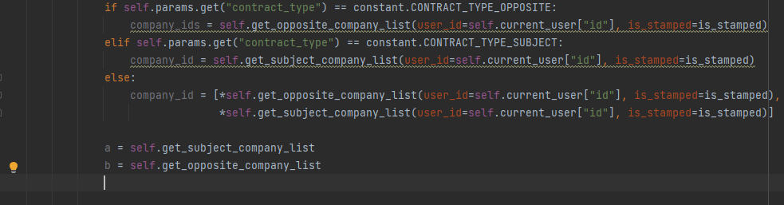

##### 或许本地笔记和博客是不同的东西，本地博客供自己记录知识，查找知识点，而博客就是交流的地方，自己查找知识的时候并不是在博客查，而是在本地查，博客就是要把自己似懂非懂的东西输出，交流提升。


#### post的额外用法

```python
post的URL中的拼接部分实际是没有用处的，并不会参与请求，但是可以用来存储一些信息。
```


#### 预执行函数？？？



每一个都写对应的函数，难以阅读，使用偏函数又难以定位具体函数，（如a,b，再写一个执行器，）


##### 聚合数据

应该想十方那样将数据聚合到一张表中，便于查询，便于定位问题是逻辑问题还是数据问题


#### 时间处理-定时器：

- [优化-处理大量定时任务的思路_大量定时任务处理方法](https://blog.csdn.net/MrCoderStack/article/details/88548584)
- [定时任务时间表达式的规则](https://www.cnblogs.com/wangning528/p/8315916.html)


#### 长链接转短连接

> 需要一个短连接服务器，短连接服务经301（永久）/302（临时）重定向后，再转向真实的长链接地址，有点可能是隐蔽安全，这些参数可以经过网关过滤一层，而且可以包含更多的参数（get请求）

**参考：**

- https://blog.csdn.net/mangomango123/article/details/119910256


#### 反射可以解决 if 判断太多的情况

加字典映射


#### 状态的修改

在调度系统与下载系统中，关于状态的转换大致思路是，用数字表示各种状态，但是都是使用 字符串形态的数字，手动选择赋值，或许可以使用二进制数据表示状态的修改，像权限系统一样。


==111==

**参与同步系统的开发维护**

同步系统是一个监控系统，通过cannal监控mysql数据表的binlog增量，通过kafka消费，通知到相关业务侧，为数据的聚合和部分业务场景提供支持。

- 项目技术：

 


#### 权限系统

cusbin


#### 错误排查

- 解释器，三方库的版本问题，包含一些已经解决的bug，像是 pandas 的 to_dict('record')


#### 一些待解决的问题

1. super 的用法，为什么可以 return super ？

2. 什么是通用方法？它的定义是什么？

   逻辑相同的公共部分，不涉及业务？通用方法并不是公共方法

3. 数据库分库分表问题


#### 数据库读写分离

> 场景：用户下了一笔订单，但没有立刻支付，以后还可能多次查看这笔订单，但都没有支付，只有最后一次支付了，

这就会出现需要反复查表，然后写表的操作，分为两个库表，一个写表，一个读表，使用一个脚本单独用于同步数据


#### 应该注意的

1. 数据库建表时应该标明个人信息，哪个字段是谁修改的，为什么修改（加一个字段）
1. fastapi-libs中的 CacheInfo 类，分别定义了 key, timeout字段，但是直接使用redis的原生方法，那么这个类几乎没有用处，应该避免

### 一些疑问：

1. 分布式锁和普通锁（单机锁）的区别？

   参考：[(145条消息) 如何用Redis实现分布式锁_GeorgiaStar的博客-CSDN博客_redis做分布式锁](https://blog.csdn.net/fuzhongmin05/article/details/119251590)

   ```python
   普通锁是基于内存的，在分布式服务，多进程服务中会出现消息不共用的情况，而想要实现分布式锁，必须借助一个外部系统，所有进程都去这个系统上申请加锁。分布式锁可以使用redis实现
   
   # 分布式锁的安全性
   安全性在于原子性，只有操作是原子性才能确保所得安全性，确保安全性的方法包括：
   1. redis 自身支持 ex nx 操作，将设置锁和设置过期时间捆绑为原子性操作。
   2. 使用 Lua 脚本，一个 Lua 脚本的执行是原子性的，而且性能更优异
   3. 使用 Redisson 利用看门狗自动延时机制避免锁过期导致的问题
   ```

   
   
   
   
   