## linux使用技巧

`ctrl + u` 删除命令行的光标前所有输入

`ctrl + k` 删除命令行的光标前后所有输入


## clash使用技巧

##### 在某个代理中添加直连网址

编辑配置

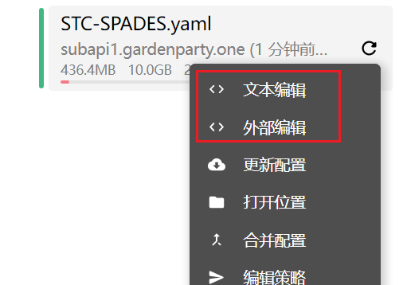

添加直连规则

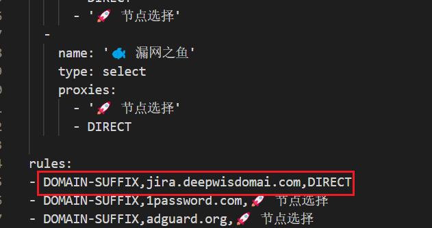


## window命令行使用技巧

查看端口占用情况

寻找特定线程pid，如查看8080端口的pid
netstat -ano|findstr 8080
Netstat -ano|findstr 8080

终止线程,如pid为12112时
taskkill /pid 12212 /f


### 暴露window的wsl系统，以便于同局域网的其他设备访问

1. 获取wsl分发版的IP地址

   ```shell
   # wsl eth0
   ip addr show eth0 | grep inet | awk '{print $2}' | cut -d/ -f1
   ```

2. 配置端口转发

   ```shell
   # 将所有访问<本机IP:端口>，转发到本地的<wsl:端口>
   netsh interface portproxy add v4tov4 listenport=80 listenaddress=0.0.0.0 connectport=80 connectaddress=<WSL的IP地址>
   
   # 删除转发配置
   netsh interface portproxy delete v4tov4 listenaddress=* listenport=12345
   ```

也可以使用修改host文件的方式


### window hosts域名解析使用技巧

```python
# 将onelawgpt.dev.metadl.com域名解析到本地主机的 IP 地址 127.0.0.1。这意味着当尝试访问 "onelawgpt.dev.metadl.com" 时，操作系统将不会发送请求到互联网上的 DNS 服务器来解析该域名，而会直接将请求发送到本地主机
127.0.0.1       onelawgpt.dev.metadl.com
```


## Vscode使用技巧

##### vscode变量替换

**参考：**

1. [ VS Code 配置调试参数、launch.json 配置文件属性、task.json 变量替换、自动保存并格式化、空格和制表符、函数调用关系、文件搜索和全局搜索](https://blog.csdn.net/wohu1104/article/details/111464778) 

```json
一些常用的变量：
• ${workspaceFolder}：项目文件夹在 VS Code 中打开的路径
• ${file}：当前开打开（激活）的文件
• ${relativeFile}：相对于 {workspaceFolder} 的文件路径
• ${fileBasename}：当前打开文件的名称
• ${fileBasenameNoExtension}：当前打开文件的名称，不带扩展名的
• ${fileExtname}：当前打开文件的扩展名
• ${fileDirname}：当前打开文件的文件夹名称
```


##### 配置输出到控制台时，使用的python环境为当前项目的虚拟环境

**参考：**

1. [ VS Code 配置调试参数、launch.json 配置文件属性、task.json 变量替换、自动保存并格式化、空格和制表符、函数调用关系、文件搜索和全局搜索](https://blog.csdn.net/wohu1104/article/details/111464778) 

```json
    // python项目使用当前虚拟环境输出到控制台
    "code-runner.executorMap": {
        // 设置输出字符为utf-8，并根据当前工作目录获取虚拟环境
        "python": "set PYTHONIOENCODING=utf-8 && ${workspaceFolder}.venv/bin/python",
        },
```


##### 在windows环境开发项目，使用wsl2中创建的虚拟环境

1. 在wsl2中安装`wsl`插件

   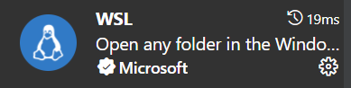

2. 连接到wsl

3. 将项目地址**软连接**到wsl环境中，这样就可以在vscode中通过wsl扩展在使用wsl环境的前提下开发项目了。

##### 自定义快捷键映射代码

> 用户代码片段

**参考：** [(47条消息) VS Code写python快捷输入if __name__ == ‘__main__‘:_雪的期许的博客-CSDN博客](https://blog.csdn.net/winter2121/article/details/121722197) 

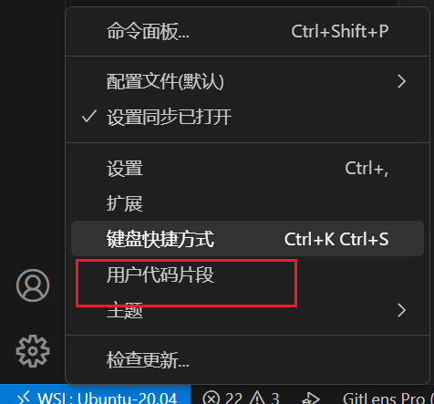


添加自定义代码，`main`函数自动生成

```python
{
	"Print to console": {
		"prefix": "main",
		"body": [
			"if __name__ == '__main__':",
			"    ${1:pass}",
			"",
		],
		"description": "python--main"
	}
}

```


##### 常用默认命令

```shell
reload window # 修改配置后重新加载vscode，使配置生效
```

##### 常用配置

```json
"terminal.integrated.cwd":"${fileDirname}"  // 在当前文件打开新的终端
```


##### 默认快捷键配置

```shell
alt left_key # 跳转到上一个位置

Shift + Alt + F	 # 格式化文档

alt shift 拖动 # 纵向选择

ctrl k + ctrl o # 打开文件夹

ctl \  # 向右拆分

ctrl + enter # 移动光标到下一行
```


##### 自定义快捷键配置

```shell
alt f2 # 快速查看函数或变量在哪里被引用
alt shift f2 # 全局查看函数或变量在哪里被引用

ctrl y # 删除本行
alt shift down_key # 向下复制

ctrl shift 1 # 标记带有注释的书签
ctrl alt k # 标记书签
ctrl 1 # 展示书签列表
ctrl alt j # 上一个书签
ctrl alt l # 下一个书签

# 调试
shift f10 # 运行(code runner)
shift f9 # 开始断点调试
shift f9 delete # 终止断点调试
shift f11 # 跳转到下一处断点
delete # 终止调试
alt f9 # 调试跳转到光标位置

f5 # 在终端开启ipython

alt shift ]  # 文件级全部折叠
alt shift [  # 文件级全部展开
ctrl shift [  # 以递归的方式折叠光标所在函数
ctrl shift ]  # 以递归的方式展开光标所在函数
ctrl [  # 折叠一级光标所在函数
ctrl ]  # 展开一级光标所在函数
```

##### 调试文件配置

```json
{
    // 使用 IntelliSense 了解相关属性。 
    // 悬停以查看现有属性的描述。
    // 欲了解更多信息，请访问: https://go.microsoft.com/fwlink/?linkid=830387
    "version": "0.2.0",
    "configurations": [
        {
            "name": "Python: 当前文件",
            "type": "python",
            "request": "launch",
            "program": "${file}",
            "console": "internalConsole",  // 调试结果打印在console 而不是 terminal
            "justMyCode": true
        }
    ]
}
```


## Navicate使用技巧

##### 查看历史日志

Ctrl + L


## **pycharm 技巧**

##### 修改内存限制

帮助 -> 更改内存设置


##### 添加本地依赖项目

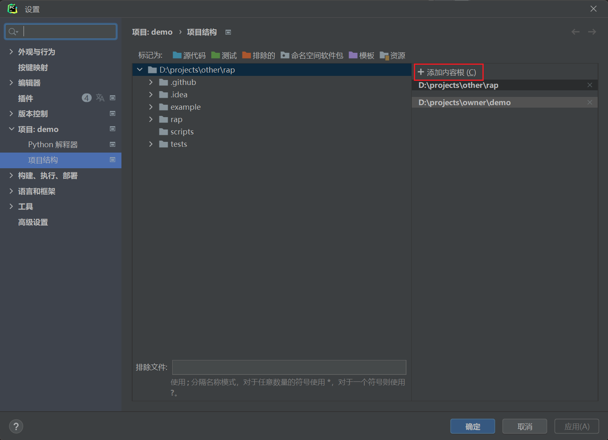


##### 关闭ESC自动聚焦

**参考：** https://www.jianshu.com/p/f1ae155cda6e

在快捷键映射配置Settings -> keymap中，找到 Plug-ins -> Terminal -> Switch Focus To Editor，删除其快捷键绑定即可。

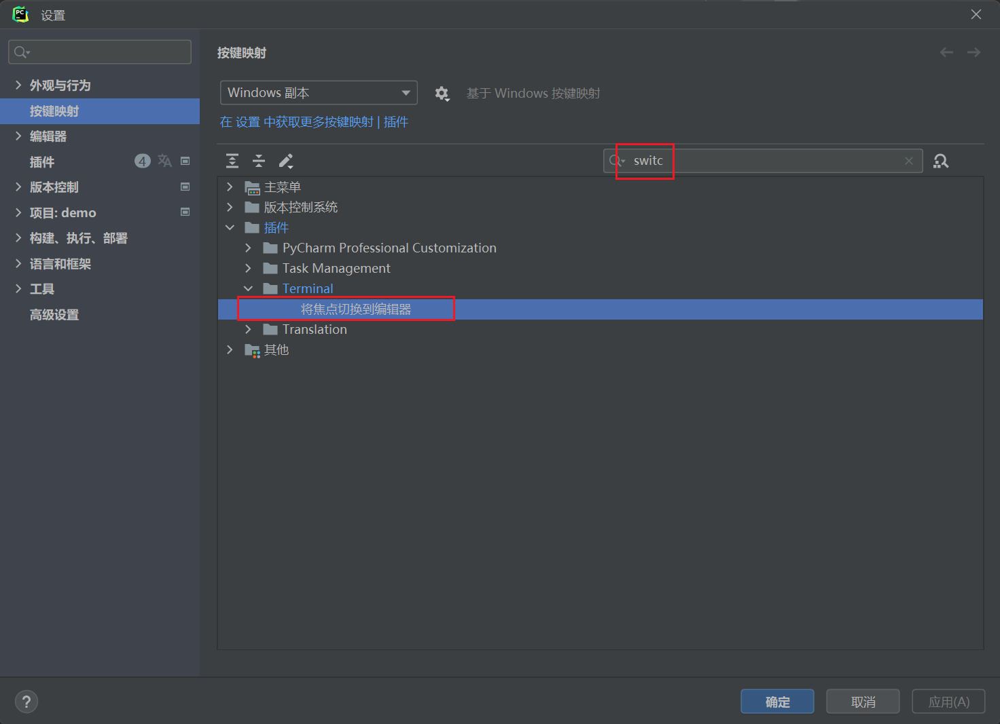


##### 格式化

ctrl + A

ctrl + alt + L


##### 获取当前函数的调用层级

alt + F7


##### 快速删除

ctrl + y 快速删除这一行


##### pycharm 在调试中动态修改变量值

右键直接修改


##### 快速结束 pycharm 调试，（ 运行到光标处 ）

最后一个，需要先放置光标

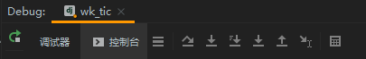

##### 快速搜索目录

直接输入字符， 不用 ctrl+F


##### 快速查找 todo fix


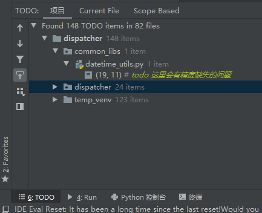


##### 纵向选择

**参考：** [pycharm 垂直选择多行,alt+鼠标左键选择 - 那时一个人 - 博客园 (cnblogs.com)](https://www.cnblogs.com/qianxunman/p/12970483.html)

- shift + alt + 鼠标圈选

- 鼠标中间


##### 快速格式化

ctrl + alt + enter


##### 向下复制

选中一行 ctrl + d


##### 删除一行

ctrl + y


##### 快速格式化代码

ctrl + alt + L


##### 关闭选项卡快捷键修改

按键映射（Keymap）- 主菜单（Main Menu）- 窗口（Window）- 编辑器选项卡（Editor Tabs）- 关闭选项卡（Close Tab）

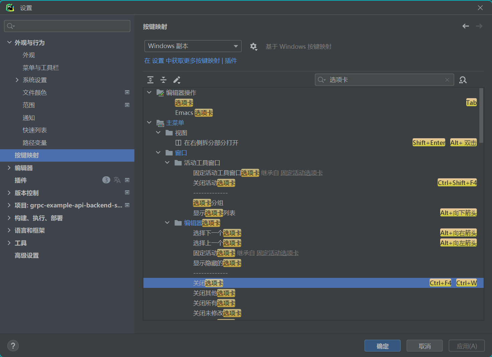


## navicate使用技巧

##### ssh借助跳板机连接线上环境

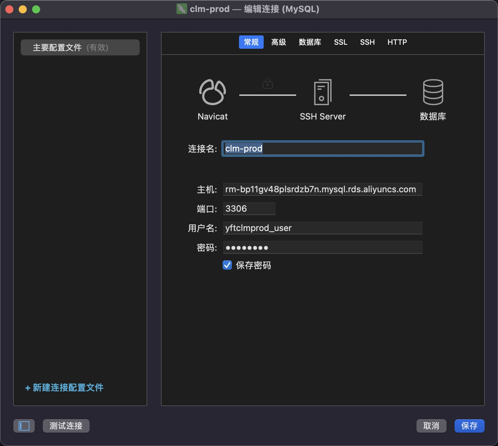

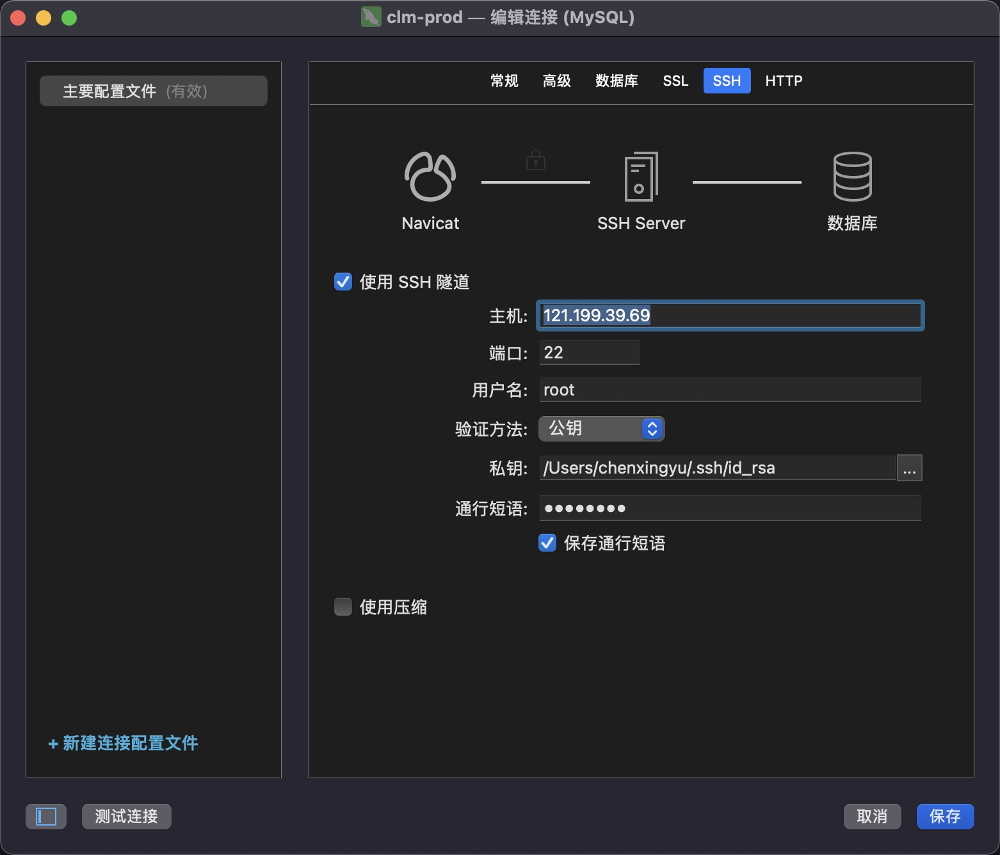

1. 121.199.39.69是待连接环境地址
2. 通行短语不需要
3. 数据库地址是阿里云地址


## chrome使用技巧

##### chrome的console中的过滤栏被意外隐藏后重新显示

**参考：** [(6条消息) 把Chrome的Console中的报错不小心隐藏掉后怎么显示出来_进阶的小名的博客-CSDN博客](https://blog.csdn.net/Tianc666/article/details/105066531) 

- 直接重置开发者工具


## windows使用技巧

##### 为git bash 设置快捷键

**参考：**[【Git Bash】在window 下，设置打开gitbash快捷键、修改默认路径_gitbash 修改快捷键_今日之风甚是温和的博客-CSDN博客](https://blog.csdn.net/qq_22227087/article/details/120226989) 

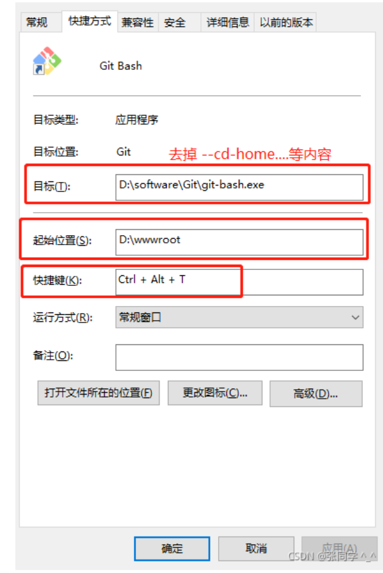


##### 投影

**参考： ** [将一台笔记本电脑作为另一台笔记本电脑的扩展屏 - 知乎 (zhihu.com)](https://zhuanlan.zhihu.com/p/515867098) 

**条件：** 

1. win10, 或者 win11
2. 需要在同一WLAN（WIFI）下
3. 检查无线投影功能是否可用，需下载“无线显示器”功能，在图一界面找到下载即可 (添加可选功能-无线显示器)
