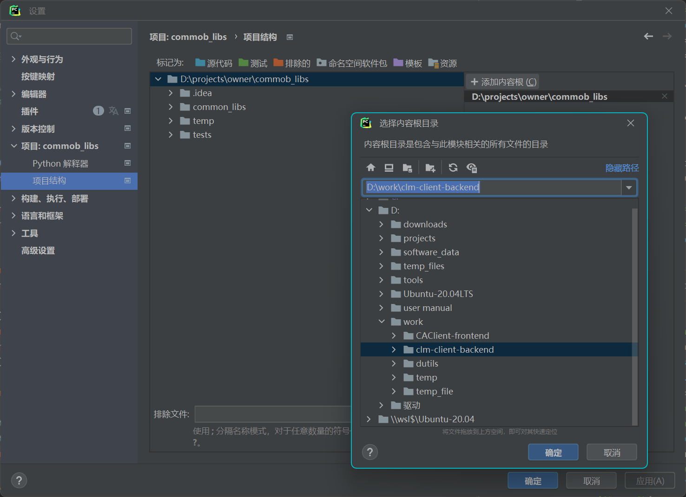

## Setuptools

> 将自己写的项目包打包分发，可以上传到pypi上供别人下载使用，
>
> 别人可以通过 pip install 包名 或者 使用python setup.py install 命令可以将这个项目作为一个第三方库安装在当前开发的项目中

**参考：** [Python打包分发工具setuptools使用教程 - 知乎 (zhihu.com)](https://zhuanlan.zhihu.com/p/162842824)


**使用方法：** 

```python
#1. 修改对应的参数 无脑使用
import os, shutil
from setuptools import setup, find_packages

#移除构建的build文件夹
CUR_PATH = os.path.dirname(os.path.abspath(__file__))
path = os.path.join(CUR_PATH, 'build')
if os.path.isdir(path):
    print('INFO del dir ', path) 
    shutil.rmtree(path)


setup(
    name = 'demo', #应用名
    author = 'selfeasy',
    version = '0.1',  #版本号
    packages = find_packages(),  #包括在安装包内的Python包
    include_package_data = True, #启用清单文件MANIFEST.in,包含数据文件
    exclude_package_data = {'docs':['1.txt']},  #排除文件
    install_requires = [#自动安装依赖
        'Flask>=0.10',
    ],
)

# 2. 使用命令 python setup.py bdist_egg
结果：
demo
|-- build
|   `-- bdist.linux-x86_64
|-- demo.egg-info
|   |-- dependency_links.txt
|   |-- PKG-INFO
|   |-- SOURCES.txt
|   `-- top_level.txt
|-- dist
|   `-- demo-0.1-py3.6.egg
`-- setup.py

该命令会在当前目录下的”dist”目录内创建一个”egg”文件，名为”MyApp-1.0-py2.7.egg”。 文件名格式就是”应用名-版本号-Python版本.egg”，我本地Python版本是2.7。 同时你会注意到，当前目录多了”build”和”MyApp.egg-info”子目录来存放打包的中间结果
```


#### 使用pycharm在Python中引用另一个项目

**参考：**

- [(6条消息) python如何引用另外一个项目_你老父亲的博客-CSDN博客_pycharm如何在一个项目中引用另一个另一个项目中的文件](https://blog.csdn.net/yuan5883052/article/details/114880215?spm=1001.2101.3001.6650.4&utm_medium=distribute.pc_relevant.none-task-blog-2~default~CTRLIST~Rate-4-114880215-blog-87997490.pc_relevant_aa&depth_1-utm_source=distribute.pc_relevant.none-task-blog-2~default~CTRLIST~Rate-4-114880215-blog-87997490.pc_relevant_aa&utm_relevant_index=9)

只需要把B项目加入到项目A的Content Root中，就可以了

操作顺序：File->Settings->Project->Projiect Structure

 

