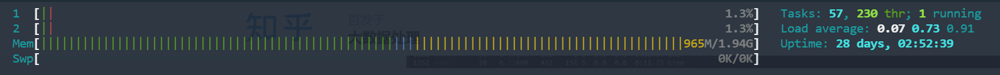

### Linux理论知识

**参考：**

- [Linux 目录结构：Unix 系统资源目录（/usr](https://learnku.com/server/wikis/36496) 

| 目录      | 描述                                                         | 备注 |
| --------- | ------------------------------------------------------------ | ---- |
| **/**     | 根目录，只包含所有文件结构的最顶层的目录                     |      |
| **/bin**  | 存放可执行文件的地方。所有的用户都可以访问                   |      |
| **/dev**  | 设备驱动程序存放的目录                                       |      |
| **/etc**  | 系统配置文件目录，该目录包含配置文件，有效用户列表，用户的群组，以太网，主机等配置 |      |
| **/lib**  | 根目录下的所程序的共享库目录，也包含一些与内核相关的文件     |      |
| **/home** | 普通用户的家目录                                             |      |
| **/mnt**  | 用于挂载其他临时文件系统，例如分别用于 CD-ROM 驱动器和软盘驱动器的 CDROM 和软盘。 |      |
| **/tmp**  | 系统运行的物理内存和物理磁盘交互的缓存文件                   |      |
| **/usr**  | 操作系统软件资源所放置的目录，可以被多个用户使用。包括管理命令、共享文件、库文件以及其他 |      |
| **/var**  | 包含内容经常变化的文件，文件的大小可能会改变，如缓冲文件，日志文件，缓存文件，等一般都存放在这里 |      |


### 基础命令

```shell
mkdir 
	-p /usr/home/test/aaa  # 根据路径创建目录，路径存在时自动创建
	
useradd 
	-r # 创建系统用户
	-g # 将这个用户添加进群组
		test_group
groupadd
	-r # 创建系统组
```

##### 查看路径下所有文件

```shell
ls ./*
```


##### xargs  命令传递（管道）

> xargs 它能够捕获一个命令的输出，然后传递给另外一个命令

**参考：**

- https://www.runoob.com/linux/linux-comm-xargs.html 

```shell
cat url-list.txt | xargs wget -c
```

##### curl命令

```shell
# 保存文件
curl -o filename.txt http://example.com/file.txt

# 跟随重定向,连接被重定向时，跟踪重定向获取资源
curl -L http://example.com

# 发送POST请求
curl -X POST -d "param1=value1&param2=value2" http://example.com/resource

# 设置代理
curl -x proxy.example.com:8080 http://example.com

# 设置请求头
curl -H "Content-Type: application/json" http://example.com

# FTP上传文件
curl -T upload.txt ftp://ftp.example.com/upload/
```


**grep模式匹配命令**

```shell
一、 基本操作
grep命令用于打印输出文本中匹配的模式串，它使用正则表达式作为模式匹配的条件。grep支持三种正则表达式引擎，分别用三个参数指定：

参数 说明

- -E POSIX扩展正则表达式，ERE
- -G POSIX基本正则表达式，BRE
- -P Perl正则表达式，PCRE

在通过grep命令使用正则表达式之前，先介绍一下它的常用参数：

参数 说明

- -b 将二进制文件作为文本来进行匹配
- -c 统计以模式匹配的数目
- -i 忽略大小写
- -n 显示匹配文本所在行的行号
- -v 反选，输出不匹配行的内容
- -r 递归匹配查找
- -A n   n为正整数，表示after的意思，除了列出匹配行之外，还列出后面的n行
- -B n   n为正整数，表示before的意思，除了列出匹配行之外，还列出前面的n行
- --color=auto 将输出中的匹配项设置为自动颜色显示
```


##### 查找命令的具体位置

```shell
# 查找 when-changed 命令包的具体位置（requests库就不行）
# 应该是针对的可以在命令行直接直接性的命令
which requests
```


### 系统信息查询

##### 系统性能指标 htop

> htop是top的升级版，用于检测内存，进程信息
>

**参考：** [Linux htop 详解 - 知乎 (zhihu.com)](https://zhuanlan.zhihu.com/p/296803907) 

```shell
sudo apt install htop
```



**swp**: 交换空间，是swap的缩写，交换空间通常设置为一个专门的分区或者是一个交换文件。这样，当物理内存不足时，操作系统就可以将部分数据移到交换空间，从而避免系统因内存不足而崩溃或变得极其缓慢。如果交换空间的使用频繁接近或达到 100%，这可能表明系统需要更多的物理内存或者存在一些内存管理的问题。在某些情况下，过度使用交换空间可能导致性能下降，因为从磁盘读写数据的速度远远慢于从内存读写数据的速度。

1. 左侧显示只有2核CPU

   1. *每一个CPU的总用量情况，注意这条上面会有不同的颜色：*
      1. 蓝色：显示低优先级(low priority)进程使用的CPU百分比。
      2. 绿色：显示用于普通用户(user)拥有的进程的CPU百分比。
      3. 红色：显示系统进程(kernel threads)使用的CPU百分比。
      4. 橙色：显示IRQ时间使用的CPU百分比。
      5. 洋红色(Magenta)：显示Soft IRQ时间消耗的CPU百分比。
      6. 灰色：显示IO等待时间消耗的CPU百分比。
      7. 青色：显示窃取时间(Steal time)消耗的CPU百分比

2. mem内存和交换空间swp的使用情况
   1. 绿色：显示内存页面占用的RAM百分比
   2. 蓝色：显示缓冲区页面占用的RAM百分比
   3. 橙色：显示缓存页面占用的RAM百分比

3. 右侧信息为，正在运行57个任务，开启了230个线程，1个进程，

4. load average 最后1分钟，最近5分钟和最后15分钟的平均负载

5. uptime 显示了系统从启动开始到现在运行的时间


##### 磁盘

```shell
# 查看系统磁盘使用情况
$ df -h
Filesystem      Size  Used Avail Use% Mounted on
none             16G  4.0K   16G   1% /mnt/wsl
none            391G  109G  282G  28% /usr/lib/wsl/drivers
/dev/sdc        251G  251G     0 100% /							# 磁盘占满，导致报错[24946] INTERNAL ERROR: cannot create temporary directory!

# 估算目录空间使用情况
$ du -h /usr/local

# 在当前目录下显示所有一级子目录的磁盘使用情况，并按照磁盘使用量从大到小进行排序，最后显示前 10 个使用量最大的子目录
# 出现权限问题时，切换为超级管理员账户 sudo -i
du -h --max-depth=1 `pwd` | sort -rh | head -n 10
sudo du -h --max-depth=1 /var 2>/dev/null | sort -rh | head -n 10  # 忽略错误信息


# docker碎片占用空间
docker system prune -a  # 删除无用资源
```

##### 内存：**free**

```shell
free -mh  # 格式化查看内存使用情况 
```


##### 网络连接情况

```shell
nc -vz 127.0.0.1 3306
# Connection to mysql-default 3306 port [tcp/mysql] succeeded!
```


##### 查找正在运行的进程号（Pid）

```shell
pidof `进程操作`

pidof tail  # 使用tail打开一个文件，另开一个shell，查看tail进程ID
```


##### 显示进程信息（包括CPU、内存使用等信息）：**top、ps**


##### 查看驱动占用内存：**lsmod**


##### linux判断一个域名|IP|端口是否存

**参考：**

- https://blog.csdn.net/sun124608666/article/details/105488642
- https://blog.csdn.net/weixin_35949153/article/details/113004124

```shell
ping xxxx

$nc -zv 127.0.0.1 80
Connection to 127.0.0.1 port 80 [tcp/arepa-cas] succeeded!    # 成功
nc: connectx to 127.0.0.1 port 80 (tcp) failed: Connection refused    # 失败

wget 是一个从网络上自动下载文件的自由工具，支持通过 HTTP、HTTPS、FTP 三个最常见的 TCP/IP协议 下载，并可以使用 HTTP 代理，Linux可以用它来测试端口。
用法：wget ip:port
#出现Connecting to ... failed: Connection refused.表示端口关闭；
#出现Connecting to ... connected.表示端口开启；
#出现No route to host表示IP错误或者iptables限制。

curl是一个利用URL语法在命令行下工作的文件传输工具，可以用它来测试端口是否开启。
用法：curl -v ip:port
#出现Connection refused表示端口关闭；
#出现Connected to ip(ip) port(#0)表示端口开启；
#出现No route to host表示IP错误或者iptables限制。
```

##### 查询Linux系统最大打开的文件描述符数量

**参考：**

- [彻底弄懂 Linux 下的文件描述符（fd）](https://yushuaige.github.io/2020/08/14/%E5%BD%BB%E5%BA%95%E5%BC%84%E6%87%82%20Linux%20%E4%B8%8B%E7%9A%84%E6%96%87%E4%BB%B6%E6%8F%8F%E8%BF%B0%E7%AC%A6%EF%BC%88fd%EF%BC%89/) 

```shell
cat /proc/sys/fs/file-max 
# 或者 
sysctl -a | grep fs.file-max
```


### 快捷技巧

##### 批量杀死所有进程

```shell
ps -aux | grep python | awk '{print $2}' | xargs kill -9
```


##### 执行命令

```shell
# `echo aaa`  == echo aaa == $(echo aaa)

# 应用场景
把上条命令的执行结果作为下条命令输入
cd `which when-changed`
cat `which when-changed`
```


### Linux理论信息

##### Linux的环境变量.bash_profile .bashrc profile文件

```shell
#全局环境变量设置文件：/etc/profile、/etc/bashrc。 
#用户环境变量设置文件：~/.bash_profile、~/.bashrc。

#主要区别在于
读取顺序：① /etc/profile、② ~/.bash_profile、③ ~/.bashrc、④ /etc/bashrc。
```

.bashrc和.bash_profile的区别

```shell
.bash_profile是在你每次登录的时候执行的；.bashrc是在你新开了一个命令行窗口时执行的。
```

**应用场景**

1. 简化命令

   **参考：**

   - [(9条消息) Linux 的.bashrc 文件详解_shadow_zed的博客-CSDN博客_linux bashrc](https://blog.csdn.net/shadow_zed/article/details/88170043)

   ```shell
   alias dc='docker-compose'
   ```

   

##### fd 文件描述符

**参考：**

- [彻底弄懂 Linux 下的文件描述符（fd）](https://yushuaige.github.io/2020/08/14/%E5%BD%BB%E5%BA%95%E5%BC%84%E6%87%82%20Linux%20%E4%B8%8B%E7%9A%84%E6%96%87%E4%BB%B6%E6%8F%8F%E8%BF%B0%E7%AC%A6%EF%BC%88fd%EF%BC%89/) 

​	linux中一切都是文件，使用一个非负整数[^递增]映射文件的句柄[^正在打开的文件]，用以实现文件的高效管理。

​	标准输入0，标准输出1，标准错误2的文件描述符都指向虚拟终端控制台 /dev/pts/1

```shell
# 1. 使用vim打开一个文件，另起一个shell执行 pidof vim 查看vim的进程ID
pidof vim 
298

# 2. 使用 ll 、proc/$pid/fd 查看这个进程的文件描述符列表
ll /proc/`pidof vim`/fd

total 0
dr-x------ 2 githuyan githuyan  0 Feb  7 11:29 ./
dr-xr-xr-x 9 githuyan githuyan  0 Feb  7 11:28 ../
lrwx------ 1 githuyan githuyan 64 Feb  7 11:29 0 -> /dev/pts/1
lrwx------ 1 githuyan githuyan 64 Feb  7 11:29 1 -> /dev/pts/1
lrwx------ 1 githuyan githuyan 64 Feb  7 11:29 2 -> /dev/pts/1
lrwx------ 1 githuyan githuyan 64 Feb  7 11:29 4 -> /mnt/d/projects/owner/ymg/.demo.py.swp*

# 标准输入0，标准输出1，标准错误2的文件描述符都指向虚拟终端控制台 /dev/pts/1
# 4 指向了 demo.py文件的附件
```

指向附件的原因：

​	vim命令会先打开一个源文件，文件描述符应该为3，复制一个副本，在这个副本上操作，文件描述符应该为4，然后关闭源文件，fd=3释放，fd=4保留


### crontab命令

**参考：**

- [Linux Crontab 定时任务 | 菜鸟教程 (runoob.com)](https://www.runoob.com/w3cnote/linux-crontab-tasks.html) 


* * * * *  #分，时，日，月，周

- ***** 取值范围内的所有数字
- **/** 每过多少个数字
- **-** 从X到Z
- **，**散列数字

