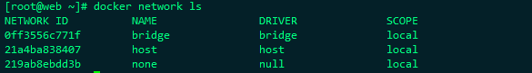

#### 技巧

重启docker服务

```shell
$ sudo systemctl daemon-reload
$ sudo systemctl restart docker
```


##### 格式化容器信息

```shell
docker inspect --format='{{.Name}} - {{range .NetworkSettings.Networks}}{{.IPAddress}}{{end}}' $(docker ps -aq)

# 输出
/nacos-standalone - 172.24.0.2

{{.ID}}: 容器的 ID。
{{.State.Status}}: 容器的状态，例如 running、exited 等。
{{.Config.Image}}: 容器使用的镜像。
{{.Config.Hostname}}: 容器的主机名。
{{.Config.Env}}: 容器的环境变量。
{{.Mounts}}: 容器挂载的卷信息。
```


##### 设置docker开机自启动

1. wsl系统

   ```shell
   # wsl系统比较特殊，并不适用systemd或者service初始化系统，
   # 要做到wsl启动后自启动docker服务，直接在linux自启动管理文件中添加docker服务启动命令，
   
   # ~/.bashrc
   ###############################
   # docker自启动服务
   ###############################
   sudo service docker start
   ###############################
   ```

   

2. 其他系统

   1. 使用systemctl管理系统

      ```shell
      步骤一：检查Docker服务是否已经安装
      
      sudo systemctl list-units --type=service | grep docker
      如果输出结果中包含docker.service，则说明Docker服务已经安装。
      
      步骤二：设置Docker服务开机自启动
      
      sudo systemctl enable docker.service
      执行上述命令后，Docker服务将会在WSL2启动时自动启动。
      
      步骤三：验证Docker服务是否已经设置开机自启动
      
      sudo systemctl list-unit-files | grep enable | grep docker
      ```
   
   
      2. 使用service管理系统
   
         ```shell
         步骤一：检查Docker服务是否已经安装
         
         sudo service docker status
         如果输出结果中包含Active: active (running)，则说明Docker服务已经安装并正在运行。
         
         步骤二：启动Docker服务
         
         sudo service docker start
         执行上述命令后，Docker服务将会启动。
         
         步骤三：验证Docker服务是否已经启动
         
         sudo service docker status
         如果输出结果中包含Active: active (running)，则说明Docker服务已经启动。
         
         步骤四：设置Docker服务开机自启动
         
         sudo systemctl enable docker.service
         ```
   
 	3. docker自启动后，如果需要自动启动容器，
          	1. 添加`docker start <容器名称>` .sh脚本文件到linux自启动配置文件中，
          	2. 如果使用`docker-compose`管理docker容器，可以直接设置`alaway=true`自动启动容器


##### 复制镜像中的文件到本地

```shell
1. 
docker run --rm demo_image cat /usr/log > /opt/log
# -d 参数表示以后台模式运行容器。
# -rm 参数表示在容器退出后自动删除容器。
# demo_image 是要运行的Docker镜像的名称。
# cat /uar/log > /opt/log 是在容器内执行的命令，它将/uar/log文件的内容输出到标准输出，然后将输出重定向到/opt/log文件。

2. 从启动的容器中复制 # 可能对本地目录没有写入权限
sudo docker cp 容器ID:容器内文件路径 本地文件路径

```


##### 批量操作容器

```shell
docker restart $(docker ps | grep test | awk '{ print $1}')
```

##### 获取容器IP地址

```shell
docker inspect -f '{{range .NetworkSettings.Networks}}{{.IPAddress}}{{end}}' <CONTAINER_ID or CONTAINER_NAME>
```


##### 清除所有无用挂载、容器、镜像

**参考：**

- https://note.qidong.name/2017/06/26/docker-clean/

```shell
docker container prune # 清理所有停止运行的容器：

docker image prune # 清理所有悬挂（<none>）镜像

docker volume prune # 清理所有无用数据卷
```


##### docker-compose安装

**参考：** https://www.cnblogs.com/trblog/p/14240084.html

```shell
# 下载安装docker-compose
# 使用 curl 命令下载 Docker Compose 的二进制文件。这里的URL包含了版本号（1.27.4）以及根据操作系统和架构动态生成的文件名。$(uname -s) 获取操作系统类型，$(uname -m) 获取硬件架构。
sudo curl -L "https://github.com/docker/compose/releases/download/1.27.4/docker-compose-$(uname -s)-$(uname -m)" -o /usr/local/bin/docker-compose

# 添加权限
sudo chmod +x /usr/local/bin/docker-compose
```


### Docker-compose

> Docker Compose 是一个在单个服务器或主机上创建多个容器的工具

#### 基础命令

```python
# 启动，重启
docker-compose up  # 用于部署一个compose应用，默认使用 docker-compose.yaml 文件
docker-compose up -f docker-compose-yyy.yaml  # 自定义 docker-compose 文件名
docker-compose restart  # 重启关闭的应用，如果在重启前，修改了应用内容，并不会对重启的应用生效，除非重新部署

# 启动多个重复的容器 `--scale` 是一个可选参数，用于设置一个或多个服务在启动时应该具有的实例数量
docker-compose up --scale demo:v1


# docker-compose.yaml文件中有两个redis服务，一个mysql服务，一个kafka服务，只启动redis服务和kafka服务
docker-compose up -d redis1 redis2 kafka
# docker-compose.yaml文件中有两个redis服务，一个mysql服务，一个kafka服务，只重启redis服务和kafka服务
docker-compose restart redis1 redis2 kafka

# 停止，删除
docker-compose stop  # 停止Compose应用相关的所有容器，但不会删除他们
docker-compose rm  # 删除已停止的compose应用，他会删除容器和网络，但不会删除卷和镜像
docker-compose down  # 停止并删除运行中的compose应用，他会删除容器和网络，但不会删除卷和镜像

# 查询	
docker-compose ps  # ，输出状态，容器运行的命令以及映射端口

```

#### 配置解析

##### 网络配置

- bridge：桥接docker（默认，自己创建也使用bridge模式）

- none：不配置网络

- host：和宿主机共享网络

  ```shell
  # 如果使用了host网络，那么就无法通过容器名来访问服务，除非有特定的理由需要使用 host 网络（比如需要直接访问宿主机的网络栈），否则建议使用默认的 bridge 网络或自定义网络
  ```

```yaml
# 使用host网络，当使用 host 网络时，容器实际上会共享宿主机的网络栈。这意味着容器不会获得自己的 IP 地址，而是直接使用宿主机的 IP 地址和端口
network_mode: host

# 使用已经存在的网络
networks:
  db:
    external: true
    
# 创建新的网络
# 需要注意的是，docker-compose自动创建的网络，网络名称自动变更为 <文件名称>_<网络名称>如：db_db
# db/docker-compose.yaml
networks:  
  db:  
    driver: bridge
```


##### 挂载操作

```yaml
# "ro"表示将挂载卷设置为"只读"（read-only）模式。这意味着容器内的文件系统可以读取挂载的文件或目录，但不能对其进行写操作。如果尝试在容器内修改挂载的文件，会导致权限错误。
version: '3.9'

services:
  nginx:
    image: nginx:latest
    ports:
      - "80:80"
    volumes:
      - ./nginx.conf:/etc/nginx/nginx.conf:ro
      # 可选：添加其他要挂载的目录或文件
       - ./your_static_website_files:/usr/share/nginx/html:ro 
    # 可选：设置其他环境变量
    # environment:
    #   - EXAMPLE_ENV=example_value

```

##### 内存限制

`ES_JAVA_OPTS=-Xms1g -Xmx1g` 这条命令和 Docker Compose 文件中的 `mem_limit: 2g` 有以下主要区别:

1. 设置不同的对象

- ES_JAVA_OPTS 设置的是 Elasticsearch JVM 的堆内存大小,即 Java heap size。
- mem_limit 设置的是 Docker 容器可以使用的最大内存量。

1. 约束级别不同

- ES_JAVA_OPTS 直接限制了 JVM 的堆内存,强制固定该值。
- mem_limit 是容器级的软限制,可以在此范围内动态调整,不会被直接终止。

1. 作用范围不同

- ES_JAVA_OPTS 仅影响 Elasticsearch JVM。
- mem_limit 约束整个容器的内存使用,包括所有进程。

1. 灵活性不同

- ES_JAVA_OPTS 的堆内存不可扩展,需重启才能生效。
- mem_limit 可以在运行时调整,无需重启容器。

1. 配额计算不同

- ES_JAVA_OPTS 是指定固定的值。
- mem_limit 通常根据主机内存比例分配。

综上,ES_JAVA_OPTS直接固定JVM内存,mem_limit按比例软约束整个容器,两者配合使用可以实现内存控制和优化。


##### 环境配置

1. 像**docker run -e** 一样，docker-.compose也可使用**docker-compose run -e**

   ```shell
   docker-compose run -e DEBUG=1
   ```

2. 直接使用当前环境变量中的值

   ```shell
   docker-compose run -e DEBUG
   ```

3. 通过`.env`文件传入

   ```shell
   # 默认从 .env 读取
   DEBUG=1
   ```

4. 通过`env_file`配置指定配置文件

   ```yaml
   # nacos-hostname.env  # 同 Dockerfile
   ...
   
   services:
     nacos1:
       hostname: nacos1
       env_file:
         - ./env/nacos-hostname.env
   
   ```


##### **配置优先级**

```shell
Compose file
Shell environment variables
Environment file
Dockerfile
Variable is not defined
```


### Docker 

> Dockerbr本身就相当于一个虚拟机，他本身就是一个Docker环境，理论上可以在任何下载Docker的设备商运行程序
>
> **docker 的镜像类似于python的类， 容器相当于python的实例， docker本身类似于python进程的docker进程**

**参考：**

1. [docker-从入门到实战](https://yeasy.gitbook.io/docker_practice/image/dockerfile/arg#:~:text=Dockerfile%E4%B8%AD%E7%9A%84%20ARG%E6%8C%87%E4%BB%A4%E6%98%AF%E5%AE%9A%E4%B9%89%E5%8F%82%E6%95%B0%E5%90%8D%E7%A7%B0%EF%BC%8C%E4%BB%A5%E5%8F%8A%E5%AE%9A%E4%B9%89%E5%85%B6%E9%BB%98%E8%AE%A4%E5%80%BC%E3%80%82%20%E8%AF%A5%E9%BB%98%E8%AE%A4%E5%80%BC%E5%8F%AF%E4%BB%A5%E5%9C%A8%E6%9E%84%E5%BB%BA%E5%91%BD%E4%BB%A4%20docker%20build%E4%B8%AD%E7%94%A8,--build-arg%20%3C%E5%8F%82%E6%95%B0%E5%90%8D%3E%3D%3C%E5%80%BC%3E%E6%9D%A5%E8%A6%86%E7%9B%96%E3%80%82%20%E7%81%B5%E6%B4%BB%E7%9A%84%E4%BD%BF%E7%94%A8%20ARG%E6%8C%87%E4%BB%A4%EF%BC%8C%E8%83%BD%E5%A4%9F%E5%9C%A8%E4%B8%8D%E4%BF%AE%E6%94%B9%20Dockerfile%20%E7%9A%84%E6%83%85%E5%86%B5%E4%B8%8B%EF%BC%8C%E6%9E%84%E5%BB%BA%E5%87%BA%E4%B8%8D%E5%90%8C%E7%9A%84%E9%95%9C%E5%83%8F%E3%80%82)


#### 理论知识

##### 启动docker服务

```shell
# 启动
# 在真实 ubuntu 系统中
systemctl start docker
systemctl deamon-reload # 后台启动
systemctl restart docker # 重启

# 在虚拟（wsl2 window linux 子系统） 中
sudo service docker start

#关闭
docker service docker stop
docker systemctl stop docker
```

#### 网络

##### docker0网桥

**参考：**

- [(17条消息) (十四)Docker0网络详解_IT_狂奔者的博客-CSDN博客_docker0网卡的作用](https://blog.csdn.net/chj_1224365967/article/details/109206131) 

> Docker0 网桥的作用是连接容器和主机网络，使得它们可以相互通信并实现容器服务的访问。

##### 网络配置

1.查看所有的docker网络：docker network ls



网络模式

- bridge：桥接docker（默认，自己创建也使用bridge模式）

- none：不配置网络

- host：和宿主机共享网络

  ```shell
  # 如果使用了host网络，那么就无法通过容器名来访问服务，除非有特定的理由需要使用 host 网络（比如需要直接访问宿主机的网络栈），否则建议使用默认的 bridge 网络或自定义网络
  ```

- container：容器网络连通（用的少，局限很大）

2.**创建自定义网络命令**：docker network create default_network

```shell
docker network create --driver bridge --subnet 192.168.1.0/16 --gateway 192.168.1.0 mynet
# 解析：
	--driver bridge  # 表示使用桥接模式
	--subnet 192.168.1.0/16  # 表示子网ip 可以分配 192.168.1.2 到 192.168.255.255
	--gateway 192.168.1.0  # 表示网关
		mynet  # 表示网络名
```

3.查看网络内部信息：docker network inspect default_network

4.移除指定的网络：docker network rm default_network

##### 

#### **镜像**

> 镜像是一种轻量级，可执行的独立软件包，用来打包软件运行环境和基于运行环境开发的软件，它包含运行某个软件所需的所有内容，包括代码，运行时的库，运行环境和配置文件

##### 镜像CURD

1. **镜像查询**

   `docker images`

   - `-a` 列出所有镜像
   - `-q` 只显示镜像id

   | REPOSITORY | TAG  | IMAGE  | CREATED | SIZE |
   | ---------- | ---- | ------ | ------- | ---- |
   | 镜像       | 版本 | 镜像id | 时间    | 大小 |

   `docker history <image:tag>`

   > 查看这个镜像的构造历史（过程）

2. **镜像搜索**

   `docker search mysql` 搜索mysql镜像

   - --filter=STARTS=3000 搜索所有starts>=3000的镜像

3. **镜像上传**

   **参考：** https://cloud.tencent.com/developer/article/1549825

1. **镜像下载**

   `docker pull mysql` 拉取下载镜像，默认下载最新版镜像

   - mysql:5.7 指定下载版本

2. **镜像删除**

   `docker rmi -f id` 根据镜像id删除镜像

   - -f $(docker images -a -q) 删除所有镜像

##### 镜像推送

**参考：**

1. [(4条消息) docker学习笔记（五）如何创建自己的阿里云镜像仓库（这是2021版的阿里云教程）_乌鱼鸡汤的博客-CSDN博客_阿里云镜像仓库](https://blog.csdn.net/a123123sdf/article/details/117373743)  

2. [容器镜像服务 (aliyun.com)](https://cr.console.aliyun.com/repository/cn-heyuan/huyanhu/onelawgpt/details)

登录阿里云

```shell
docker login --username=githuyan registry.cn-heyuan.aliyuncs.com
```

从Registry中拉取镜像

```shell
docker pull registry.cn-heyuan.aliyuncs.com/huyanhu/onelawgpt:[镜像版本号]
```

将镜像推送到Registry

```shell
$ docker login --username=githuyan registry.cn-heyuan.aliyuncs.com
$ docker tag [ImageId] registry.cn-heyuan.aliyuncs.com/huyanhu/onelawgpt:[镜像版本号]
$ docker push registry.cn-heyuan.aliyuncs.com/huyanhu/onelawgpt:[镜像版本号]
```


#### 容器相关

##### 容器的CRUD

1. **容器的创建并启动**

   > 开始后 docker 会在本机寻找镜像，判断本机是否有这个镜像（image),如果有就运行这个镜像
   >
   > 如果没有就去 Docker Hub上下载，DockerHub上如果有这个镜像，就下载这个镜像，然后运行这个镜像，没找到这个镜像就会报错

   `docker run [可选参数] image` 

   - `-it` 使用交互方式运行，创建容器并进入容器
   - `-d` 使用后台运行方式
   - `-p` 查看容器端口，端口映射 -p 8080[^主机端口] :8080[^容器端口]，可以同时暴露多个端口 -p 8080:80 -p3306:3306
   - docker run -it centos /bin/bash 这指定了景区容器后的控制台
   - `-P` 随机指定端口映射
   - `-v` 数据卷挂载
   - `-e` 环境配置
   - `--name` 给容器命名（一般没有必要）

   进入当前正在运行的容器

   - `docker exec -it 容器名/id /bin/bash`  重新进入这个运行的容器时，需要指定控制台（通常使用）
   - `docker attach 容器名/id` 进入容器，正在执行的终端，不会启动新的进程

   **docker run 和 docker exec 的区别**

   > docker run 更倾向于 根据镜像创建一个容器并运行一个命令
   >
   > docker exec 倾向于 在运行的容器中执行命令，操作的对象是一个容器

   

2. **容器的启动与停止**

   docker start 容器id

   - restart 容器id
   - stop 容器id
   - kill 容器id  强制停止

   **删除所有孤立的容器**

   ```shell
   docker container prune
   ```

   

3. **容器查询**

   `docker ps ` 当前正在运行的容器

   - `-a` 列出当前和历史运行过的容器
   - `-q` 只显示容器的id
   - `-n=1` 只显示最近运行过的1个容器

   **查询日志**

   **参考：**

   1. https://blog.csdn.net/m0_59092234/article/details/124169005 

   ```shell
   # docker 日志存储位置
   /var/lib/docker/containers/ID/ID-json.log
   
   # docker logs [OPTIONS] CONTAINER
     Options:
           --details        显示更多的信息
       -f, --follow         跟踪实时日志
           --since string   显示自某个timestamp之后的日志，或相对时间，如42m（即42分钟）
           --tail string    从日志末尾显示多少行日志， 默认是all
       -t, --timestamps     显示时间戳
           --until string   显示自某个timestamp之前的日志，或相对时间，如42m（即42分钟）
           
   docker logs --since 30m CONTAINER_ID  # 实时查看最近30分钟日志
   docker logs -t --since="2018-02-08T13:23:37" CONTAINER_ID # 实时查看某个时间点之后的日志
   
   `docker logs 容器名/id -tf --tail 10`查看容器日志（加时间戳，允许日志输出后10条日志）
   ```

   

   查看容器中的进程信息

   - `docker top 容器名/id` （pid是进程id，ppid是父进程id）

   查询容器元数据信息

   - `docker inspect 容器名/id`   inspect 指令同样可以查询镜像的详细信息

   查看CPU内存状况

   - ` docker stats` 默认查看所有容器的CPU内存占用情况

     容器id  追加id可以查看指定容器的CPU使用情况

4. **容器退出与删除**

   `exit` 容器停止并退出

   `Ctrl + P + Q` 容器不停止但退出

   `docker rm 容器名/id` 正在运行的容器不能删除

   `docker rm -f $(docker ps -aq)` 强制删除所有容器

##### 容器数据卷

> 数据如果都存在容器中，容器删除后，数据会丢失，卷技术就是容器之间的数据共享技术，将容器中产生的数据同步到本地

1. **数据卷的挂载**

   > bind mount(挂载) a volume 这是一个双向绑定，两个地址指向同一片内存，无论在哪个目录操作都会同时作用到双方的目录，但是以主机中的目录为主，无法删除容器中的挂载目录，但是可以删除主机中的嘎在目录，

   - **挂载**

     docker -it -v /home/test[^本机目录absolute] : /home[^容器目录] --name[^容器名称] image[^镜像名称] /bin/bash[^目录映射]

     - 可以创建多个映射，只需 -v 映射 -v 映射

   - **设置权限**

     docker run -d -P -v 卷名 : 容器内目录路径 : 权限 镜像名 

     - ro 只读，指定容器内的卷对外部具有只读权限，则数据由主机写入
     - rw 读写  指定容器的卷能写入主机

   - **挂载方式**

     - -v 容器内目录  									匿名挂载
       - sudo docker run -d --name 容器名 -P -v 卷名 : 目录名 镜像名
     - -v 卷名：容器内路径 		 				具名挂载
       - sudo docker run -d --name nginxa -P -v juming-nginx:/etc/nginx nginx 这是具名挂载
     - -v 主机目录路径：容器内目录路径    指定路径挂载
       - sudo docker run -d --name nginxb -P -v /home/githuyan/桌面:/etc/nginx nginx 这是目录映射挂载

2. **数据卷的查询**

   `docker volume ls` 查看所有卷的情况

   - inspect 卷名 (具名挂载的名字) 检查指定卷的详细情况
   - prune  移除所有不用的卷名
   - rm 卷名 
   - create 卷名

3. **数据卷继承**

   > 容器间的挂载就是继承，一个父容器可以有多个子容器，而他们的文件共享相当于地址指针都指向了主机所挂载的目录，任意删除某一个子容器的挂载卷，不影响其他子容器的卷

   sudo docker -d --name nginxa -v /home/githuyan/桌面/nginxa:/home/test nginx 这是父容器

   sudo docker -d --name nginxb --volumes-from nginxa[^父容器] nginx[^镜像名]  这是子容器

   由于父容器创建时 test 目录挂载了 nginxa 目录，所以以后继承父容器的子容器也将挂载同一个目录，主机/nginxa目录，父容器/test目录，子容器/test目录，这三个目录信息同步

#### DockerFile

> 用来构建docker镜像的文件！ 命令参数脚本 这个文件没有后缀名。创建一个自己的镜像，原来的nginx基础镜像，只能创建一个nginx的容器，而自定义的镜像可以是一个包含nginx+flask+python+uwsgi的一套环境

##### 基础指令

> 就是一个脚本

| 指令               | 含义                                                         | 备注                                       |
| ------------------ | ------------------------------------------------------------ | ------------------------------------------ |
| FROM               | 基础镜像                                                     |                                            |
| MAINTAINER         | 这个镜象的作者 姓名+邮箱                                     | yang<123456@qq.com>                        |
| ENV                | 构建的时候设置环境变量（ -e） 这是键值对的形式               | MYPATH /home/dockerfile                    |
| RUN                | 镜像构建时需要运行的命令                                     |                                            |
| ADD filename /path | 添加依赖文件到指定路径                                       | 相当于拷贝ADD jdk.tar.gz /usr/local        |
| WORKDIR            | 镜像的工作目录                                               |                                            |
| VOLUME             | 挂载的目录  COLUME ["colume1","colume2"]                     | **注意dockerfile挂载无法指定宿主机路径，** |
| EXPOSE             | 暴露端口。如果不指定，就需要在创建容器时，使用-p暴露端口     |                                            |
| CMD                | 指定这个容器启动时要运行的命令（脚本）只有最后一个会生效，而且可被替代 |                                            |
| ENTRYPOINT         | 指定这个容器时要运行的的命令，可以追加命令                   |                                            |
| ONBUILD            | 当构建一个继承自这个文件的镜像时，会触发这个指令             |                                            |
| COPY               | 类似ADD命令，将文件拷贝到镜像中                              |                                            |

1. **CMD 和 ENTRYPOINT**

   都是用于定义容器启动时执行的命令或脚本的指令

   ENTRYPOINT 是静态命令，通常用于配置容器的主要执行程序，而CMD是动态命令，而`CMD`用于提供默认参数

   


##### 构建镜像

> docker构建镜像实际上是将本地的文件发送到远程docker服务器上，使用docker引擎构建，这是一组docker api
>
> 远程和本地的路径差异就出现了 上下文， 所以构建镜像最好使用 **绝对路径， 并空值dockerfiel的目录**
>
> 两种构建方式，1. **直接使用dockerfile控制镜像的生成**, 2. **将一个基础容器改造后升级为一个镜像**, 但是前者可以方便的修改这个镜像的配置，而后者因为是每一步都是确定的，所以这个镜像是一个死镜像

```shell
# docker build [选项] <上下文路径/URL/->

$ docker build -t nginx:v3 .
Sending build context to Docker daemon 2.048 kB  # 将当前本地要构建镜像的上下文 发送到远程服务器
Step 1 : FROM nginx								# 拉取基础镜像，
 ---> e43d811ce2f4
Step 2 : RUN echo '<h1>Hello, Docker!</h1>' > /usr/share/nginx/html/index.html # 在基础镜像中运行命令，得到第二层镜像
 ---> Running in 9cdc27646c7b
 ---> 44aa4490ce2c
Removing intermediate container 9cdc2cp7646c7b  # 删除第一层镜像
Successfully built 44aa4490ce2c
```

**其他构建方式**

docker build DockerFile[^默认寻找DockerFile文件进行构建]

- -f CustomFile[^自定义文件名]

1. 实例

   > 这整个文件写下来，每一句命令都是单独的一层，所以过多无意义的层，会造成镜像膨胀过大，首先from 继承centos环境，然后作者，配置工作目录，添加（相当于拷贝）应用压缩包到指定目录并解压缩，暴露端口 cmd执行命令

   ```dockerfile
   #菜鸟教程例子
   FROM centos
   RUN **yum install** **wget**
   RUN **wget** -O redis.tar.gz "http://download.redis.io/releases/redis-5.0.3.tar.gz"
   RUN **tar** -xvf redis.tar.gz
   
   # 以上执行会创建 3 层镜像。可简化为以下格式：
   FROM centos
   RUN yum install wget \
         && wget -O redis.tar.gz "http://download.redis.io/releases/redis-5.0.3.tar.gz" \
         && tar -xvf redis.tar.gz
   # 以 && 符号连接命令，这样执行后，只会创建 1 层镜像。
   ```

   sudo docker build -f /home/dockerfile -t aaanginx:1.0 .

   根据 home目录下的dockerfile文件创建了一个名叫 aaanginx 版本号为1.0的镜像在 当前目录下 ( . )

2. 提交一个镜像

   docker commit -a="author" -m="fiest commit"[^描述性内容] 容器id customimage[^自定义镜像名]:v1.0[^自定义版本号]

##### 实例命令解析

> 想输入外部参数或许可以利用 RUN 命令运行shell脚本的方式添加

**FROM**

> 指定基础镜像
>
> docker 项目的迭代，docker第二层镜像 = 第一层镜像 + 存储层（修改）数据，docker commit 之后，此时的docker镜像属于第二层
>
> **挂在在卷中的数据不会记录进容器存储层**

```dockerfile
# FROM 指令并不是必须的，甚至可以指定一个空白镜像, 
FROM scratch
...
```

**RUN**

> run命令实在运行 shell 命令， 每一个 RUN 都是在构建一层镜像，过多的 RUN 会导致镜像冗余，应该使用尽量少的 RUN 
>
> 镜像构建时，一定要确保每一层只添加真正需要添加的东西，**任何无关的东西都应该清理掉**。

```dockerfile
FROM debian:stretch

# 这里构建了7层镜像
RUN apt-get update
RUN apt-get install -y gcc libc6-dev make wget
RUN wget -O redis.tar.gz "http://download.redis.io/releases/redis-5.0.3.tar.gz"
RUN mkdir -p /usr/src/redis
RUN tar -xzf redis.tar.gz -C /usr/src/redis --strip-components=1
RUN make -C /usr/src/redis
RUN make -C /usr/src/redis install

# 正确写法
RUN set -x; buildDeps='gcc libc6-dev make wget' \
    && apt-get update \
    && apt-get install -y $buildDeps \
    && wget -O redis.tar.gz "http://download.redis.io/releases/redis-5.0.3.tar.gz" \
    && mkdir -p /usr/src/redis \
    && tar -xzf redis.tar.gz -C /usr/src/redis --strip-components=1 \
    && make -C /usr/src/redis \
    && make -C /usr/src/redis install \
    && rm -rf /var/lib/apt/lists/* \    # 这一组命令的最后添加了清理工作的命令， 
    && rm redis.tar.gz \     # 删除了为了编译构建所需要的软件
    && rm -r /usr/src/redis \   # 清理了所有下载、展开的文件
    && apt-get purge -y --auto-remove $buildDeps  # 清理了 apt 缓存文件
    
    #镜像构建时，一定要确保每一层只添加真正需要添加的东西，任何无关的东西都应该清理掉。
```

**CMD**

> 和 RUN 类似，docker没有前台后台的概念，一个docker 进程都应该是前台执行，**直接执行可执行文件**

```dockerfile
# ubuntu 中的 bash 命令默认为 /bin/bash
CMD echo $HOME  === CMD [ "sh", "-c", "echo $HOME" ]   # 必须使用双引号
# 相当于 sh -c "echo $HOME"

FROM ubuntu:18.04
RUN apt-get update \
    && apt-get install -y curl \
    && rm -rf /var/lib/apt/lists/*
CMD [ "curl", "-s", "http://myip.ipip.net" ]
```


COPY

> linux  中的 cp，可以使用正则， 单正则要满足 go 语言的正则标准

```dockerfile
# 目标路径为空时会自动创建
COPY  <源路径>... <目标路径>

# 在使用该指令的时候还可以加上 --chown=<user>:<group> 选项来改变文件的所属用户及所属组
COPY --chown=55:mygroup files* /mydir/
```

**ADD**

> 和 COPY 功能类似，只是他的功能定位不清晰，官方**仅建议使用他的自动解压缩功能**

```dockerfile
# 另一个功能， 自动解压缩到另一个文件中，
ADD ubuntu-xenial-core-cloudimg-amd64-root.tar.gz /
```


**ENV**: 

> 设置环境变量, 环境变量可以使用的地方很多，很强大。通过环境变量，我们可以让一份 `Dockerfile` 制作更多的镜像，只需使用不同的环境变量即可

```dockerfile
# 可以设置多个变量
ENV VERSION=1.0 DEBUG=on \
    NAME="Happy Feet"
```

**ARG**

> ARG 指令有生效范围，如果在 `FROM` 指令之前指定，那么只能用于 `FROM` 指令中。
>
> 使用上述 Dockerfile 会发现无法输出 `${DOCKER_USERNAME}` 变量的值，要想正常输出，你必须在 `FROM` 之后再次指定 `ARG`

```dockerfile
# 相当于设置了一个 变量

# 只在 FROM 中生效
ARG DOCKER_USERNAME=library

FROM ${DOCKER_USERNAME}/alpine

# 要想在 FROM 之后使用，必须再次指定
ARG DOCKER_USERNAME=library

RUN set -x ; echo ${DOCKER_USERNAME}
```

**VOLUME**

> dockerfile 目录|文件挂载只是在指定容器内的路径，挂载宿主机的路径是自动生成的

通过`docker inspect`

```
"Mounts": [
    {
    "Name": "d411f6b8f17f4418629d4e5a1ab69679dee369b39e13bb68bed77aa4a0d12d21",
    "Source": "/var/lib/docker/volumes/d411f6b8f17f4418629d4e5a1ab69679dee369b39e13bb68bed77aa4a0d12d21/_data",
    "Destination": "/data1",
    "Driver": "local",
    "Mode": "",
    "RW": true
    },
    ...
    ]
```

WORKDIR

> 在dockerfile 文件中指定当前的工作路径, **改变环境状态并影响以后的层**
>
> 若路径不存在，会自动创建
>
> 

```dockerfile
WORKDIR /app
RUN echo "hello" > world.txt
WORKDIR /app/api
COPY ./word.txt .
RUN word.txt
```

#### 整体流程

1. 全部指令

   


### 一些问题

1. docker 命令执行缓慢

   ```shell
   现象：
   docker ps 或者 docker images 等命令需要等待3-4s才能得到响应，更改/etc/docker/daemon.json源后，出现docker无法启动的问题，Cannot connect to the Docker daemon at unix:///var/run/docker.sock. Is the docker daemon running?
   
   原因：
   未知
   
   解决方式：
   1. 修改daemon.json源后，重启wsl服务
   #停止LxssManager服务
   net stop LxssManager  
    
   #启动LxssManager服务
   net start LxssManager 
   
   2. 再重启docker服务
   sudo service docker start
   ```

2. 无法使用docker-compose启动mysql服务

   > 在wsl中启动mysql容器，映射路径不能在window实体中**（mnt/d/work)**，要在虚拟linux中（**opt/work)**，

   ```yaml
   - /opt/work/mysql/data/:/var/lib/mysql/
   - /mnt/d/work/mysql/data/:/var/lib/mysql/  # 错误
   ```

3. docker碎片化数据过多，导致无法创建临时文件

   **参考：** [服务器启动docker报错cannot create temporary directory索引节点100%占用排查_/dev/nvme0n1p2 100%-CSDN博客](https://blog.csdn.net/qq_36250766/article/details/123546215) 

   ```shell
   [24946] INTERNAL ERROR: cannot create temporary directory!
   
   # 查看磁盘使用情况
   df -h 
   
   # 清理无用数据
   docker system prune -a
   ```

   #### 构建镜像

   > 两种构建方式，
   >
   > 1. **直接使用dockerfile控制镜像的生成**,
   >
   > 2. **将一个基础容器改造后升级为一个镜像**, 但是前者可以方便的修改这个镜像的配置，而后者因为是每一步都是确定的，所以这个镜像是一个死镜像

   这个基础镜像只会在基础环境变更的时候变更，而其他的镜像都是依赖于这个镜像，可以更改版本，可以把基本不变的东西搞出来作为基础镜像（可能有很多不同的版本，其他的依赖于各个版本）

   ```python
   # 材料
   ubuntu | windows
   python 3.X  
   redis
   mysql
   nginx
   supervisious
   
   这些组合显然必须使用dockerfile才能随时生成不同组合的镜像。（而且是要下载，不能复制已有的文件）
   ```

   ```dockerfile
   FROM ubuntu:20.04
   
   MAINTAINER huyan<2478154897@qq.com>
   
   # 准备工作文件
   RUN mkdir -p
   ```

   

   ##### 出现的问题

   1. 应该是某一个容器内存爆炸后，会出现整个docker都变得特别慢，然后docker服务会自动停止，重启电脑可以解决。


---

docker命令有跟linux命令和shell脚本相结合的部分，docker的常用功能依然需要经常使用才能熟练

:dancer: 现在是2021.6.20 ...