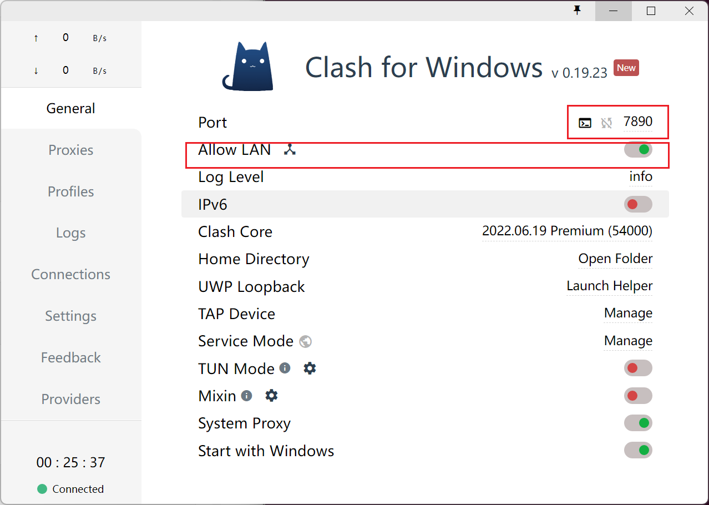

### 国内镜像源

> 镜像网站不只有pypi ，还有其他可各种开源工具可供下载

#### python从git安装三方包

**参考：**

- https://blog.51cto.com/u_15688254/5392139

①pip 从 git源码仓库直接install（安装git仓库中的包）

```shell
pip install git+http://127.0.0.1/xxx/demo.git --user
```

②pip 从git源码仓库中某一分支直接instal

```shell
pip install git + <git仓库地址>@分支名称
```


#### PIP镜像

```python
豆瓣镜像
    pip install 包名-i http://pypi.douban.com/simple/ --trusted-host pypi.douban.com
sudo pip3 install --trusted-host https://pypi.doubanio.com/simple/ requests

清华镜像
pip install -i https://pypi.tsinghua.edu.cn/simple/ 包名
pip install -i https://pypi.tuna.tsinghua.edu.cn/simple --trusted-host pypi.tuna.tsinghua.edu.cn 模块名

华为云镜像
pip3 install 模块 -i https://repo.huaweicloud.com/repository/pypi/simple

阿里镜像
http://mirrors.aliyun.com/pypi/simple/

中科大镜像
http://pypi.mirrors.ustc.edu.cn/simple/

北外大镜像
https://mirrors.bfsu.edu.cn/

永久配置镜像
pip config set global.index-url https://tuna.tsinghua.edu.cn/simple
```

pip设置全局镜像

```shell
pip config --global set global.index-url http://pypi.douban.com/simple 
pip config --global set install.trusted-host pypi.douban.com
```


#### GIT镜像  

**参考：** [(46条消息) pip设置全局镜像源_pip 设置全局镜像_梦无矶的博客-CSDN博客](https://blog.csdn.net/qq_46158060/article/details/122877004) 

```python
git clone https://github.com.cnpmjs.org/---.git
```


#### .gitignore

```txt
__pycache__
*.pyc
*venv/
Pipfile
.idea/
.vscode
.tox
.pytest_cache
htmlcov/
.DS_Store
.coverage
.sqlite3
CMQ_python_sdk.log
dispatcher/config/*.json
dump.rdb
.history
env/
.gitignore
*.egg-info
dist/
build/
*___*
*.js
*.css
*.html
demo.py
```


#### gitlib代码行数统计

**参考：**

- [项目代码行数统计](https://zhuanlan.zhihu.com/p/121746910) 

```shell
git log --author="huyan" --pretty=tformat: --numstat | awk '{ add += $1; subs += $2; loc += $1 - $2 } END { printf "added lines: %s, removed lines: %s, total lines: %s\n", add, subs, loc }' -
```


#### linux快速跳转目录脚本

> 在此目录下的脚本会开机自启， （需要重启）/etc/profile.d (都放在.bashrc文件中也可以)

**参考：**

- [(4条消息) Linux系统启动运行自定义脚本_qq_1034406352的博客-CSDN博客](https://blog.csdn.net/qq_35180423/article/details/120702360) 

```shell
#!/bin/sh  
# mark
export MARKPATH=$HOME/.marks
export MARKDEFAULT=sanguo#设置你的默认书签，可以直接输入g跳转

function g {
    local m=$1
    if [ "$m" = "" ]; then m=$MARKDEFAULT; fi
    cd -P "$MARKPATH/$m" 2>/dev/null || echo "No such mark: $m"
}
function mark {
    mkdir -p "$MARKPATH"
    local m=$1
    if [ "$m" = "" ]; then m=$MARKDEFAULT; fi
    rm -f "$MARKPATH/$m"
    ln -s "$(pwd)" "$MARKPATH/$m"
}
function unmark {
    local m=$1
    if [ "$m" = "" ]; then m=$MARKDEFAULT; fi
    rm -i "$MARKPATH/$m"
}
function gs {
    ls -l "$MARKPATH" | grep ^l | cut -d ' ' -f 13-
}

_completemarks() {
    local curw=${COMP_WORDS[COMP_CWORD]}
    local wordlist=$(ls -l "$MARKPATH" | grep ^l | cut -d ' ' -f 13)
    COMPREPLY=($(compgen -W '${wordlist[@]}' -- "$curw"))
    return 0
}

complete -F _completemarks g unmark
```

**使用方法：**

1. 添加标记：跳转到目标目录，使用命令`mark alisa_name` 标记路径并设置别名
2. 移除标记：使用命令`unmark alisa_name`移除`alisa_name`标记
3. 跳转标记点：使用命令`g alisa_name`，跳转标记点


#### .bashrc自定义命令别名映射

```shell
###########################################################
# 自定义命令别名映射
###########################################################
alias dc='docker-compose'

###########################################################
###########################################################
```


#### wsl2增加网络代理

> 网络安装耗时太久

**参考：**

- [为 WSL2 一键设置代理](https://zhuanlan.zhihu.com/p/153124468) 



1. 确保端口号对应，`Allow LAN`开启

2. 编写脚本

   ```shell
   # .bash  加载自定义代理配置
   ##########################################################
   ##########################################################
   # 从.bash_custom_proxy文件加载代理
   if [ -f ~/.bash_custom_proxy ]; then
           . ~/.bash_custom_proxy
   fi
   #########################################################
   #########################################################
   
   
   # .bash_custom_proxy  自定义代理配置
   function on_proxy() {
       host_ip=$(cat /etc/resolv.conf |grep "nameserver" |cut -f 2 -d " ")
       export all_proxy="http://$host_ip:7890"
       echo -e "代理已开启 all_proxy:$all_proxy"
   }
   
   function off_proxy(){
       unset all_proxy
       echo -e "代理已关闭 all_proxy:$all_proxy"
   }
   
   function test_proxy(){
       echo `curl -vv https://www.google.com`
   }
   ```

3. 测试是否访问成功

   ```shell
   on_proxy  # 指定shell函数，开启代理
   
   test_proxy  # 有返回则访问成功
   ```

   

