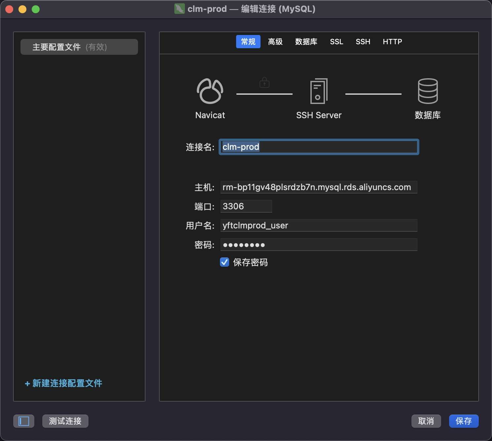

### Navicate使用技巧

##### 查看历史日志

Ctrl + L

## **pycharm 技巧**

##### 获取当前函数的调用层级

alt + F7

##### 快速删除

ctrl + y 快速删除这一行

##### pycharm 在调试中动态修改变量值

右键直接修改

##### 快速结束 pycharm 调试，（ 运行到光标处 ）

最后一个，需要先放置光标

##### 快速搜索目录

直接输入字符， 不用 ctrl+F

##### 快速查找 todo fix

##### 纵向选择

**参考：** [pycharm 垂直选择多行,alt+鼠标左键选择 - 那时一个人 - 博客园 (cnblogs.com)](https://www.cnblogs.com/qianxunman/p/12970483.html)

- shift + alt + 鼠标圈选

- 鼠标中间

##### 快速格式化

ctrl + alt + enter

##### 复写一行

选中一行 ctrl + d

##### 删除一行

ctrl + y

##### 快速格式化代码

ctrl + alt + L

##### 关闭选项卡快捷键修改

按键映射（Keymap）- 主菜单（Main Menu）- 窗口（Window）- 编辑器选项卡（Editor Tabs）- 关闭选项卡（Close Tab）

## navicate使用技巧

##### ssh借助跳板机连接线上环境

1. 121.199.39.69是待连接环境地址
2. 通行短语不需要
3. 数据库地址是阿里云地址

## chrome使用技巧

##### chrome的console中的过滤栏被意外隐藏后重新显示

**参考：** [(6条消息) 把Chrome的Console中的报错不小心隐藏掉后怎么显示出来_进阶的小名的博客-CSDN博客](https://blog.csdn.net/Tianc666/article/details/105066531) 

- 直接重置开发者工具

## windows使用技巧

##### 投影

**参考： ** [将一台笔记本电脑作为另一台笔记本电脑的扩展屏 - 知乎 (zhihu.com)](https://zhuanlan.zhihu.com/p/515867098) 

**条件：** 

1. win10, 或者 win11
2. 需要在同一WLAN（WIFI）下
3. 检查无线投影功能是否可用，需下载“无线显示器”功能，在图一界面找到下载即可 (添加可选功能-无线显示器)
