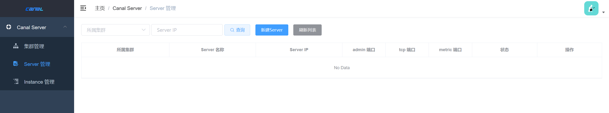

### canal环境搭建

**参考：**

- [(17条消息) 多个docker-compose共享网络并相互调用服务_前端开发-小通的博客-CSDN博客](https://blog.csdn.net/weixin_43960320/article/details/123231357#:~:text=数据库的docker-compose文件 1 我们可以使用 docker network,create my_net 创建一个网络，之后每个docker-compose.yml引用即可 2 也可以先启动数据库服务，最后api服务的docker-compose.yml引用数据库的网络即可，这里我使用这种方式) 
- [Canal高可用架构部署 - 腾讯云开发者社区-腾讯云 (tencent.com)](https://cloud.tencent.com/developer/article/1805726) 
- [Canal Admin 搭建 Canal 集群以及体验 - 掘金 (juejin.cn)](https://juejin.cn/post/6844904045325320199) 
- [(17条消息) (十四)Docker0网络详解_IT_狂奔者的博客-CSDN博客_docker0网卡的作用](https://blog.csdn.net/chj_1224365967/article/details/109206131) 

#### canal-admin-ui

```yaml
# canal-admin只是一个管理页面，没有canal-server也可以运行
version: '3'

services:
  canal-admin:
    image: canal/canal-admin:v1.1.5
    container_name: canal-admin
    ports:
      - "8089:8089"
    environment:
      - canal.adminUser=admin  # 用户名密码其实是直接写在数据库中的
      - canal.adminPasswd=123456  # 这里的密码明文展示
    volumes:
      - ./logs/:/home/admin/canal-admin/logs/
    networks:
      - canal-net
networks:
  canal-net:
```

**效果：**

> 访问http://127.0.0.1:8089进入canal-adminUI页面




#### canal-server

```yaml
version: '3'

services:
  canal-server:
    image: canal/canal-server:v1.1.5
    container_name: canal-server
    ports:
      - "11111:11111"
      - "11110:11110"
    environment:
      - canal.instance.mysql.slaveId=100 # 数据库从库ID，不能与主库ID相同
      - canal.auto.scan=false
      - canal.instance.master.address=172.17.0.1:3306  # 数据库容器IP
      - canal.instance.dbUsername=huyan
      - canal.instance.dbPassword=123
      
      - canal.instance.filter.regex=.*\\..*
      - canal.admin.port=11110
      - canal.admin.user=admin
      - canal.admin.register.auto=true
      - canal.admin.passwd=6BB4837EB74329105EE4568DDA7DC67ED2CA2AD9  # 这里的密码使用数据库加密设置
      - canal.admin.register.cluster=   # 集群设置，不填为空
      - canal.admin.manager=172.17.0.1:8089 # admin端容器的IP

    volumes:
      - ./logs/:/home/admin/canal-server/logs/

    networks:
      - canal-admin_canal-net
networks:
  canal-admin_canal-net:
    external: true
```

**网络部分：**

`canal.instance.master.address` 和 `canal.admin.manager` 的网络设置其实都是直接访问了整个docker的网卡 `docker0` 

**参考：**

- [(17条消息) (十四)Docker0网络详解_IT_狂奔者的博客-CSDN博客_docker0网卡的作用](https://blog.csdn.net/chj_1224365967/article/details/109206131) 


#### 数据库binlog日志权限开启与canal账号设置

```ini
# my.cnf
[mysqld]
pid-file        = /var/run/mysqld/mysqld.pid
socket          = /var/run/mysqld/mysqld.sock
datadir         = /var/lib/mysql
secure-file-priv= NULL

log-bin=mysql-bin # 开启 binlog
binlog-format=ROW # 选择 ROW 模式
server_id=1 # 配置 MySQL replaction 需要定义，不要和 canal 的 slaveId 重复
log_slave_updates=1 # 让从库日志也写到binlog
```

```sql
# 增加canal账号，并刷新权限
CREATE USER canal IDENTIFIED BY 'canal';  
GRANT SELECT, REPLICATION SLAVE, REPLICATION CLIENT ON *.* TO 'canal'@'%';
FLUSH PRIVILEGES;
```

