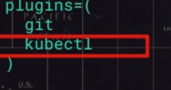

#### oh-my-zsh安装

> 这是一个shell命令行，支持多种插件，提供更强大的命令补全

安装脚本

**参考：**

- https://zhuanlan.zhihu.com/p/35283688 

```shell
sh -c "$(curl -fsSL https://gitee.com/mirrors/oh-my-zsh/raw/master/tools/install.sh)"
```

卸载

```shell
uninstall_oh_my_zsh
```

注意：

默认主题中，会默认安装 git 插件，这个插件带有很多 别名快捷操作，会跟便捷跳转冲突，需要删除重启




#### 常用插件

##### **kubectl**

```shell
# 进入Oh-My-Zsh的plugins目录
cd ~/.oh-my-zsh/plugins/

# 在其下建立kubectl目录
mkdir kubectl

# 下载插件
wget https://d.frps.cn/file/kubernetes/oh-my-zsh/kubectl/kubectl.plugin.zsh
```

