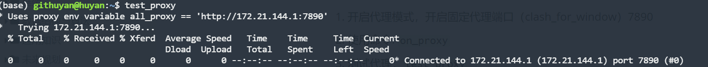

#### linux代理设置

> 在linux环境开启代理，用于下载国外工具包
>
> 放在linux脚本目录，如.bashrc, profile.d，在此目录下的脚本会开机自启， （需要重启）/etc/profile.d (都放在.bashrc文件中也可以)


##### 源码（linux）

```shell
function on_proxy() {
    host_ip=$(cat /etc/resolv.conf |grep "nameserver" |cut -f 2 -d " ")
    export all_proxy="http://$host_ip:7890"
    echo -e "代理已开启 all_proxy:$all_proxy"
}

function off_proxy(){
    unset all_proxy
    echo -e "代理已关闭 all_proxy:$all_proxy"
}

function test_proxy(){
    echo `curl -vv https://www.google.com`
}
```


##### 使用方法

1. 开启代理模式，开启固定代理端口（clash_for_window）7890
2. 使用命令: `on_proxy`
3. 测试代理：`test_proxy`
4. 关闭代理：`off_proxy1`


##### 注意事项

1. 此脚本需要放在linux指定目录，才能开机自启
2. 开启代理需要`clash_for_window`开放固定代理端口 7890


##### 效果展示





