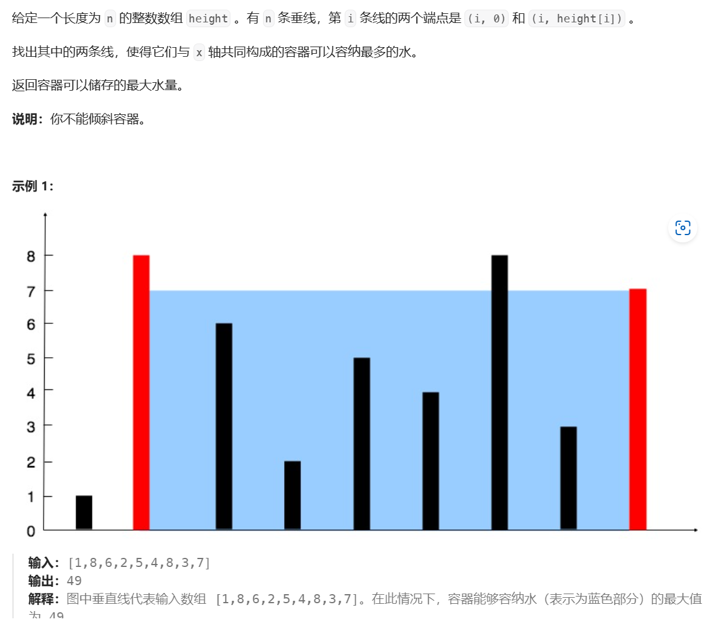

##### [盛最多水的容器]([11. 盛最多水的容器 - 力扣（LeetCode）](https://leetcode.cn/problems/container-with-most-water/?envType=study-plan-v2&envId=top-100-liked)) 

**思路**

1. 什么是最大水量，最大水量怎么算？计算公式？
2. 规律是什么？如果是双指针，那么移动标准是什么？