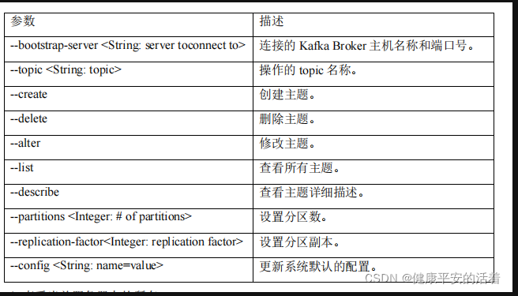

## kafka常用命令

```shell
bin/kafka-topics.sh --bootstrap-server localhost:9092 --create --topic test1 --partitions 2 --replication-factor 2
```



**--describe:**

> 此时开启了两个broker，一个名为 test1 的Topic，3个分区，2个副本

```python
githuyan@DESKTOP-11VL9CJ:/opt/kafka$ bin/kafka-topics.sh --bootstrap-server localhost:9092 --describe
Topic: test1    TopicId: dRuKt0Y1SEqfMHYQYMBw9g PartitionCount: 3       ReplicationFactor: 2    Configs: segment.bytes=1073741824
        Topic: test1    Partition: 0    Leader: 0       Replicas: 0,1   Isr: 0,1
        Topic: test1    Partition: 1    Leader: 1       Replicas: 1,0   Isr: 1,0
        Topic: test1    Partition: 2    Leader: 0       Replicas: 0,1   Isr: 0,1
# 此时可以看到，Partition0 的 leader 是Replicas0,ISR顺序是 [Replicas0,Replicas1]
# 按理来说，两个副本应该均匀的分布在两个broker上
```


**注意：**

- partitions（分区数）只能增加不能减少
- 无法通过 --alter 命令修改replication（副本）数


## Replicates

在创建主题的时候指定副本

在启动broker的时候配置副本


## 移位重设

> 通过移位重设实现了消息确认机制， 在第一个消费者创建的时候设置移位

**参考：**

- [Kafka 消费者组位移重设的几种方式 - 掘金 (juejin.cn)](https://juejin.cn/post/7034447850066935844) 

移位重设策略：

- **earliest**

  > 把位移重设到当前最早位移处。
  >
  > **注意：**  Kafka 会删除较早的日志，因此，最早的位置不一定是 0

  ```python
  bin/kafka-consumer-groups.sh --bootstrap-server <host>:<port> --group <group_id> --reset-offsets --all-topics --to-earliest –execute
  ```

- **latest**

  > 把位移重设到当前最新位移处。跳过所有历史消息，从最新的消息开始消费

  ```python
  bin/kafka-consumer-groups.sh --bootstrap-server <host>:<port> --group <group_id> --reset-offsets --all-topics --to-latest –execute
  ```

- **current**

  > 把位移重设到当前最新提交的位移处。

  ```python
  bin/kafka-consumer-groups.sh --bootstrap-server <host>:<port> --group <group_id> --reset-offsets --all-topics --to-current –execute
  ```

- **specified-offset  和  Shift-By-N**

  > 把位移重设到一个指定的位移处。或者一个相对的位移（+n)
  >
  > 用于某一段时间消息因外部原因无法消费，需要跳过的场景
  >
  > **注意：** 这里的 n 也可以是负数，表示之前。

  ```python
  # --to-offset <offset>
  bin/kafka-consumer-groups.sh --bootstrap-server <host>:<port> --group <group_id> --reset-offsets --all-topics --to-offset 100 –execute
      
  #  --shift-by <offset_N>
  bin/kafka-consumer-groups.sh --bootstrap-server <host>:<port> --group <group_id> --reset-offsets --all-topics --to-shift-by -100 –execute
  ```

- **dateTime** 

  > 把位移重设为指定时间之后第一个位置

  ```python
  # 这个时间格式可能有点问题？？
  bin/kafka-consumer-groups.sh --bootstrap-server <host>:<port> --group <group_id> --reset-offsets --all-topics --to-datetime 2021-11-25T20:00:00.000 –execute
  ```

- **duration**

  > 把位移重设为与当前时间相对的一个时间点之后的第一个位置。（相对时间）

  ```python
  # 对于 Duration 策略，需要提供一个符合 ISO-8601 规范的 Duration 格式，以字母 P 开头，后面由 4 部分组成，即 D、H、M 和 S，分别表示天、小时、分钟和秒
  bin/kafka-consumer-groups.sh --bootstrap-server <host>:<port> --group <group_id> --reset-offsets --all-topics --by-duration PT0H30M0S –execute
  ```

## 消息交付语义

**参考：**

- [(8条消息) Kafka的三种语义_简单随风的博客-CSDN博客_kafka三种语义](https://blog.csdn.net/lt326030434/article/details/119881907) 

#### at-last-one

> 至少一次，保证消息一定会被消费，但可能会重复消费
>
> 消费者的消息处理完并输出到结果库，但是offset还没提交，这个时候消费者挂掉了，再重启的时候会重新消费并处理消息，所以至少会处理一次

实现至少一次消费语义的消费者也很简单。

1. 设置enable.auto.commit为false，禁用自动提交offset
2. 消息处理完之后手动调用consumer.commitSync()提交offset

这种方式是在消费数据之后，手动调用函数consumer.commitSync()异步提交offset，有可能处理多次的场景是消费者的消息处理完并输出到结果库，但是offset还没提交，这个时候消费者挂掉了，再重启的时候会重新消费并处理消息，所以至少会处理一次

#### at-most-once

> 至多一次， 保证不会重复消费，但可能会丢失消息
>
> 消费者的offset已经提交，但是消息还在处理中(还没有处理完)，这个时候程序挂了，导致数据没有被成 功处理，再重启的时候会从上次提交的offset处消费，导致上次没有被成功处理的消息就丢失了

```python
# 改配置
# 这个配置使得kafka会有一个独立的线程负责按照指定间隔提交offset
enable.auto.commit = true
auto.commit.interval.ms=10  # 设置一个较小的时间范围
```

至多一次消费语义是kafka消费者的默认实现。配置这种消费者最简单的方式是

> 消息还没处理完就开始提交offset
>

1. enable.auto.commit设置为true。
2. auto.commit.interval.ms设置为一个较低的时间范围。
   由于上面的配置，此时kafka会有一个独立的线程负责按照指定间隔提交offset。

消费者的offset已经提交，但是消息还在处理中(还没有处理完)，这个时候程序挂了，导致数据没有被成 功处理，再重启的时候会从上次提交的offset处消费，导致上次没有被成功处理的消息就丢失了。

#### exactly-once

> 恰好一次， 完美的方式
>
> 以原子事务的方式保存offset和处理的消息结 果，这个时候相当于自己保存offset信息了，把offset和具体的数据绑定到一块，数据真正处理成功的时 候才会保存offset信息

这种语义可以保证数据只被消费处理一次。

1. 将enable.auto.commit设置为false，禁用自动提交offset
2. 使用consumer.seek(topicPartition，offset)来指定offset
3. 在处理消息的时候，要同时保存住每个消息的offset。

以原子事务的方式保存offset和处理的消息结 果，这个时候相当于自己保存offset信息了，把offset和具体的数据绑定到一块，数据真正处理成功的时 候才会保存offset信息

这样就可以保证数据仅被处理一次了。


