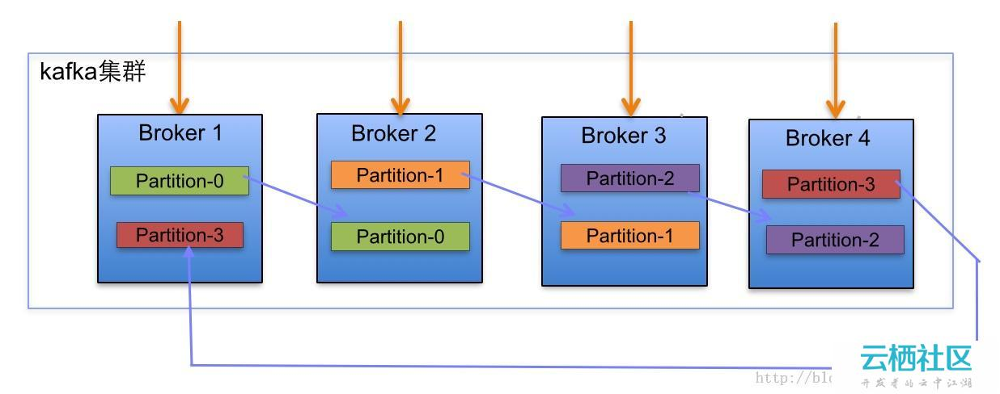
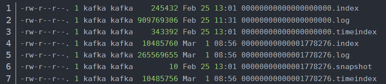
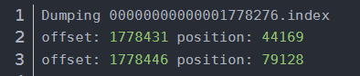
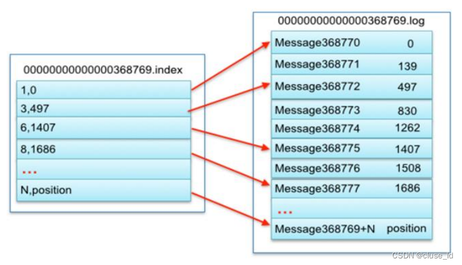
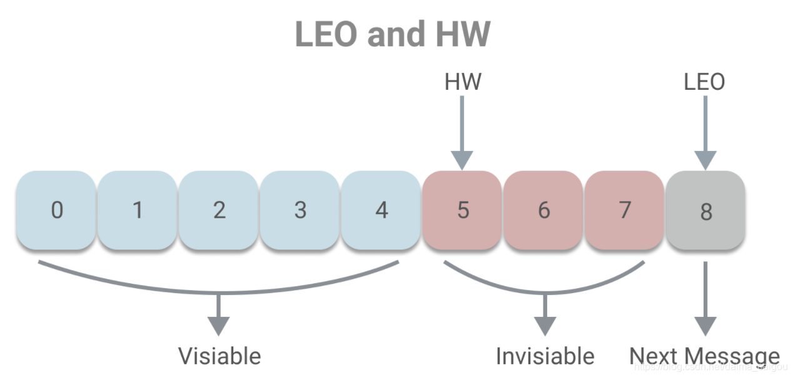
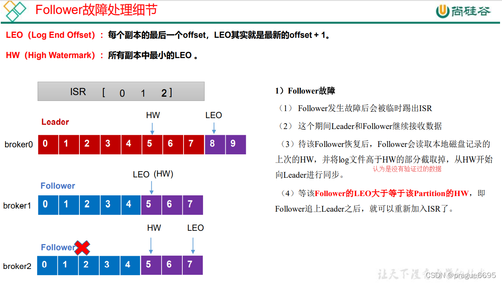
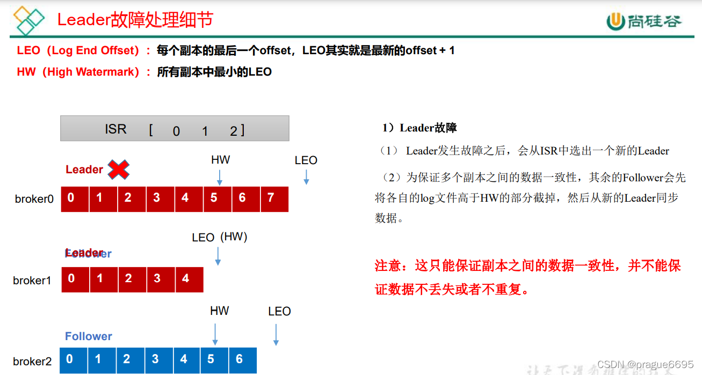
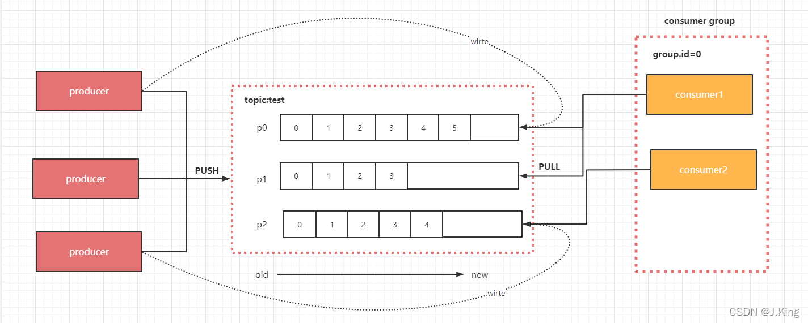

# kafka

> 一个分布式流处理框架，用于实时构建流处理应用，经常被应用为企业级消费引擎。

## Broker（kafka实例）

> broker是kafka的实例，每台服务器可以起多个kafka实例

## Topic（主题）

> topic是消息的分类，每个broker可以创建多个topic

## Partition（分区）

> 一个partition其实就是一个有序的消息队列（分区有序不代表整体有序）

**参考：**

- [(10条消息) kafka的topic,broker,partition之间的关系_小甄笔记的博客-CSDN博客_kafka分区与broker关系](https://blog.csdn.net/qq_36042938/article/details/114320342#:~:text=一个 topic 对应多个 partition ， partition 分布在多 broker,partition ，同一个 Topic 下 的 不同 的partition 包含不同消息。) 



<center>（这个图极好）</center>

### **partition（分区）的特点:**

1. **每个Topic可划分多个partition，这些partition中的消息类别是相同的，但同一个Topic的不同分区的数据是不重复的**

   > 同一个Topic下的不同的partition包含相同类型的不同消息。每个消息被添加至分区时，分配唯一offset，以此保证partition内消息的顺序性。

2. **同一个Topic的多个partition可能分布在多个broker中 -- 如上图**

   > 以broker区分集群内服务器，同一个topic下，**多个partition可以经hash到不同的broker**

   在 kafka 中，一条消息由key、value两部分构成，Producer 发送消息的时候，可以指定一个 Partition Key，这样就可以写入特定 Partition 了，这条消息的 partition key会被传递个一个hash函数，拥有相同partition key 的消息会被分到同一个partiotion中	

3. **每个分区只能被消费者组中的一个消费者消费，但消费者组中的消费者能消费不同的分区**

   > 提升性能的方法便是增加分区，增加消费者，当消费者数量大于分区数量时，性能不再提升，因为会有消费者处于等待状态。

### partition（分区）的目的：

> 作用是做负载，提高kafka的吞吐量

1. 便于扩展，只需要增加一个broker实例，就可以再创建一个topic，又可以多出许多分区
2. 提高并发， 这增加出的许多分区，可以被更多的消费者并发消费

```python
# 在server.conf中通过num.partitions参数指定创建topic时包含多少个partition。默认是num.partitions=1
```

### partition中segment文件存储结构

> **segment file组成：由2大部分组成，分别为index file和data file，此2个文件一一对应，成对出现，后缀".index"和“.log”分别表示为segment索引文件、数据文件.**
>
> partiton命名规则： topic名称+有序序号，第一个partiton序号从0开始，序号最大值为partitions数量减1
>
> segment命名规则：partion全局的第一个segment从0开始，后续每个segment文件名为上一个segment文件**最后一条消息的offset值**。数值最大为64位long大小，19位数字字符长度，没有数字用0填充。

**参考：**

- [Kafka文件存储机制及partition和offset - 你的泪我的眼 - 博客园 (cnblogs.com)](https://www.cnblogs.com/yitianyouyitian/p/10287293.html) -- 极好
- [(10条消息) kafka日志分段（.log文件）及日志文件索引机制（偏移量索引、时间戳索引）_千与千与千的博客-CSDN博客_kafka 日志文件](https://blog.csdn.net/liu_feng_zi_/article/details/123207695) --极好

每个partition为一个目录，partiton命名规则为topic名称+有序序号，第一个partiton序号从0开始，序号最大值为partitions数量减1



如图，这里有两个segment

每一个partition的文件夹，其中的.index，.log文件分别存储message的索引和数据，这些文件就是一个segment的概念，使用相应的配置可以修改这些文件的大小和存储位置，当一个文件存储的数量到达预定阈值时，就会重新创建一个segment，有着另一个.index，.log文件

```python
# 配置
log.segment.bytes=1073741824(1G)  # 每个partition文件存储的message大小
log.dirs=/tmp/kafka-logs  # 分区的消息数据存储路径
```

**index文件内容：**



1. **position**对应**log**文件中的**position**

   > 为这一批消息的起始position

2. **offset**对应**log**文件中的**lastOffset** 

   > 这里的offset是因为kafka是批量创建消息，这里的offset实际上是这一批消息的最后一个offset，所以图中可以看到 1778276文件的第一行的offset并不是+1，是因为上一批有1778431-1778276个消息

**log文件内容：**

一条**批消息**（Record Batch）日志记录，包含多条的实际数据

> 批消息：kafka是批量创建消息

1. lastOffset - baseOffset + 1 = count，baseOffset和lastOffset为批消息中第一条记录和最后一条记录的偏移量，在整个topic分区中的偏移量，count为批消息中包含的记录数

2. **position为批消息的起始位置（这里应该是物理地址），每个log文件中，position 都是从0开始的**

3. **CreateTime**在批消息中为批消息中最后一条记录的创建时间，在记录中为记录的创建时间

4. **size**为批消息的大小，从内容可以看出，前一条批消息的position，加上前一条消息的size，结果为后一条消息的position

   > 这里体现了字节控制

5. **offset**为记录的偏移量，整个topic分区中的偏移量

6. **valuesize**为一条记录的大小

**index和log的对应关系：** 



### 在partition中查找message

> Kafka为每个分段后的数据文件建立了索引文件，文件名与segment文件的名称是一样的只是扩展名为.index。index文件中并没有为数据文件中的每条Message建立索引，而是采用稀疏存储，每隔一定字节建立一条索引。避免了索引文件占用过多空间。

1. **通过offset查找message**

   ```python
   # 例如读取offset=368776的message，需要通过下面2个步骤查找
   1. 根据二分查找，定位数据所在的log和index文件
   2. 通过二分查找，定位到<=指定偏移量的批消息offset
   3. 再通过二分查找获取指定的消息
   ```

2. **通过时间戳查找message**

   ```python
   
   ```

### partition消息过期

**参考：**

- [(10条消息) kafka消息过期时间设置（全局和特定topic）_尺规作图的博客-CSDN博客_kafka消息过期时间](https://blog.csdn.net/u012809308/article/details/110006925) 

**kafka全局消息设置**

> 该种设置消息过期时间的优点是可以对所有topic全部生效，缺点是需要**重启kafka**服务，造成服务短暂的不可用！

```python
# config/server.properties
log.retention.hours=168  (配置该参数即可，默认7天)
log.cleanup.policy=delete （默认，可不配置）
```

**针对特定topic设置过期时间**

> 不需要重启

```python
# kafka/bin
./kafka-configs.sh --bootstrap-server <host>:<port> --alter --entity-name my_topic--entity-type topics --add-config retention.ms=86400000
```

**kafka过期消息删除过程**

> kafka至少会保留1个工作segment保存消息。消息量超过单个文件存储大小就会新建segment，

kafka是在**segment的维度**删除消息，批量删除，效率很高，但是会出现超过过期时间的消息依然存在的情况，无伤大雅。

```python
# kafka定时扫描非工作segment,发现过期会打上.delete标记，kafka中有专门的定时任务删除kafka，
00000000000108550131.log.deleted
00000000000108550131.index.deleted
00000000000108550131.timeindex.deleted
```

## Replication（副本）

> 每个topic可以有很多个partition，每个partition可以有多个replica。这些replica都保存在brokers上，分为两种，**Leader Replica**， **Follower Replica**
>
> leader的选择保证load balance（负载均衡）
>
> partition的Leader可以读写，而Follower只能读，同步Leader的数据


<center>此图有四个实例，两个副本</center>

### Leader选举

> kafka的所有Broker都会注册到kafka集群中去。kafka集群会选举一个Broker作为Leader作为kafka集群的总控制器**Controller**。他负责管理整个集群所有分区Partition和副本follower的状态。

**参考：**

- [(10条消息) Kafka副本Leader选举流程_cluse_ld的博客-CSDN博客](https://blog.csdn.net/Laoddaaa/article/details/126182054) 

==这里有个问题，这个选举出的broker级的Leader控制器他也只能管理这个集群中的所有分区，并不能管理其他broker中的分区?==

```powershell
# 开启了2个broker，创建了1个名为test1的Topic， 3个分区，2个副本
githuyan@DESKTOP-11VL9CJ:/opt/kafka$ bin/kafka-topics.sh --bootstrap-server localhost:9092 --describe
Topic: test1    TopicId: T8a3_nwIQPaR_-7eqq4ChA PartitionCount: 3       ReplicationFactor: 2    Configs: segment.bytes=1073741824
        Topic: test1    Partition: 0    Leader: 0       Replicas.: 0,1   Isr: 0,1
        Topic: test1    Partition: 1    Leader: 1       Replicas: 1,0   Isr: 1,0
        Topic: test1    Partition: 2    Leader: 0       Replicas: 0,1   Isr: 0,1
        
# 第二列 三个副本
# 第三列 这三个副本的Leader序号（因为只有两个Broker）
# 第四列 AR副本列表
# 第五列 每一个分区的ISR列表都有两个副本
```

**Controller:**

> Kakfa启动时会在所有broker中选择一个controller，创建Topic，Leader的选举，添加分区，修改副本数量之类的管理任务都由controller完成
>
> controller的选举是通过ZK注册的方式产生的，集群启动时所有的broker会尝试在ZK上竞争注册（通过RPC的方式响应调用），这是高可用的，一旦controller崩溃，会有其他的broker重新注册为controller

==这里有个问题，如果不是controller的broker崩了，那这个broker岂不是直接不可用了，它的所有分区，所有副本都将失效？==

**Controller选举partition leader**

controller读取到当前分区的ISR，只要有一个Replica还幸存，就选择其中一个作为leader否则，则任意选这个一个Replica作为leader

如果该partition的所有Replica都已经宕机，则新的leader为-1


**为什么不能通过ZK的方式来选举partition的leader？**

Kafka集群如果业务很多的情况下，会有很多的partition，假设某个broker宕机，就会出现很多的partiton都需要重新选举leader，如果使用zookeeper选举leader，会给zookeeper带来巨大的压力。所以，kafka中leader的选举不能使用ZK来实现


### 基于ISR机制的完全同步

> 保证Producter发送消息的可靠性：给每个partition都给配上副本，做数据同步，保证数据不丢失
>
> **ISR 的核心就是：动态调整**， ISR的机制就保证了，处于ISR内部的follower都是可以和leader进行同步的，一旦出现故障或延迟，就会被踢出ISR。
>
> **Kafka采用的就是一种完全同步的方案，而ISR是基于完全同步的一种优化机制**

```python
# 同步复制
Follower同步Leader过程中处于阻塞状态，所有的replicas全部完成同步，这个提交的消息的状态才是 commit，这条消息对于consumer才可见
# 异步复制
Follower同步Leader过程不阻塞，只要leader完成写入log，这条消息就被标记为commit，就对consumer可见，如果leader突然崩溃可能会造成消息丢失
```

**参考：**

- [(10条消息) Kafka之ISR机制的理解_搬砖党弟中弟的博客-CSDN博客_isr机制](https://blog.csdn.net/daima_caigou/article/details/109390705) -- 极好

**AR**（Assigned Repllicas）一个partition的所有副本（就是replica，不区分leader或follower）

**ISR**（In-Sync Replicas）能够和 leader 保持同步的 follower + leader本身 组成的集合。

> kafka只对ISR中的副本进行完全同步

**OSR**（Out-Sync Relipcas）不能和 leader 保持同步的 follower 集合

```python
1. 一旦partition的副本被判断为失去同步，就会被踢出ISR进入OSR
2. 新增加的副本也是不满足ISR条件的，会被判断为OSR
3. 刚宕机恢复的副本也是不满足ISR的，会被判断为OSR
```

公式：AR = ISR + OSR


#### 消息副本同步的流程

```python
# 这参数的意义是，规定Follower副本必须在此时间间隔内赶上Leader副本，完成同步（LEO（此副本）>= HW（Leader）
replica.lag.time.max.ms  # 配置默认10000 即 10秒
```

**LEO**（last end offset）： **当前replica存的最大的offset的下一个值**

**HW**（high watermark）：**小于 HW 值**的offset所对应的消息被认为是“已提交”或“已备份”的消息（高可用），才对消费者可见。



1. 数据写到leader的partition上 
2. leader更新自己的leo
3. follower带上自己的leo请求同步leader
4. .leader更新follower列表每个follower对应的leo
5. Leader尝试更新ISR 
6. Leader取follower的leo列表最小值做hw并尝试更新
7. Leader将hw返回follower
8. follower更新自己的leo 
9. follower取自己的hw和leader返回的hw做对比取最小值更新。


#### ISR伸缩

> 失效副本：1. 功能失效 2. 同步失效

**功能失效导致的ISR伸缩：**

> broker宕机，在该节点上的副本都属于功能失效副本。

**同步失效导致的ISR伸缩：**

> 因为带宽或者负载等因素无法及时完成同步
>
> follower 副本所在的 broker 因为带宽或者负载等因素无法及时完成同步，导致被踢出 ISR。
>
> lastCaughtUpTimeMs  # 此副本最后一条消息的同步时间，（follower 副本把 leader 副本 LEO之 前的日志全部同步完成时，则认为 follower 副本已经追赶上了 leader 副本，这个时候会更新这个副本的lastCaughtUpTimeMs 标识）

**参考：**

- [kafka 消息分发机制、分区和副本机制_J.King的博客-CSDN博客_消息分发](https://blog.csdn.net/weixin_43281498/article/details/124233357) 
- [KAFKA 入门：【六】能否深入聊一下 ISR 的伸缩过程？ - Keepal - 博客园 (cnblogs.com)](https://www.cnblogs.com/keepal/p/16341759.html)   -- 极好

**每个 broker 在启动的时候都会启动两个定时任务**

> 1. leader 所在的 broker 的 `isr-expiration` 定时任务，去检查失效副本和更新 zk 的 /state 节点数据，同时写入 `isrChangeSet`
> 2. 去检查 isrChangeSet 是否有新增数据，如果有，则往 zk 中的 `/isr_change_notification` 节点下创建子节点，固定执行周期为 2.5s
> 3. 最终由 Controller 感知到节点的变化，然后从 zk 中获取最新的元数据，然后通知所有的 Broker 更新元数据，完成整个 ISR 列表的数据更新

- isr-expiration

  > 看当前 Leader 的 ISR 列表中是否存在失效副本，默认执行周期为 replica.lag.time.max.ms / 2 = 5s。

  ```python
   # 只有当 follower 完全追上了 Leader 才更新lastCaughtUpTimeMs，而不是每 Fetch 一次就更新，这个参数更像是一个速率的概念
  lastCaughtUpTimeMs
  
  # 则说明 follower 在 replica.lag.time.max.ms 都没能追上 leader 的 LEO，就会被认定为失效，从而踢出 IS 列表，此副本被踢出ISR
  now(Leader) - lastCaughtUpTimeMs(Follower) > replica.lag.time.max.ms 
  ```

- isr-change-propagation

  > 去检查 isrChangeSet 是否有新增数据，如果有，则往 zk 中的 `/isr_change_notification` 节点下创建子节点，固定执行周期为 2.5s

**重新将副本添加进ISR**

> 主要差别点在于，ISR 列表的扩张是在 Fetch 请求的时候去判断和执行的。

```python
1. 当Follower先Leader申请同步时（Fetch），会携带自身的LEO，Leader会判断 LEO（此副本）>= HW（Leader）（副本的同步已经赶上了Leader）
2. 是则将此副本写入isrChangeSet
3. 然后由isr-change-propagation实现ISR扩容
```

### 副本错误处理

#### Follower错误处理




#### Leader错误处理




## Producter（生产者）

### 消息分发

> 默认情况下，kafka采用的是 hash 取模的分区算法。如果 Key 为 null，则会随机分配一个分区。这个随机是在这个参数metadata.max.age.ms的时间范围内随机选择一个。对于这个时间段内，如果key为 null，则只会发送到唯一的分区。这个值默认情况下是10分钟更新一次。

**Metadata：** 每一个 topic 的每一个 partition，需要知道对应的 broker 列表是什么，leader 是谁、follower 是谁。这些信息都是存储在 Metadata 这个类里面。

### 生产一致性策略

1. **acks = 0 :** 

   > 意味着producer不等待leader同步完成的确认，继续发送下一条(批)信息，容易丢数据。

2. **acks = 1（默认）：**

   > 意味着producer要等待leader成功收到数据并得到确认，才发送下一条message。此选项提供了较好的持久性较低的延迟性。如果Leader宕机，follower尚未复制，数据就会丢失。

3. **acks = -1/all ：**

   > 意味着producer得到所有follower(ISR)确认，才发送下一条数据。除极端ISR里没有任何follower的情况，都不会丢数据。
>
   > 可能会出现重复（follower节点数据同步完成且leader节点未发送ack，leader宕机后，producer未收到ack，会继续发送导致数据重复）

   

## Consumer（消费者）

> **增减 consumer、broker、partition都会导致 rebalance，所以 rebalance 后 consumer 对应的 partition会发生变化**
>
> 如果 consumer 从多个 partition 读到数据，不保证数据间的顺序性，kafka 只保证在一个 partition 上数据是有序的




### Consumer的重平衡机制（Reblance）

> 在 Rebalance 的过程中 consumer group 下的所有消费者实例都会停止工作，等待 Rebalance 过程完成。

**触发重平衡的条件**

1. 有Consumer加入或者退出Consumer Group

   > Consumer消费超时，长响应，（会被GroupCoordinator(组协调器)认为此consumer下线）

2. Consumer Group 对应的GroupCoordintr节点变更

3. 消费者组订阅Topic变更，或者主题Partition数量变更

### 重平衡分区分配策略

- **range**：按照分区序号排序，假设 n＝分区数／消费者数量=3，假设10个分区，3个消费者，那么分区划分为1-3,4-6,7-10

- **round-robin策略**：轮询分配，比如分区0、3、6、9给一个consumer，分区1、4、7给一个consumer，分区2、5、8给一个consumer

- **sticky策略**：在rebalance的时候，需要保证如下两个原则。

  > 分区的分配要尽可能均匀。
  > 分区的分配尽可能与上次分配的保持相同。
  >
  > sticky策略当两者发生冲突时，第一个目标优先于第二个目标。


## 一些问题

1. 解决消息确认机制的问题，

   移位（offset），传统的消息确认机制包括，consumer从broker中获取消息进行消费，broker更新消息状态为send， consumer消费结束后返回标志符，broker再更新消息装填为consumed，但是这个过程可能会出现大量的消息不一致和性能问题：

   - 重复消费，consumer处理了消息，但是发送标志的时候出错
   - broker存储大量的状态（为了保持一致性，需要加锁），造成性能浪费

2. 副本的撕裂

   如果有5个副本，2个分布在河南的broker，3个分布在深圳的broker，深圳的一个broker宕机，且中断了河南和深圳的联系，那么就会在河南和深圳就会出现两个leader

   > 应该不会出现这种情况，深圳和河南的两个broker一定是有一个为leader（broker级）

---


## 性能优化

1. 优化大量的小型I/O操作

   产生了消费者组的概念，假设我们在处理大量的web活动数据，通过合理的将消息分组，是的网络请求将多个消息打包成一组，而不是每次发送一条消息，Consumer每次获取多个大型有序的消息块，批处理操作使得允许更大的数据包，更大的顺序读写磁盘操作，和连续的内存块，讲这些顺序写入磁盘，获得性能提升。

2. 优化字节拷贝

   消息量极大时就会对性能产生影响。通过格式化消息的流动，从producter，broker，consumer 都共享标准化的二进制消息格式，这样消息的传递就不需要修改。解决字节拷贝的问题。

3. 使用零拷贝技术


## Push or Pull

> consumer获取数据的方式，kafka采用 pull-base 方案

**Push-base**

> producter  --push--> broker --push-->consumer

```python
# 优点：
1. consumer能以尽可能的最大速率消费
# 缺点：
1. 可能会使consumer不堪重负（拒绝服务攻击）
2. 由于 broker 控制着数据传输速率， 所以 push-based 系统很难处理不同的 consumer
```

**Pull-base**

> producter  --push--> broker,  consumer --pull-->broker

```python
# 优点：
1. consumer占据主导，可以自己选择消费何种类型的消息
2. producter可以足够快，broker可以出现消息挤压，consumer后面在空闲的时候消费
# 缺点：
如果broker中没有数据，consumer可能会出现busy轮询，直到有消息待消费， 这里可以在消费时加参数，设置 long pull
```


