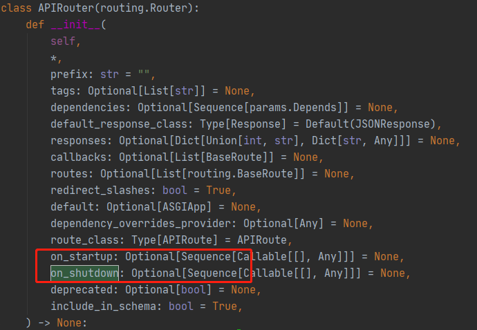

## FastApi


APIRouter.on_startup

> 这个不是中间件，这个也不是依赖项， 仅仅是特殊定义的启动和关闭时的钩子函数**（就是一个特殊处理）** 
>
> 中间件在 starlette 的 user_middleware 序列中
>
> 依赖项在 app 的 dependencies 序列中



```python
# 通过装饰器将处理函数注册到APP的on_startup属性列表中，类似于钩子函数
@app.on_event('startup')
async def startup_event():
    pass
```

