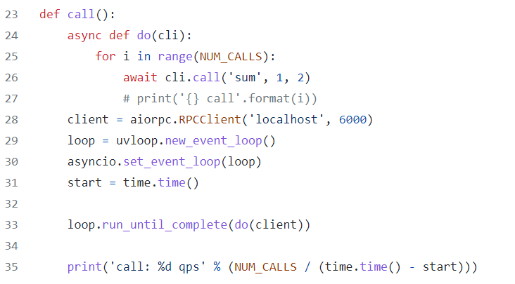
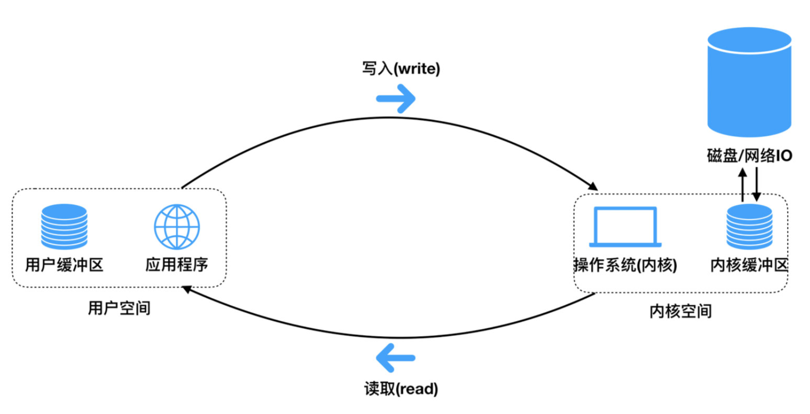

## 异步 I/O 和协程是两个概念

**参考：**

- [异步编程基础](https://python-gino.org/docs/zh/1.1b2/explanation/async.html) --极好

**例子：**

- https://github.com/choleraehyq/aiorpc/blob/master/benchmarks/benchmark_aiorpc_inet.py

这是一个压测的例子，NUM_CALLS是压测数量，正常情况下，一个线程只能运行一个阻塞IO操作，如web请求，但是协程的出现使得一个线程可以同时运行多个IO，`loop.run_until_complete(do(client))` 虽然有`await cli.call('sum', 1, 2)` 会等待处理结果，但是有偶遇`cli.call()` 操作是IO操作，使得可以同时启动多个。

### 协程及其相关

> 进程，线程，协程的区别

#### 进程

> 一个在内存中运行的应用程序。每个进程都有自己的独立空间，一个进程可以有多个线程

1. 进程是操作系统资源分配的基本单位，cpu资源，内存资源
2. 资源独立，更好的资源管理和保护
3. 健壮性更好，一个进程崩溃，不会对其他进程产生影响
4. 执行开销大，进程切换消耗的资源大
5. 可高并发

#### **线程**

> 基于多线程来实现并发，在系统遭遇I/O阻塞时，会由一个算法自动进行线程的切换

1. 线程是处理器任务调度和执行的基本单位
2. 共享本进程的资源如内存，I/O,CPU等，不利于资源的管理和保护
3. 健壮性差，一个线程崩溃，整个进程都会死掉
4. 不能独立执行，执行开销小
5. python不能实现真正的并行，

#### 协程

> 基于协程来实现并发，
>
> 线程和进程的操作是由程序触发系统接口，最后的执行者是系统，系统会自动执行I/O阻塞时线程的切换，；协程的操作则是程序员,当程序中存在大量不需要CPU的操作时（例如 I/O），适用于协程，由程序直接完成I/O切换，相对于线程来说节省了线程切换时的资源。

1. 和线程一样，相对独立，有自己的上下文
2. 协程的切换由自己控制，避免了不必要的上下文切换和竞态条件
3. 数据结构简单
4. 协程是单线程，在协程中控制共享资源不加锁

**协程的优势**

- 线程遇到I/O阻塞时，会由系统进行线程的切换，而协程则是直接由程序完成I/O切换，相对于线程来说节省了线程切换时的资源
- 节约内存，系统会给每个线程分配一定大小的栈内存（8M）和堆内存（64M），线程数量有瓶颈；而协程的栈通常只有十几K，并且是从线程的堆里面分配出来的，数量受限小
- 协程简单，开发效率高，可以利用协程将一些耗时操作异步化；
- 协程是单线程，所以操作共享资源不加锁

**通信方式**

- 管道
- 通信队列
- 信号量（锁）

### I/O模型

> **I/O的本质**
>
> 1. 内存分为内核缓冲区和用户缓冲区
>
> 2. 用户的应用程序不能直接操作内核缓冲区，需要将数据从内核拷贝到用户才能使用
>
> 3. 而IO操作、网络请求加载到内存的数据一开始是放在内核缓冲区的  ==todo==
>
>    > 假设一个RPC请求，接收到响应之后，网络传输过来的数据由硬件（网关，CDN，I/O，串口之类的）写到内核缓冲区，然后再由程序读取到用户缓冲区，最后才格式化为Response对象？
>
> 4. 数据复制的过程中不会消耗CPU

#### IO处理-DMA

> （Disk Manager Access）数据读取

**参考：**

- [协程，DMA，IO -- 视频](https://www.bilibili.com/video/BV1S4411Z7M2?spm_id_from=333.880.my_history.page.click) 

正常IO操作流程，例如读取一个文件

1. CPU向DMA发送读取文件指令，包含要读取的磁盘设备想信息，文件位置信息

   > CPU下达指令后，此时是异步的，可以释放CPU资源，切换到其他的线程（此时几乎就是硬件在操作了）

2. DMA接收到指令后，通知硬盘进行文件读取，并将读取的文件信息加载到内存、

   > 所谓的线程体现在这里，假如DMA在几乎相同的时间接收到三个线程的指令，CPU具有多条线路，DMA可以充分的利用，最终实现并行的读取

3. 加载完成后，硬盘反馈DMA读取完成

4. DMA接收到反馈后，以中断的形式通知CPU，文件读取完成

5. CPU接收到中断，读取内存信息

#### IO多路复用

**参考：**

- [Linux IO模式及 select、poll、epoll详解](https://segmentfault.com/a/1190000003063859#item-3-13) 
- [【并发】IO多路复用select/poll/epoll介绍-b站](https://www.bilibili.com/video/BV1qJ411w7du/?spm_id_from=333.1007.top_right_bar_window_history.content.click&vd_source=3f2458a0b912bf68d3358cc2c916388d) 

#### 四种I/O模型介绍

**参考：**

- [(9条消息) python协程与IO模型_go|Python的博客-CSDN博客](https://blog.csdn.net/qq_55752792/article/details/122630120) 

1. #### BIO

   > 用户进程从发起请求，到最终拿到数据前，一直挂起等待, 同步阻塞IO
   >
   > 数据会由**用户进程**完成拷贝

2. #### **NIO – 非阻塞模式I/O**

   > 用户进程发起请求，如果数据没有准备好，那么立刻告知用户进程未准备好；此时用户进程可选择继续发起请求、或者先去做其他事情，稍后再回来继续发请求，直到被告知数据准备完毕，可以开始接收为止； 
   >
   > 数据会由**用户进程**完成拷贝
   >
   > 系统调用阶段变为了非阻塞(轮训) 有一个等待的阶段(copy data)，轮训的阶段是比较消耗资源的

3. #### **IO Multiplexing - I/O多路复用模型**

   > 类似BIO，只不过找了一个代理，来挂起等待，并能同时监听多个请求； 
   >
   > 数据会由**用户进程完成**拷贝
   >
   > 利用select或者epoll来监管多个程序 一旦某个程序需要的数据存在于内存中了 那么立刻通知该程序去取即可

   **参考：**

   - [IO多路复用，select poll epoll 的区别 -- 视频](https://www.bilibili.com/video/BV1qJ411w7du?spm_id_from=333.880.my_history.page.click) 

   - [epoll内核源码详解+自己总结的流程_技术交流_牛客网 (nowcoder.com)](https://www.nowcoder.com/discuss/26226) 

4. #### **AIO – 异步I/O模型**

   > python 协程 AIO， asyncio
   >
   > 发起请求立刻得到回复，不用挂起等待； 
   >
   > 数据会由**内核进程**主动完成拷贝
   >
   > 只需要发起一次系统调用 之后无需频繁发送 有结果并准备好之后会通过异步回调机制反馈给调用者

