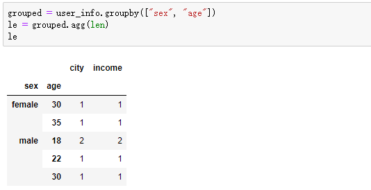
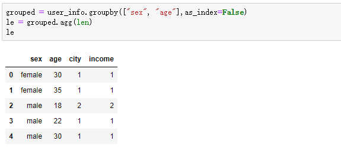
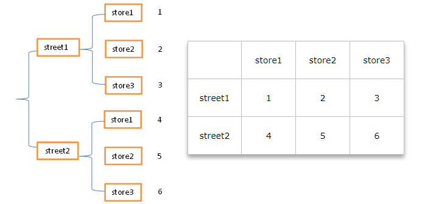

# Pandas

## 基础知识

**inf(-inf,inf):infinity,inf表示正无穷，-inf表示负无穷**

什么时候回出现inf包括（-inf，+inf,比如一个数字除以0，（python中直接会报错，numpy中是一个inf或者-inf）

使用 替换的方法将空值替换为特定值

## DataFrame常用基础操作

### 行列操作 - columns ( row )， index

> 使用切片操作行

```python
df = pd.DataFrame({'one': pd.Series([1,2,3], ['a','b','c']),
                   'two': pd.Series([1,2,3,4], index=['a','b','c','d'])
                  })
df['three'] = df['one']+df['two']

df.loc[:2]
```

**增**

```python
# 创建空二维数组
df = pd.DataFrame(columns=['name','tom'], dtype=np.int)

# 列操作
df['new'] = [1,2,2,3]
df.insert(1,columns='score', value=[1,2,3,4]) # 只能单列添加

# 行操作
df1 = pd.DataFrame([[1,2], [2,3]], columns=['one','two'])
df.append(df1)
```

**删**

```python
# 行操作
del df['name'] # 源数据操作， 没有删除对象直接报错
df.pop() / df.pop('name') # 源数据操作 有则删除，否则空操作
df.drop(columns=['name'], axis=1) 

# 列操作
df.drop(0) / df.drop('one') # 此处的 0 为索引，根据索引删除行，

**drop**

> 删除表中的某一行或者某一列更明智的方法是使用drop，它不改变原有的df中的数据，而是返回另一个dataframe来存放删除后的数据


drop(labels=None, # 指定删除的（行列）名
     axis=0,  # 指定删除行还是列 0：行（默认），1：列
     index=None, # 指定删除行
     columns=None, # 指定删除列
     level=None, 
     inplace=False, 
     errors='raise')
```

**axes** 

> 返回行标签列标签组成的列表

```python
df.axes 
df.axes
Out[41]: 
[Index(['a', 'b', 'c', 'd'], dtype='object'),
 Index(['one', 'two'], dtype='object')]
```

**类型**

> **总结一下astype()函数有效的情形：**
>
> - **数据列中的每一个单位都能简单的解释为数字(2, 2.12等）**
> - **数据列中的每一个单位都是数值类型且向字符串object类型转换**
>
> **如果数据中含有缺失值、特殊字符astype()函数可能失效。**

```python
dtypes # 返回每一列的数据类型
df['a'].dtype # 获取某一列的类型
df['num'].astype('int64') # 强制类型转换

# 强制类型转换的替代方法：
1. 使用pandas中的辅助函数， 
pd.to_numeric(df['num'], error='coerce').fillna(0)

2. 自定义转换函数
def convert_str(): pass
df['num'].apply(convert_str) # 自由度更高
```


**empty**

> 判断整体对象是否为空[^行和列任意一个为空]

**size, ndim, shape**

> 元素数量，维度，（行数，列数）

**head, tail**

> 返回首尾的一部分数据

**shift**

> 覆盖式移动，**相当于二进制中的左移，右移**

```python
df.shift(peroids, freq, axis, fill_value) # 移动的幅度，日期偏移， 行列， 填充
df
Out[42]: 
   one  two
a  1.0    1
b  2.0    2
c  3.0    3
d  NaN    4
df.shift(1,axis=0)
Out[43]:  # 相当于二进制中的左移，右移
   one  two
a  NaN  NaN
b  1.0  1.0
c  2.0  2.0
d  3.0  3.0
```

### 函数

**count()**

> 统计某个非空值的数量

**算术运算**

> sum(), mean()[^平均值], median()[^中位数], mode()[^众数]，std()[^标准差], min(), max(), abs()

**pipe()**

> 操作整个数据表， **以整个数据表为基本单位**

```python
def adder(x,y):
    return x+y

df.pipe(adder, 3) # 相当于执行一个偏函数
```

**apply()**

> 操作行，或者列，**以行列为基本单位**

```python
df.apply(np.min) # 默认为操作行，将真个行作为参数传入
df.apply(np.min, axis=0) # 操作列， 将整个列作为参数传入
```

**applymap()**

> 操作单一元素， **以每一个元素为基本单位**

```python
df.applymap(lambda x: x+1)
df['name'].applymap(lambda x: x+1)
```

**排序**

```python
# 按照行 / 列标签排序
df.sort_index()  # 队列值排序
df.sort_index(axis=0) # 对行值排序

# 按照值排序
df.sort_values(columns=['one','tow'], ascending=[True, False])
```

**drop_duplicates**

> 去重

```python
df.drop_duplicates(subset=['one','two'], keep='last')
```

**pd.round( int )** 

> 圆整,取 Int 位小数

```python
dp.round(2)   #四舍五入的保留小数点后的几个数字。round()不添加任何参数的时候，等同round(0)就是取整

np.ceil(): 计算各元素的ceiling，对元素向上取整。numpy 中的方法

>>> import numpy as np
>>>a=np.array([2.5,3.4,5.7,-1.2,-3.5,-3.8,6])
>>>a1 = np.ceil(a)
>>>a1
array([ 3.,  4.,  6., -1., -3., -3.,  6.])
```

**eval**

> 运算 ，pandas 中的一些计算语句，和在python中使用 eval  类似
>
> [Pandas学习笔记十——高性能的eval和query方法_eval pandas](https://blog.csdn.net/jasonzhoujx/article/details/81709526)

```python
esult_df.eval(f'pay_rate = pay_cnt / {pay_rate_field} * 100', inplace=True)  # 做了一些计算，并重新赋值
```


### 缺失值处理

> 计算时会将NA值视为 0 

```python
# 非空判断
isnull(), notnull() # 注意，返回的是bool

# 填充
df.fillna(0)

# 替换
df.replace({np.na: 0})

# 删除
df.dropna()
```


### 分组 groupby

> 类似于 SQL 的分组操作

**注意：**

1. 按照条件分组后，索引会转换为条件列，需要使用 reset_index() 重置索引
2. 聚合条件为空值时，会舍弃空值这几行

如果是根据多个键来进行聚合，默认情况下得到的结果是一个多层索引结构。有两种方式可以避免出现多层索引，第一种。对包含多层索引的对象调用 reset_index 方法。第二钟 df.goupby(['a','b'],reset_index=False) 





**对组应用聚合函数**

```python
df.groupby('name').agg(np.sum)
```

**对组应用过滤函数**

```python
df.groupby('name').filter(lambda x: x>1) # 为 False 的会被过滤
```

### 合并

> 类似于 SQL 的表连接操作

**merge**

> 类似于MySQL的连表操作，默认使用内连接（取交集）

**参考：**

1. https://blog.csdn.net/Late_whale/article/details/103772861
2. https://blog.csdn.net/Asher117/article/details/84725199

```python
merge(left, 
      right, 
      how=‘inner’, # 默认时内连接，'outer','left','right'
      on=None, 
      left_on=None, right_on=None,  # 手动指定左边的连接条件和右边的连接条件
      left_index=False, right_index=False, # 是否使用索引为连接关键字
      sort=False, 
      suffixes=(’_x’, ‘_y’), # 重复列命名重整
      copy=True, 
      indicator=False, 
      validate=None)
```


**注意:**

合并后作为子的那一项为浮点数

| 参数        | 作用                                                         |      |
| ----------- | ------------------------------------------------------------ | ---- |
| left        | 参与合并的左侧DataFrame                                      |      |
| right       | 参与合并的右侧DataFrame                                      |      |
| how         | 连接方式：‘inner’（默认）、‘outer’、‘left’、‘right’,分别对应内连接、外连接、左连接、右连接；外连接其实左连接和右连接的并集。左连接是左侧DataFrame取全部数据，右侧DataFrame匹配左侧DataFrame。（右连接right和左连接类似） |      |
| on          | 用于连接的列名，必须同时存在于左右两个DataFrame对象中，如果未指定，则以left和right列名的交集作为连接键 |      |
| left_on     | 左侧DataFarme中用作连接键的列                                |      |
| right_on    | 右侧DataFarme中用作连接键的列                                |      |
| left_index  | 将左侧的行索引用作其连接键                                   |      |
| right_index | 将右侧的行索引用作其连接键                                   |      |
| sort        | 根据连接键对合并后的数据进行排序，默认为True。有时在处理大数据集时，禁用该选项可获得更好的性能 |      |
| suffixes    | 字符串值元组，用于追加到重叠列名的末尾，默认为（‘_x’,‘_y’）.例如，左右两个DataFrame对象都有‘data’，则结果中就会出现‘data_x’，‘data_y’ |      |
| copy        | 设置为False，可以在某些特殊情况下避免将数据复制到结果数据结构中。默认总是赋值 |      |


**多个键进行合并**

```python
df1
Out[134]: 
    name  two  one
0    tom    2    1
1    job    2    2
2    bob    2    6
3  susan    3    5
df
Out[135]: 
   one  two
a  1.0    1
b  2.0    2
c  3.0    3
d  NaN    4
pd.merge(df,df1,on=['one','two'])
Out[136]: 
   one  two name
0  2.0    2  job

pd.merge(df,df1,on=['one','two'],how='left')
Out[137]: 
   one  two name
0  1.0    1  NaN
1  2.0    2  job
2  3.0    3  NaN
3  NaN    4  NaN
```

### 拼接

> concat, append

```python
pd.concat([df1,df2]，sort=False) # 默认为按照键拼接，不匹配的为空，为True时，严格按照位置拼接
df1.append(df2) 
```

### 合并重叠数据

> 类似于合并，对应处若有空值则填充，否则 pass

**技巧：**

只能修补空值，可以先将混杂数据清洗为空值，再修补

```python
left=pd.DataFrame({'A':[np.nan,'A0','A1','A2'],'B':[np.nan,'B1',np.nan,'B3'],'key':['K0','K1','K2','K3']})
right=pd.DataFrame({'A':['C0','C1','C2'],'B':['D0','D1','D2']},index=[1,0,2])

left
     A    B key
0  NaN  NaN  K0
1   A0   B1  K1
2   A1  NaN  K2
3   A2   B3  K3

right
    A   B
1  C0  D
0
0  C1  D1
2  C2  D2

# 根据索引进行重叠合并
left.combine_first(right)
    A   B key
0  C1  D1  K0
1  A0  B1  K1
2  A1  D2  K2
3  A2  B3  K3
```


## 技巧

### loc

#### df.loc 和 df.iloc() 切片 

> 都可以对行或者列进行操作
>
> 只能使用标签索引，不能使用整数索引
>
> 取值范围为，**前闭后闭**
>
> df.loc[ : , : ]  两个参数，分别是行和列，以 **,** 分割

```python
df.loc['a':'b'] # 对行标签进行切片
df.loc[:,'one':'two'] # 对列标签进行切片
df.loc['a':'b','one':'two'] # 同时对行和列进行切片
```

**df.iloc()**

> 只能使用整数索引，不能使用标签索引
>
> 取值范围：**前闭后开**

#### 取值

```python
left=pd.DataFrame({'A':[np.nan,'A0','A1','A2'],'B':[np.nan,'B1',np.nan,'B3'],'key':['K0','K1','K2','K3']})

left.loc[2, 'key'] # 根据标签取值
```

#### **获取某一列，某几列**

```python
# 根据第几列进行排序

columns_name = df.iloc[:,[1,2,3]]
df.sort_values(columns_name.columns.to_list())
```

### 窗口函数

```python
df
Out[87]: 
   one  two
a  1.0    1
b  2.0    2
c  3.0    3
d  NaN    4
# 窗口移动函数
df.rolling(window=2, min_periods=1).sum()  # 相邻的两行求和作为这一行的值，只用的是原值，则第零行等于空行加第零行，最小观测值为2时，第一行会为空，，最小观测值为 1，则第零行就是第零行
Out[86]: 
   one  two
a  1.0  1.0
b  2.0  2.0
c  3.0  3.0
d  NaN  4.0

# 窗口扩展函数
df.expanding(min_periods=2).sum() # 相邻的两行求和作为这一行的值，但是使用的不是原值，而是聚合后的值
Out[85]: 
   one   two
a  1.0   1.0
b  3.0   3.0
c  6.0   6.0
d  6.0  10.0
```

### 聚合函数

```python
df.aggregate(np.sum)

df = pd.DataFrame({'a':[1,2,3,3],'b':[2,2,3,4],'c':[3,3,4,4]})

# .agg({columns: func})
a.groupby('a').agg({'b':list})
a.groupby('a').agg(len)
        b
a        
1     [2]
2     [2]
3  [3, 4]
```

### 数据清洗转换

**.to_dict(origin=dict)**

> to_dict 可以对DataFrame类型的数据进行转换

```python
都是转换为字典，但具体形式不同：
orient='dict',默认,字典套字典：{column:{index:value}}
orient ='list' ,字典里面为列表：{column：[values]}
orient ='series',字典里为series形式：{column: Series(values)}
orient ='split',字典里是数据对应列表：{'index':[index],'columns':[columns],'data': [values]}
orient ='records',转化后是 list形式：[{column: value},...,{column:value}]
orient ='index',字典里面同样有字典：{index:{column:value}}
```

**dp.astype("int64")**

> 用来转换特定的数据类型，python中默认是 int32

```python
dp.astype("int64")
```

**pd.fillna(0)**

> 填充空值

```python
dp.fillna(0)  # 用 0 来填充空值
```

### 字符串处理

字符串分割转**Dataframe**

```python
aaa = "aaa||bbb|ccc,aa||bb||cc,a||b||c"
df = pd.DataFrame(aaa.split(','))
df[0].str.split('\|\|', expand=True)
     0        1     2
0  aaa  bbb|ccc  None
1   aa       bb    cc
2    a        b     c
```

### 输出转换

.to_dict()

**注意：**

1. 老版本的pandas 会在 .to_dict('record') 时自动类型转换为 float64

### 创建DataFrame

> 制定的列不够时会自动截断，只保留指定的列
>
> 字典的列表也可以直接转换DataFrame结构

```python
df = pd.DataFrame({'a':1,'b':2,'c':3})
```

### stack 和 unstack

> 树结构和表结构的转换，一维与二维之间的转化
>
> stack的意思是堆叠，堆积，unstack即“不要堆叠”
>
> 执行stack是一个层次化的过程，即由原来表格数据结构转化为树形结构。
>
> Unstck反之

**参考：**

- https://blog.csdn.net/qq_42006613/article/details/109387817?spm=1001.2101.3001.6661.1&utm_medium=distribute.pc_relevant_t0.none-task-blog-2%7Edefault%7EOPENSEARCH%7ERate-1.pc_relevant_default&depth_1-utm_source=distribute.pc_relevant_t0.none-task-blog-2%7Edefault%7EOPENSEARCH%7ERate-1.pc_relevant_default&utm_relevant_index=1

- [博客园 - 树与表之间的关系- 形象](https://www.cnblogs.com/bambipai/p/7658311.html)

**树形结构** - **表格结构**

> 通过 stack 转为树形结构后，就类似与一维结构，只是拥有二级索引



## 优化

1. pandas 多次合并的效率低于单次合并拼接再分割的效率
