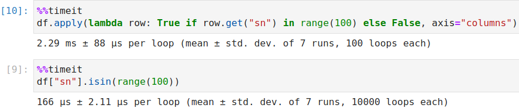

# Pandas


## 基础知识

### CRUD

**增**

```python
# 创建空二维数组
df = pd.DataFrame(columns=['name','tom'], dtype=np.int)

# 列操作
df['new'] = [1,2,2,3]
df.insert(1,columns='score', value=[1,2,3,4]) # 只能单列添加

# 行操作
df1 = pd.DataFrame([[1,2], [2,3]], columns=['one','two'])
df.append(df1)
```

**删**

```python
# 行操作
del df['name'] # 源数据操作， 没有删除对象直接报错
df.pop() / df.pop('name') # 源数据操作 有则删除，否则空操作
df.drop(columns=['name'], axis=1) 

# 列操作
df.drop(0) / df.drop('one') # 此处的 0 为索引，根据索引删除行，

**drop**

> 删除表中的某一行或者某一列更明智的方法是使用drop，它不改变原有的df中的数据，而是返回另一个dataframe来存放删除后的数据


drop(labels=None, # 指定删除的（行列）名
     axis=0,  # 指定删除行还是列 0：行（默认），1：列
     index=None, # 指定删除行
     columns=None, # 指定删除列
     level=None, 
     inplace=False, 
     errors='raise')
```

### loc 和  iloc

> 两者都可以对行或者列进行操作，loc 使用标签索引切片，iloc 使用整数索引切片
>
> loc (标签索引) 取值范围为，**前闭后闭**， loc[ : , : ]  （行，列）
>
> iloc (整数索引) 取值范围，**前闭后开**

```python
data = {
    'id': [1, 2, 3], 
    'name': ['tom', 'jerry', 'susan'], 
    'age': [11, 11, 23], 
    'three': [12, 13, 26]
}
df = pd.DataFrame(data)

# loc
df.loc['a':'b'] # 对行标签进行切片
df.loc[:,'one':'two'] # 对列标签进行切片
df.loc['a':'b','one':'two'] # 同时对行和列进行切片
df.loc[1, 'name']  # 取行索引为1，列索引为name  此处并非使用了整数索引

# iloc
df.iloc[0:4]
df.iloc[:, 0:5]
df.iloc[:, [1,2,4]]  # 取 1,2,4 列
df.iloc[1,3]  # 取1行3列
```

**at**

- `.at`不支持类型隐式转换，而`.loc`是支持的
- `.at`的速度比`.loc`要快

### 函数与属性

**axes** 

> 返回行标签列标签组成的列表

```python
df.axes
Out[41]: 
[Index(['a', 'b', 'c', 'd'], dtype='object'),
 Index(['one', 'two'], dtype='object')]
```

**empty**

> 判断整体对象是否为空[^行和列任意一个为空]

**size, ndim, shape**

> 元素数量，维度，（行数，列数）

**head, tail**

> 返回首尾的一部分数据

**shift**

> 覆盖式移动，**相当于二进制中的左移，右移**

```python
df.shift(peroids, freq, axis, fill_value) # 移动的幅度，日期偏移， 行列， 填充
df
Out[42]: 
   one  two
a  1.0    1
b  2.0    2
c  3.0    3
d  NaN    4
df.shift(1,axis=0)
Out[43]:  # 相当于二进制中的左移，右移
   one  two
a  NaN  NaN
b  1.0  1.0
c  2.0  2.0
d  3.0  3.0
```

**count()**

> 统计数量

**算术运算**

> sum(), mean()[^平均值], median()[^中位数], mode()[^众数]，std()[^标准差], min(), max(), abs()

**pipe()**

> 操作整个数据表， **以整个数据表为基本单位**

```python
def adder(x,y):
    return x+y

df.pipe(adder, 3) # 相当于执行一个偏函数
```

**apply()**

> 操作行，或者列，**以行列为基本单位**

```python
df.apply(np.min) # 默认为操作行，将真个行作为参数传入
df.apply(np.min, axis=0) # 操作列， 将整个列作为参数传入
```

**applymap()**

> 操作单一元素， **以每一个元素为基本单位**

```python
df.applymap(lambda x: x+1)
df['name'].applymap(lambda x: x+1)
```

**排序**

```python
# 按照行 / 列标签排序
df.sort_index()  # 队列值排序
df.sort_index(axis=0) # 对行值排序

# 按照值排序
df.sort_values(columns=['one','tow'], ascending=[True, False])
```

**drop_duplicates**

> 去重

```python
df.drop_duplicates(subset=['one','two'], keep='last')

keep: {
    first： 保留第一次出现的重复行，删除后面的重复行,
	last： 删除重复项，除了最后一次出现,
	False： 删除所有重复项
}
```

**pd.round( int )** 

> 圆整,取 Int 位小数

```python
dp.round(2)   #四舍五入的保留小数点后的几个数字。round()不添加任何参数的时候，等同round(0)就是取整

np.ceil(): 计算各元素的ceiling，对元素向上取整。numpy 中的方法

>>> import numpy as np
>>>a=np.array([2.5,3.4,5.7,-1.2,-3.5,-3.8,6])
>>>a1 = np.ceil(a)
>>>a1
array([ 3.,  4.,  6., -1., -3., -3.,  6.])
```

**eval**

> 运算 ，pandas 中的一些计算语句，和在python中使用 eval  类似
>
> [Pandas学习笔记十——高性能的eval和query方法_eval pandas](https://blog.csdn.net/jasonzhoujx/article/details/81709526)

```python
esult_df.eval(f'pay_rate = pay_cnt / {pay_rate_field} * 100', inplace=True)  # 做了一些计算，并重新赋值
```

### 

## 数据处理

### 特殊值处理

#### 缺失值处理

> 计算时会将NA值视为 0 

```python
isnull().notnull() # 非空判断 # 注意，返回的是bool
df.fillna(0) # 填充
df.replace({np.na: 0}) # 替换
df.dropna() # 删除
```

**dropna**

> DataFrame.dropna(**axis**=0, **how**='any', **thresh**=None, **subset**=None, **inplace**=False)

**参考：** https://blog.csdn.net/qq_43188358/article/details/108335776

```txt
how 
	- any 默认值 带有空值即删除
	- all 全部为空值才删除
thresh 
	保留至少含thresh个非空值的行（这一行至少有thresh个字段不为空才不会被删除）
subset
	指定行列
```


### 数据聚合处理

#### 合并

**参考：** 

1. https://blog.csdn.net/Late_whale/article/details/103772861
2. https://blog.csdn.net/Asher117/article/details/84725199

| 参数        | 作用                                                         | 备注                   |
| ----------- | ------------------------------------------------------------ | ---------------------- |
| left        | 参与合并的左侧DataFrame                                      |                        |
| right       | 参与合并的右侧DataFrame                                      |                        |
| how         | inner（默认）、outer、left、right。                          | outer == left && right |
| on          | 如果未指定，则以left和right列名的交集作为连接键，**可为列表** | 交集                   |
| left_on     | 左侧DataFarme中用作连接键的列                                |                        |
| right_on    | 右侧DataFarme中用作连接键的列                                |                        |
| left_index  | 将左侧的行索引用作其连接键                                   |                        |
| right_index | 将右侧的行索引用作其连接键                                   |                        |
| sort        | 对合并后的数据进行排序，默认为True。                         | 大数据时，应该禁用     |
| suffixes    | 重复列的后缀，用于命名重整 **（'_x', '_y')**  一个元组       |                        |
| copy        | 为False，可以在某些特殊情况下避免将数据复制到结果数据结构中。默认为True | **???**                |


#### 拼接

> concat, append

```python
pd.concat([df1,df2]，sort=False) # 默认为按照键拼接，不匹配的为空，为True时，严格按照位置拼接
df1.append(df2) 
```

#### 表间填充

> 类似于合并，对应位置有值则跳过，空值则用另一张表的数据填补
>
> **注意：** **只能修补空值**，可以先将混杂数据清洗为空值，再修补

```python
left=pd.DataFrame({'A':[np.nan,'A0','A1','A2'],
                   'B':[np.nan,'B1',np.nan,'B3'],
                   'key':['K0','K1','K2','K3']})
right=pd.DataFrame({'A':['C0','C1','C2'],
                    'B':['D0','D1','D2']})

left
     A    B key
0  NaN  NaN  K0
1   A0   B1  K1
2   A1  NaN  K2
3   A2   B3  K3

right
    A   B
1  C0  D0
0  C1  D1
2  C2  D2

# 根据索引进行重叠合并， left 中为空的部分会用right对应位置的部分填充
left.combine_first(right)
    A   B key
0  C0  D0  K0
1  A0  B1  K1
2  A1  D2  K2
3  A2  B3  K3
```

### 类型转化处理

**类型**

> **总结一下astype()函数有效的情形：**
>
> - **数据列中的每一个单位都能简单的解释为数字(2, 2.12等）**
> - **数据列中的每一个单位都是数值类型且向字符串object类型转换**
>
> **如果数据中含有缺失值、特殊字符astype()函数可能失效。**
>
> 用来转换特定的数据类型，python中默认是 int32

```python
dtypes # 返回每一列的数据类型
df['a'].dtype # 获取某一列的类型
df['num'].astype('int64') # 强制类型转换

# 强制类型转换的替代方法：
1. 使用pandas中的辅助函数， 
pd.to_numeric(df['num'], error='coerce').fillna(0)

2. 自定义转换函数
def convert_str(): pass
df['num'].apply(convert_str) # 自由度更高
```


### 格式转换处理

#### 输入转换

**一维序列 --> 字典**

> **{ 序列号1： 序列值1，序列号2： 序列值2 } **

```python
# b
account_id
1    [{'account_id': 1, 'tag_name': 'tom'}, {'accou...
3             [{'account_id': 3, 'tag_name': 'susan'}]
dtype: object
                                             
# b.to_dict()
{1: [{'account_id': 1, 'tag_name': 'tom'}, {'account_id': 1, 'tag_name': 'jerry'}], 3: [{'account_id': 3, 'tag_name': 'susan'}]}
```

**二维 --> 字典**

> **{ 索引1： 值1，索引2： 值2 }**

```python
# c
                                                     tag_info
account_id                                                   
1           [{'account_id': 1, 'tag_name': 'tom'}, {'accou...
3                    [{'account_id': 3, 'tag_name': 'susan'}]
                                                    
# c.to_dict('index')
{1: {'tag_info': [{'account_id': 1, 'tag_name': 'tom'}, {'account_id': 1, 'tag_name': 'jerry'}]}, 3: {'tag_info': [{'account_id': 3, 'tag_name': 'susan'}]}}
```

**嵌套字典生成PD**

> **{键：{键：值，键：值}，键：{键：值，键：值}}**

```python
c = {0: {0: 'a', 1: 1, 2: 0}, 1: {0: 'b', 1: 2, 2: 0}}
pd.DataFrame().from_dict(c) # 每一个键值对作为一列，以键为列名，子键为行名
   0  1
0  a  b
1  1  2
2  0  0
pd.DataFrame().from_dict(c, orient='index') # 每一个键值对作为一行，以键为行名，子键为列名
   0  1  2
0  a  1  0
1  b  2  0
```


**不等长数组构成的字典 -> DataFrame**

```python
data = {
    'a': [1,2,3,4],
    'b': [1,2,3]，
    'c': [1,2]
}

df = pd.DataFrame.from_dict(data, orient='index')
   0  1    2    3
a  1  2  3.0  4.0
b  1  2  3.0  NaN
c  1  2  NaN  NaN

# 需要转置一次
df.T
```

#### 输出转换

**.to_dict(origin=dict)**

> to_dict 可以对DataFrame类型的数据进行转换

**注意：**

1. 老版本的pandas 会在 .to_dict('record') 时自动类型转换为 float64

```python
都是转换为字典，但具体形式不同：
orient='dict',默认,字典套字典：{column:{index:value}}
orient ='list' ,字典里面为列表：{column：[values]}
orient ='series',字典里为series形式：{column: Series(values)}
orient ='split',字典里是数据对应列表：{'index':[index],'columns':[columns],'data': [values]}
orient ='records',转化后是 list形式：[{column: value},...,{column:value}]
orient ='index',字典里面同样有字典：{index:{column:value}}
```

### 排序

#### 基础排序

#### 按照指定顺序排序

1. 重置索引

   ```python
   df = df.set_index('account_id').reindex(sort_account_ids).reset_index()
   
   # 1. 当 sort_account_ids == df.account_id, 按照指定顺序排序
   # 2. 当 sort_account_ids 全包含 df.account_id 多出来的 account_id 行填充为空
   # 3. 当 sort_account_ids 与 df.account_id 有不匹配的值时， 不匹配的 account_id 全部为空
   ```

2. 分类排序

   > 相当于优先级排序， 给 sort_account_ids 的值分类并排序 [(123456, 0) , (654321, 1) , 最后按照某一类的优先级排序 df 

   **参考：** https://www.cnblogs.com/lemonbit/p/7004505.html

   


## 技巧

### 窗口函数

```python
df
Out[87]: 
   one  two
a  1.0    1
b  2.0    2
c  3.0    3
d  NaN    4
# 窗口移动函数
df.rolling(window=2, min_periods=1).sum()  # 相邻的两行求和作为这一行的值，只用的是原值，则第零行等于空行加第零行，最小观测值为2时，第一行会为空，，最小观测值为 1，则第零行就是第零行
Out[86]: 
   one  two
a  1.0  1.0
b  2.0  2.0
c  3.0  3.0
d  NaN  4.0

# 窗口扩展函数
df.expanding(min_periods=2).sum() # 相邻的两行求和作为这一行的值，但是使用的不是原值，而是聚合后的值
Out[85]: 
   one   two
a  1.0   1.0
b  3.0   3.0
c  6.0   6.0
d  6.0  10.0
```

### 聚合函数

> apply函数牺牲了性能换取了灵活性

**内置聚合函数**

> 尽量使用内置聚合函数，自定义函数的性能得不到保证

```python 
max/min/mean/median(算术中位数)/count（数量）/all(是否所有元素都为真）/any（是否至少一个元素为真）/idxmax（最大值索引）/idxmin/mad(平均绝对偏差)/nunique(唯一值的数量)/skew(偏度)/quantile(分位数)/sum/std(无偏(分母为n-1)标准差/var（方差）/sem(均值的标准误差)/size/prod（积）
```

**聚合重命名**

```python
ddf = df.groupby('account_id').agg(new_name=('fee', 'sum'))
```

```python
df.aggregate(np.sum)

df = pd.DataFrame({'a':[1,2,3,3],'b':[2,2,3,4],'c':[3,3,4,4]})

# .agg({columns: func})
a.groupby('a').agg({'b':list})
a.groupby('a').agg(len)
        b
a        
1     [2]
2     [2]
3  [3, 4]
```


### 字符串处理

字符串分割转**Dataframe**

```python
aaa = "aaa||bbb|ccc,aa||bb||cc,a||b||c"
df = pd.DataFrame(aaa.split(','))
df[0].str.split('\|\|', expand=True)
     0        1     2
0  aaa  bbb|ccc  None
1   aa       bb    cc
2    a        b     c
```


### stack 和 unstack

> 树结构和表结构的转换，一维与二维之间的转化
>
> stack的意思是堆叠，堆积，unstack即“不要堆叠”
>
> 执行stack是一个层次化的过程，即由原来表格数据结构转化为树形结构。
>
> Unstck反之

**参考：**

- [树与表](https://blog.csdn.net/qq_42006613/article/details/109387817?spm=1001.2101.3001.6661.1&utm_medium=distribute.pc_relevant_t0.none-task-blog-2%7Edefault%7EOPENSEARCH%7ERate-1.pc_relevant_default&depth_1-utm_source=distribute.pc_relevant_t0.none-task-blog-2%7Edefault%7EOPENSEARCH%7ERate-1.pc_relevant_default&utm_relevant_index=1)

- [博客园 - 树与表之间的关系- 形象](https://www.cnblogs.com/bambipai/p/7658311.html)

**树形结构** - **表格结构**

> 通过 stack 转为树形结构后，就类似与一维结构，只是拥有二级索引


## 注意

**inf(-inf,inf):infinity,inf表示正无穷，-inf表示负无穷**

什么时候回出现inf包括（-inf，+inf,比如一个数字除以0，（python中直接会报错，numpy中是一个inf或者-inf）

使用 替换的方法将空值替换为特定值

1. pandas 并不能对**集合，元组**做操作

   ```python
   pd.DataFrame( set() | tuple() )
   
   # ValueError: DataFrame constructor not properly called!
   ```

### 

## 优化

1. pandas 多次合并的效率低于单次合并拼接再分割的效率

2. pandas的apply和isin性能相差一个数量级，以后这种场景尽量用isin
