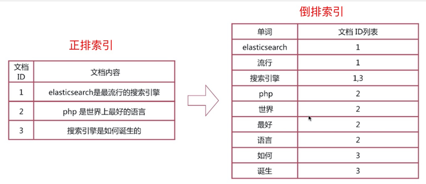

### Elasticsearch

#### 基础理论知识

##### 倒排索引

正排索引，也叫正向索引（Forward Index），是通过文档ID去查找关键词（文档内容）。
倒排索引，也叫反向索引（Inverted Index），是通过关键词查找文档ID。

> 倒排索引而不是倒序索引

倒排列表（Posting List）：记录了单词对应的文档结合，由倒排索引项组成，包括：

- 文档ID，等同于数据库主键；
- 词频（Term Frequency），该单词在文档中出现的次数，主要是用于打分；
- 位置（Positon），单词在文档中分词的位置，用于语句搜索；
- 偏移（Offset），记录单词的的位置；

