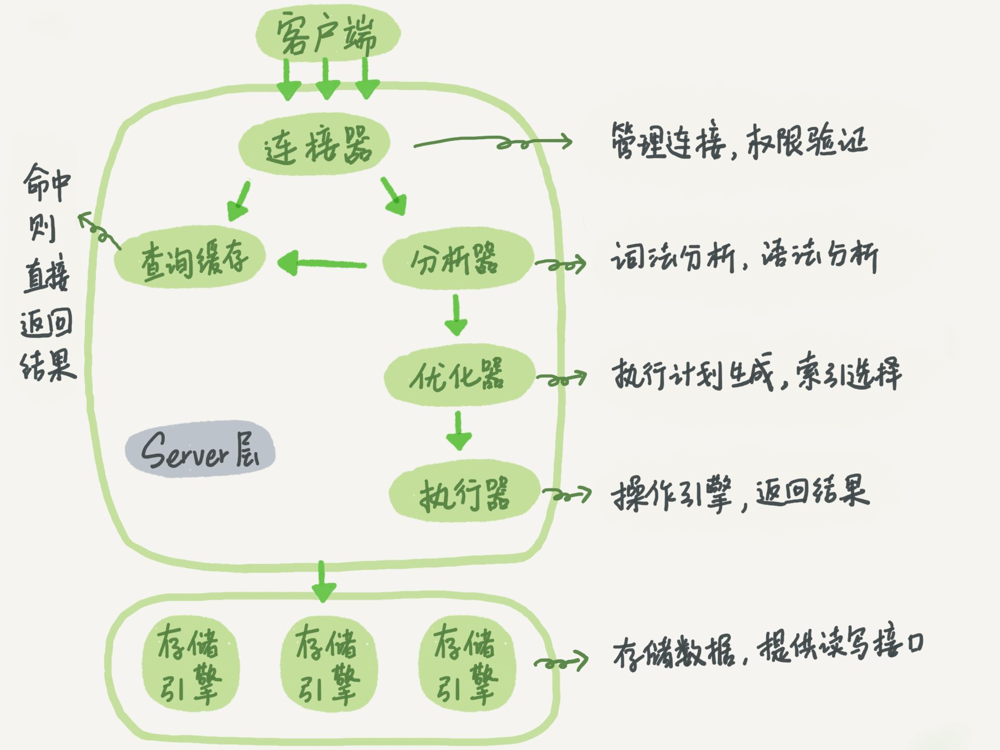
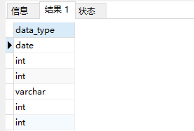
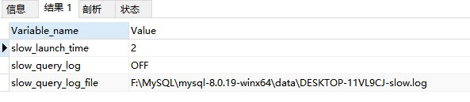
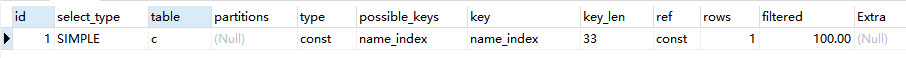
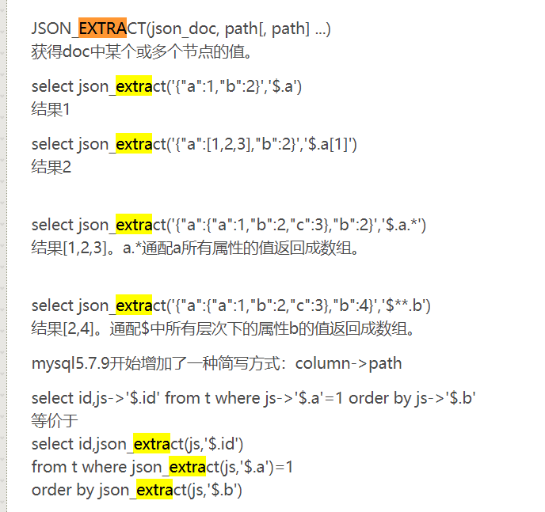
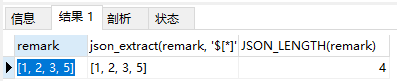
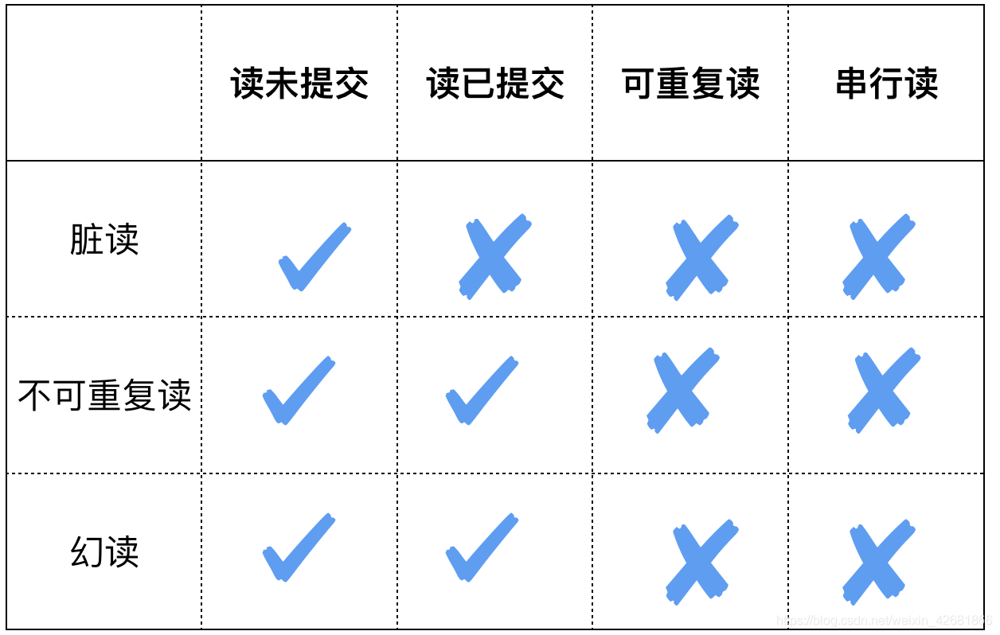
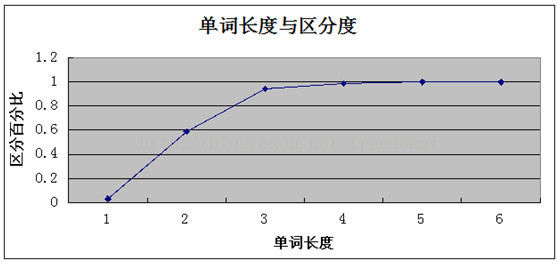
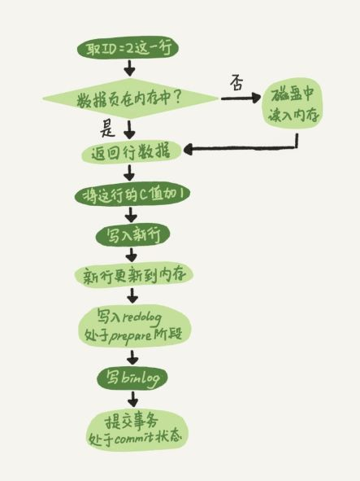

# MySQL基础总结

> 连接器（权限效验），分析器（词法分析，语法分析），优化器（索引相关），执行器
>



##### 最佳参考：

- [mysql实战45讲](https://funnylog.gitee.io/mysql45/) 


## 理论，概述

### 语句的优先

```mysql
# sql的每一步执行都会产生一个虚拟表，用于下一步执行

from > join > on > where > group by > having > select > distinct > order by > limit
```

### 名词解释

**DDL：**（Data Manipulation Language）数据操纵语言

对数据库中的数据进行操作，如 insert , update, delete, select 等

**DML：**（Data Definition Language）数据定义语言

建库，建表，设置约束等，create, drop, alter 等

**DCL：**（Data Control Language）数据控制语言

如commit，revoke等

**MDL：**MDL全称为metadata lock，即元数据锁，

**脏页：**

内存数据库与磁盘数据页内容不一致，redo log 未写入磁盘时，这个内存就属于脏页

**数据页空洞**

表的增删改操作都可能会导致空洞，删除有空洞是因为，标记了已删除可复用的节点位置，不会被释放。增加有空洞是因为，随机插入有空洞，由于数据页的分裂造成。更新有空洞是因为，索引树字段被更新，数据过大也会造成页分裂

### 基础知识

- MySQL 是否处于运行状态:Debian 上运行命令 service mysql status

- 开启或停止 MySQL 服务 :运行命令 service mysqld start 开启服 务；运行命令 service mysqld stop 停止服务 ；

- 获取表内所有 Field 对象的名称和类型 :describe table_name；

- 什么是索引?索引是一种数据结构,可以帮助我们快速的进行数据的查找.

  **为什么MySQL不建议使用delete删除数据**

  答：使用delete删除数据只是将数据标记为**已删除可复用**，但是磁盘上的文件不会减少，删除数据会在空间中留下一些空洞，后面添加数据时，就会将数据添加进空洞中，数据过于分散，导致后续的读写操作多出了大量IO影响性能，所以一般都对要删除的数据进行标记删除

  **连接**

  1. 本地连接

     mysql -u username -p123456;

  2. 远程连接

     mysql  -h 要访问的ip地址 -u username -p123456;
  
- **char 和 varchar的区别 :**

  char和varchar的共同点是存储数据的长度，不能 超过max_length限制，

  不同点是varchar根据数据实际长度存储，char按指定max_length（）存储数据；所有前者更节省硬盘空间；
  
- 如何在 SQL 中插入 单引号 ' 

  在 SQL 中两个单引号是一个单引号 

  ```sql
  insert into users(name) values ('[''aaa'']') # 这就插入了这样一个字符串 "['aaa']"
  ```

### 字段类型

**TIMESTAMP**

> 在标识时间时推荐使用，TIMESTAMP 存储的时间范围 1970-01-01 00:00:01 ~ 2038-01-19-03:14:07。TIMESTAMP使用4字节，DATETIME使用8个字节，同时TIMESTAMP具有自动赋值以及自动更新的特性。

```sql
# create_time在创建记录时自动插入，update_time字段自动插入并在记录修改时自动更新
CREATE TABLE `ytest` (
  `id` int unsigned NOT NULL AUTO_INCREMENT COMMENT '测试',
  `name` varchar(255) COMMENT '测试',
  `create_time` timestamp NOT NULL DEFAULT CURRENT_TIMESTAMP COMMENT '创建时间',
  `update_time` timestamp NOT NULL DEFAULT CURRENT_TIMESTAMP ON UPDATE CURRENT_TIMESTAMP  COMMENT '更新时间',
  `is_deleted` tinyint(1) unsigned NOT NULL DEFAULT 0 COMMENT '测试', 
  PRIMARY KEY (`id`)
) ENGINE=InnoDB comment "测试demo表";
```


### CRUD

1. ##### 增

   ```mysql
   create table student (id int,auto_increment,name varcha(20) not null) # 增加表
   
   insert into table (id,name) values (1,tom),(2,job); # 插入
   ```

   SQL Server 设置自增主键

   ```sql
   indetity(start,step)
   ```

   插入空值

   ```python
   sql = f"""insert into users(name,age) values ('Null',{age})"""
   ```

2. ##### 删

   > delete 和 truncate 的区别在于，执行delete操作后，存储在硬盘上的数据没有被删除，只不过在记录行上做了逻辑删除，而 truncate 是真正的删除，索引也会回到初始值，delete 操作可以被会滚，而 truncate 操作不可以被会滚
   >
   > drop 操作会直接删除表，然后重建一个，但是丢失了表结构信息

   ```mysql
   delete from polls_article where id=1 	# 删除某一条数据
   
   truncate table staudent; 				# 清空数据，保留表结构，不能撤销还原
   // 注意，truncate 无法删除具有外键关联的表，即使表是空的
   
   delete from polls_article 			# 清空,保留表的结构
   
   drop table test 					# 删除表，数据，表结构，快速
   ```

   **重新序列化**

   当删除表记录时，可能表的自增序列就不是连续的了，这时可以删掉 原 id序列，然后重新添加 id 序列

   ```mysql 
   alter table city drop id
   alter table city add id int unsigned auto_increment not null,add primary key (id);
   
   # 也可以设置开始的序列值
   auto_increment = 100
   
   # 重建索引
   alter table users engine=innoDB
   ```

3. ##### 改

   **更新** -- 记录

   ```mysql
   update table users set name='tom',grade=50 where id>1 # **更新全部数据**
   
   update student set grade=90; # 默认全部修改
   
   # 用一张表更新另一张表
   UPDATE lawyer_censor
   INNER JOIN contract ON lawyer_censor.contract_id = contract.id
   SET lawyer_censor.file_id = contract.file_id;
   ```

   **修改** -- 字段

   ```mysql
   # 字段的增加
   alter table test add love char(30) # 默认附加到末尾
   alter table test add love atime date after love
   
   alter table city add is_love int first # 在首列增加
   
   # 字段的删除
   # 如果只剩一个字段，则无法使用drop删除
   alter table test drop love
   
   # 字段的修改
   alter table test love modify newlove char(20)
   alter table test change love newlove char(20)
   alter table test modify love int not null default 100 # 注意，原本旧表有空值时，无法设置为非空，需要先将空值转为非空值
   
   # 默认值的修改（两个alter)
   alter table test alter love set default 100
   alter table test alter love drop default
   
   # 外键的修改
   alter table test drop foreign key keyname
   
   # 主键的修改
   alter table test add primary key(love) # 一张表只能有多个字段被设置为主键，主键必须是唯一的，在创建主键时，默认为主键添加索引
   alter table test drop primary key # 主键带任何约束，所以可以直接删除
   alter table test modify love int # 如果主键字段带有自增属性，则需先去掉自增属性，然后在删除主键
   alter table test drop primary key 
   
   # 表名的修改
   alter table test rename to new_test
   
   # 引擎的修改
   alter table test engine=myisam
   ```

4. **查**

   ```mysql
   select * from student where di in (1,2,3) **in**  # 关系查询
   select id,name from student where name like "s%"  # 通配符查询以s开头的
   # c%g ”表示以字符 c 开始，以 g 结尾的字符串；
    # 字符串“ %y% ”表示包含字符“ y ”的字符串，无论“ y ”在字符串的什么位置。
    
   # between and
   WHERE login_date BETWEEN '2015-10-01' AND '2016-05-01';
   ```

   日期查询

   > 根据日期存储格式的不同会有不同的区别，如：'2019-01-12'
   >
   > 注意：mysql中日期的查询需要带 '2021-07-20' and '2021-07-21' 带引号

   ```mysql
   # 某一段范围内日期的查询
   select * from polls_article where birthday_time between '2021-07-20' and '2021-07-21'
   
   # 查询制定月份的数据记录
   select * from polls_article where Year(birthday_time)=2021 and Month(birthday_time)=7
   
   # 查询据现在一段时间范围的数据记录
   select * from polls_article WHERE to_days(now()) - to_days(birthday_time) <= 30
   ```

### mysql查询中的变量

**参考：**

- [Using SQL Variables in Queries](https://www.oreilly.com/library/view/mysql-cookbook/0596001452/ch01s15.html)

```mysql
select @owner_id := owner_id, @owner_type := owner_type from contract_category where is_default=1;
select @owner_id, @owner_type
```


### 相关参数

**innodb_file_per_table**

- innodb_file_per_table = ON (默认) :

  > 推荐，单独表结构易于管理，可以使用 drop table 命令直接删除文件，而OFF 时，即使数据被删除了，表空间依然没有被回收

   每个 innoDB 表数据存储在一个以 .idb 为后缀的文件中

  

- innodb_file_per_table = OFF

  表的数据放在系统共享表空间，根数据字典放在一起

**innodb_flush_log_at_trx_commit**

> 控制 redo log buffer 的写入机制


**查看表的存储情况（是否紧凑）**

> 每个数据页的大小为 16kb

对表的增删改操作都会造成数据页空洞，解决方式是重建表（建新表+迁移+删旧表）`alter table users engine=innoDB`,建成的表会保留10%的空洞，用于更新操作，

```sql
# 用于查看表的存储情况,当page的尺寸距离16kb很近时，说明快满了，较紧凑
select * from information_schema.INNODB_BUFFER_PAGE 
```

### 表信息查询

> doris , mysql 的所有信息都在 information_schema 中

```mysql
# 获取记录的数据类型
select data_type from information_schema.columns where table_name='dws_stat_ot_agg'
```




## **SQL慢查询优化**

> 1. 查询执行计划
> 2. 建立合适的索引
> 3.  使用合适的连接关系和过滤条件来实现SQL语句的优化

参考

- [MySQL中Profiling功能的介绍以及通过Profiling排查慢SQL的**案例**](https://help.aliyun.com/document_detail/204734.html)
- [Mysql-性能分析-Profiling ](https://www.jianshu.com/p/36b35f84ccde)
- [mysql性能优化-慢查询分析、优化索引和配置](https://www.jianshu.com/p/bc9ba20d7aba) - 详细
- [MySQL 慢查询日志  mysql慢查询日志怎么看](https://blog.csdn.net/Hu_wen/article/details/105096133) -- 基础配置

### 慢查询基础配置

捕获 **慢查询** SQL语句

```sql
1. 开启慢查询日志
show variables like 'slow%' # 查询开启情况
set global slow_query_log_file='F://MySQL//slow-log.log' # 更改日志存储位置
set global slow_query_log = 'ON'; # 开启

2. 检查慢查询频率
# 慢查询频率  执行时间超过 5 秒的语句会被记录
show variables like 'long%'
set long_query_time = 5

3. 执行待优化的 SQL 语句
sleep(2)

4. 检查慢查询日志内容（满足慢条件的 SQL 会被记录）
```



### 语句执行计划

> 展示本条语句的执行详细信息，包括结果，索引，字段等信息

```sql
explain select name from city where city.name='孙悟空'

# 在 MySQL 中执行一条SQL时，语句并没有在你预期的时间内执行完成
show processlist
```



id：是一个查询序列号。

select_type：查询类型。

table：表示与查询结果相关的表的名称。

partition：表示查询访问的分区。

**key**：表示优化器最终决定使用的索引是什么。

key_len： 表示使用了索引的字节数，可通过该列计算查询中使用的索引的长度

ref： 表示上述表的连接匹配条件，即哪些列或常量被用于查找索引列上的值， 引用到的上一个表的列

**rows**：估算SQL要查找到结果集需要扫描读取的数据行数。

filtered：表示查询筛选出的记录占全部表记录数的百分比。

possible_key：表示查询时可能使用的索引。如果这里的值是空，就说明没有合适的索引可用。

**Extra**：表示MySQL执行查询中的附加信息。

> 性能从好到坏：Using index > Using where > Using temporary > Using filesort

- using index 覆盖索引
- using temporary  要解决查询，MySQL需要创建一个临时表来保存结果(数据量太大了)
- using condition 索引下推

type：表的连接类型。


## 技巧

### 分组统计

> 根据一个分组条件，可以在统计函数中对这一组的每一条记录进行操作

```sql
select sum(if(age>10, amount, 0)) as total_amount from price group by user_id
```


### 递归查询

> 部门表的子查询，通过顶级ID查询各层级数据

```sql
WITH RECURSIVE dept_tree(id, name) AS (
  SELECT id, name
  FROM dept
  WHERE id = {指定id}
  UNION ALL
  SELECT d.id, d.name
  FROM dept d
  JOIN dept_tree t ON d.parent_id = t.id
)
SELECT id FROM dept_tree WHERE id;
```


### 连表插入|更新

**参考：**

- [MySQL 两张表关联，以另一个表的值更新字段值](https://blog.csdn.net/qq_36535820/article/details/99071934) 

**例子：**

```sql
BEGIN;
# 查询结果并插入
insert into category(name, owner_id, owner_type, is_recommend)
select 0 as recommend_id, '其他' as name, owner_id, owner_type, False as is_recommend
from category where owner_type in (1,2);

# 查询结果并更新
update template as ct 
left join category as cc on ct.template_category_id=cc.parent_id 
set ct.template_category_id=cc.id 
where cc.owner_type in (1,2)

commit;
```

```sql
UPDATE user AS u
JOIN (
    SELECT phone_number, person_open_code
    FROM user
    WHERE authentication_status >= 2
) AS t ON u.phone_number = t.phone_number
SET u.authentication_status = if(u.authentication_status=1, 2, u.authentication_status),
u.person_open_code=if(u.authentication_status=1, t.person_open_code, u.person_open_code)
;
```


### 有则更新无则插入

**on duplicate key update**

> 存在则更新，否则插入
>
> **前提条件** 是插入的数据字段设置了主键或唯一索引

**参考：**

- [(3条消息) mysql批量插入on duplicate key update_lucas1018的博客-CSDN博客](https://blog.csdn.net/yang1018679/article/details/114649803) 

```sql
# 这个语法的前提是唯一索引，只会对唯一键生效

# 在表中插入( 3, 'aaa', 40 )，如果表中存在 id=1 and name='tom'的数据，则更新( 3, 'aaa', 40 )
INSERT INTO ytest ( id, NAME, age )
VALUES
	( 3, 'aaa', 40 ) ON DUPLICATE KEY UPDATE id=1, name='tom'

# 批量更新
INSERT INTO ytest ( id, NAME, age )
VALUES
	( 3, 'aaa', 40 ), (4, 'bbb', 50) ON DUPLICATE KEY UPDATE id=values(id)
	
# 错误语法， 会导致更新失败
# Duplicate entry '11' for key 'ytest.PRIMARY' 实际上id并没有重复
INSERT INTO ytest ( id, NAME, age )
VALUES
	( 3, 'aaa', 40 ), (4, 'bbb', 50) ON DUPLICATE KEY UPDATE id=3
```

**insert into … select … where not exist …**

> 使用虚表dual后跟条件 EXISTS,  适合于插入的数据字段没有设置主键或唯一索引

```sql
```


### 开窗函数 （窗口函数）

> 取每个班中成绩最好的三名同学（三组）
>
> **注意：** MySQL5.7不支持， 8.0以上开始支持

**5.7的解决方案**  ==---？？==

参考： [mysql 用Group by分组后,取每组的前几条记录的方法和理解](https://blog.csdn.net/junzi528/article/details/84404412)

```sql
select * from 班级表 as a where ( select count(0) from 班级表 as b where b.班级=a.班级 and b.成绩>a.成绩)<3 order by a.班级, a.成绩 desc
```

**8.0**

参考: [SQL：开窗函数（窗口函数）]( https://blog.csdn.net/weixin_43660536/article/details/119009252)

```sql
-- 如果我们想在每个班级内按成绩排名，得到下面的结果。
select *,
   rank() over (partition by 班级
                 order by 成绩 desc) as ranking
from 班级表;
```

名次
**rank函数**：这个例子中是5位，5位，5位，8位，也就是如果有并列名次的行，会占用下一名次的位置。比如正常排名是1，2，3，4，但是现在前3名是并列的名次，结果是：1，1，1，4。

**dense_rank函数**：这个例子中是5位，5位，5位，6位，也就是如果有并列名次的行，不占用下一名次的位置。比如正常排名是1，2，3，4，但是现在前3名是并列的名次，结果是：1，1，1，2。

**row_number函数**：这个例子中是5位，6位，7位，8位，也就是不考虑并列名次的情况。比如前3名是并列的名次，排名是正常的1，2，3，4

```sql
select *,
   rank() over (order by 成绩 desc) as ranking,
   dense_rank() over (order by 成绩 desc) as dese_rank,
   row_number() over (order by 成绩 desc) as row_num
from 班级表

# 指定phone_number字段根据id排序确定编号
SELECT phone_number, id, ROW_NUMBER() OVER ( PARTITION BY phone_number ORDER BY id ) AS row_num from user
```


### 语法技巧

#### 连表更新（同步）

> 同步两张表中的字段

**参考：** https://blog.csdn.net/weixin_42724467/article/details/88873183

```sql
(不推荐):
update one_table as one set one.name_value=(select two.name_value from two_table as two where one.id=two.id)

(推荐)：
update one_table as one, two_table as two set one.name_value=two.name_value where one.id=two.id

(update 的表连接)
UPDATE people LEFT JOIN city ON people.city_code=city.`code` SET people.city_name=city.`name`;
```

#### 查询并将结果插入

```sql
insert into ytest(name, age) select 0 as name, 0 as age from ytest where id=15
```


### 批量执行  SQL

```sql
source data.sql
```

### 自关联

> 一个数据表中的某个字段关联了该数据表中的另外一个字段
>
> 好处是，减少了表的数量

```sql
// 如创建正常外键关联一样
create table areas( id int primary key not null auto_increment,name varchar(20),parent_id int)

// 自关联查询
select p.name as p_name,c.name as c_name from areas as p left join areas as c on p.id=1 and c.parent_id=p.id
```

#### 应用实例

1. 省市镇关系 - [数据库自关联](https://blog.csdn.net/weixin_37780776/article/details/104865429)

### 碎片整理

> 重建表保留 10% 的空洞，用于更新

一个经常增删改的表会存在这很多的空洞，使得主键索引不紧凑，数据页的利用率降低，重建表可以收缩表空间

```sql
# 这条语句做的操作是，新建一个临时表(temp_file)，迁移数据，然后删除旧表
alter table users engine=innoDB
```


## 语法

### 模糊匹配

1. 下划线可以匹配单个字符，而%是匹配多个字符


### 隐式类型转换

- 字符串和数字比较时，会将字符串转化为数字

### 存储过程：

存储过程是一条或者多条SQL语句的集合，是完成一定功能的可重复调用的程序，相当于一个自定义函数，存储在数据库中，经过第一次编译后再次调用不需要再次编译，用户通过指定存储过程的名字并给出参数（如果该存储过程带有参数）来执行它

```sql
delimiter //  #  实现两个整数相加的存储过程
create procedure test(in a int, in b int)  #创建存储过程
begin
   <你想要实现的SQL功能语句>
end //
delimiter ;
call test(2, 3); # 调用存储过程   
```

**事务和存储过程**

事务：事务是多个操作作为一个整体，要么都执行，要么都不执行，事务的提出主要是为了解决并发情况下保持数据一致性的问题

注意：**如果是表要使用到事务，表的搜索引擎需要设置为InnoDB**

### 表结构查询

```sql
# 查看表结构
show create table test
desc test; # 这一种比较清晰

# 查询索引信息 -- 更详细
show index from city\G # \G是指格式化显示

show table status like 'r'\G
```

### 变量存储

> 存储过程是一条或者多条SQL语句的集合

**系统变量**

> @@local.sort_buffer_size 一些系统变量可以修改

**两种定义变量的方式**

> **用户变量**，在客户端链接到数据库实例整个过程中用户变量都是有效的

```sql
#1. 可以在一个会话的任何地方声明，作用域是整个会话，称为用户变量
set @name='tom'; 

#2. 以declare关键字声明的变量，只能在存储过程中使用，称为存储过程变量
declare id int default 0;
```

**本地变量的存储**

> 此变量只能存储单个值

```sql
select name into @name from emp where id=1;
select country from city where name=@name
```

### last_insert_id

> 获取刚插入数据的信息

```sql
// MySQL 版本
# 获取刚插入数据的 id,
# 注意： 若使用一条 Insert 同时插入多条数据，那么 last_insert_id 将返回第一条数据的 id 
insert into users(id,name,age) values (1,'tom',11)
select last_insert_id() as lastid 

// sql server 版本
insert into other(id,name,age) output inserted.id values(6,'aaa',234)
```

### 	exists 和 in 

> in : 确定给定的值是否与子查询或列表中的值相匹配
>
> exists 指定一个子查询，检测行的存在

**in:**

> 当内表较小时，操作较快 

```sql
# 先查询子表，再查询子表，再根据条件筛选
select * from users where users.id in (select roles.user_id from roles)
```

**exists:**

```sql
# 先查主表 users 再根据每一条记录是否符合条件进行筛选
select * from users where exists (select roles.user_id from roles where users.id=roles.user_id)
```

**not in 和not exists**

如果查询语句使用了not in 那么内外表都进行全表扫描，没有用到索引；而not extsts 的子查询依然能用到表上的索引。所以无论哪个表大，用not exists都比not in要快。

### 重命名表

```mysql
rename table oldname1 to newname1,oldname2 to newname2
alter table oldtablename rename to newtablename
```

### 临时表

```mysql
# 显式的创建临时表
create temporary table temp(id int primary key not null,name char(20))

use warehouse;
with 
tmp as (
    select object_id channel_id
    from dim_adb_division_term_class
    where id in (10022486)
)
select * from tmp;

# 推荐
with temp1 as (select * from users), temp2 as (select * from roles)

# 例子
with temp as (select * from dws_wk_invoice_topic limit 10)
select * from temp
```

**子查询临时表**

**注意：**

1. 子查询中的别名无法应用到外层

   > 子查询必须有一个别名

   ```mysql
   select a.id, b.name from user_id in (select id in users as b)  # 别名 b 在子查询中，无法应用到外层
   
   select a.id, b.name from user_id in (select id in users) as b # 正确的查询方法
   ```

2. 有些版本的MySQL不支持在子查询中使用分页 （limit）

   > **报错** This version of MySQL doesn't yet support 'LIMIT & IN/ALL/ANY/SOME subquery'

   **参考：**

   1. https://www.cnblogs.com/zfding/p/10688031.html

   ```mysql
   # 失败
   select id from table where id in ( select t.userId from user limit 10)
   # 成功
   select id from table where id in (select userId from ( select t.userId from user limit 10) tt)  # 可以多包一层解决
   ```

   

## 函数，应用

### 函数

- **判断（ if ）**

  > 配合count， sum函数使用可以针对某一个字段的某一种值操作

  ```mysql
  select t.name,if(t.weight<80,'正常','肥胖') 体重 from t_customer t
  
  # 特例
  IFNULL(expr1,expr2)：
  ```

  

- **排序(desc , asc)**

  ```sql
  # 限定了两个条件，先根据 dept_id逆排序，相同的部分，再根据join_date正排序
  select * from emp e order by e.dept_id desc,e.join_date asc;
  
  select * from message order by age asc limit 1 # 获取第一个值
  select * from message order by age desc limit 1 # 获取最后一个值
  ```

  **注意事项：**

  - ***在批量插入条件下的问题**

    使用时间进行排序时一定注意，如果出现瞬间批量插入的情况，他们的时间都是一样的，那么查询时就可能会出现乱序（**分页时**），最好使用联合排序，**保证唯一性**

- ##### 合并多个结果集（union and union all)

  ```mysql
  # union 默认去重，union all 输出所有不去重
  select name from china as c
  union 
  select name from users as u
  order by u.id
  limit 10, 10
  ```

- ##### 统计 count

  ```mysql
  # count(*) 会统计为 NULL 的行
  select age,count(*) from message group by age
  
  # count(*) 不会统计为 NULL 的行
  select count(age) from message 
  
  # 计算该列除 NULL 之外的不重复数量
  select count(distinct name) from users
  
  # 统计某一个字段为某一确定值的记录的数量 #### 注意这里是 NULL
  select count( if(status="success" 1, NULL) ) as success_count from invoice_topic
  ```

  - `COUNT(列名)`表示的是查询符合条件的列的值**不为NULL**的行数
  - `COUNT(常量)` 和 `COUNT(*)` 表示的是直接查询符合条件的数据库表的行数

- ##### 算术计算 ( max,min,avg,sum, div )

  ```mysql
  select max(age) from message
  
  select avg(age) from message  # 返回包含数据列的平均值
  
  #当某一列的值全是 NULL 时，count (col) 的返回结果为 0，但 sum (col) 的返回结果为 NULL，因此使用 sum () 时需注意 NPE 问题。
  正例：可以使用如下方式来避免 sum 的 NPE 问题：SELECT IF (ISNULL (SUM (g)),0,SUM (g)) FROM table
  select sum(age) from message 
  
  # 统计某一个字段等于某一确定值的记录的和
  select sum( if(status="success" 1, 0) ) as success_sum from invoice_topic
  
  # 除运算
  select 5 div 2  # 2  div  为整除，该运算符只取商的整数部分
  select 5 / 2 # 2.500  /   浮点数除运算
  ```

- ##### [分组 group by](https://blog.csdn.net/qq_41059320/article/details/89281125)

  ```mysql
  select name,count(age) from message group by name,age # 这个返回的事复合信息，所以不能用 select * 来获取，只能使用聚合函数来处理，如（sum...) 参考连接
  ```

- **分组拼接 **

  **参考：**

  - [MySQL JSON_OBJECTAGG() 函数使用指南 (sjkjc.com)](https://www.sjkjc.com/mysql-ref/json_objectagg/) 

  - **group_concat**(columns separator sign)

    ```sql
    # 语法
    group_concat( [DISTINCT] 要连接的字段 [Order BY 排序字段 ASC/DESC] [Separator ‘分隔符’] )
    
    select id, group_concat(price) from goods group by id;  # 默认以 , 分割
    ```

  - **group_arrayagg**(expr)

    > 不同于 group_concat 的是，group_arrayagg将所需字段聚合为一个列表

    ```sql
    # 语法
    SELECT name AS `Name`, JSON_ARRAYAGG(subject) AS `Subjects` FROM student_score GROUP BY name;
    
    +------+---------------------+
    | Name | Subjects            |
    +------+---------------------+
    | Tim  | ["English"]         |
    | Tom  | ["Math", "English"] |
    +------+---------------------+
    ```

  - **json_abjectagg**(key_expr, value_expr)

    > 将两个字段聚合为一个JSON

    ```sql
    # 示例
    SELECT name AS `Name`	, JSON_OBJECTAGG(filed_as_key, field_as_value) AS `Scores`FROM student_score GROUP BY name;
    +------+-----------------------------+
    | Name | Scores                      |
    +------+-----------------------------+
    | Tim  | {"English": 98}             |
    | Tom  | {"Math": 80, "English": 90} |
    +------+-----------------------------+
    ```

- **josn_object(k1, v1, k2, v2...)**

  ```sql
  SELECT JSON_OBJECT("name",name, "age",age) from ytest
  ```


- **concat 字符串拼接**

  ```mysql
  select concat(id,name,age) as info from users
  
  # concat_ws
  # select concat(分隔符，columns) as info from users, 分隔符不可为空，否则结果为空
  select concat_ws('--', id, name, age) as info from users 
  ```

- ##### 具有 having 和 where类似，只是，where无法用于聚合函数

  > 用于分组后的结果

  ```mysql
  select name,age from message group by name,age having count(age)>1 # 用于找出成员数量大于1的组
  ```

- ##### 字符串修饰 ( lcase,lower,upper,ucase)

  ```mysql
  select lcase('WWW.baidu.com')
  select upper('Www.baidu.Com')
  select ucase(name) from message
  ```

- **类型转换**

  > Binary，Char，Date，Datetime，Time，Decimal (高精度浮点数float)，Signed (int)，Unsigned (无符号 int )
  >
  > CAST(xxx AS 类型) , CONVERT(xxx,类型)  两个函数功能类似

  ```sql
  char -> binary
  cast('123' as binary)
  
  char -> date
  cast('2019-02-02' as date)
  
  char -> datetime
  cast('2019-02-02 10:10:10' as date)
  
  float -> decimal
  cast(220.123456 as decimal(3)) # 高精度类型保留3位小数
  ```

- **翻转 reverse**

  ```sql
  select * from user where email=reverse('mot')
  ```

- ##### 提取字符 mid

  ```mysql
  # mid(目标字段内容，[开始索引，要返回的字符数])
  select mid(name,1,3) as n from message
  ```

- ##### 字符串拼接修改

  ```mysql
  select concat(name,'哈哈') from message
  ```

- ##### 字符串替换 replace

  ```mysql
  # replace(目标字段值，‘目标字段中待匹配内容’，‘用于替换的内容’)
  update message set name=replace(name,'om','aaaaaaaaaaaaa')
  ```

- ##### 去除空格

  ```mysql
  select trim('  aaa   ') # 去除首尾空格
  select ltrim('  aaa  ') # 
  select rtrim('  aaa  ')
  ```

- ##### 长度测量 length --mysql

  ```mysql
  select length(name) from message # 此处获取的是真实长度，而不是字段规定长度
  ```

- ##### 圆整 

  ```mysql
  # round(目标字段名，要圆整为几位小数)
  select round(age,2) from message
  ```

- ##### 开方 sqrt

  ```mysql
  select sqrt(16)
  ```

- ##### 随机数 rand 产生0-1 之间的随机数

  ```mysql 
  select rand(),rand()
  
  # 应用
  select * from message order by rand() # 使用随机数对记录进行随机化排列
  ```

- ##### 间隔 interval

  > interval( column,start,end ) 区间为 前闭后开，<start == 0，(start,end] == 1，>=end == 2

  ```sql
  SELECT id,age,INTERVAL(age,25,50) from test;
  
  # 在 group by 中使用 interval
  select age from test group by interval(age,20,100)
  ```

- **添加指定的时间间隔**

  ```mysql
  # date_add(date,interval expr type)
  date_add(date, interval 1 day)
  ```


- ##### [日期函数](https://blog.csdn.net/lilongsy/article/details/79061639)

  ```mysql
  select now()
  select now() - interval 72 hour # 获取三天前的时间
  select date_format(now(),'%Y-%m-%d %H:%I:%S %W') # 日期格式化
  select unix_timestamp(now())  # 获取当前时间戳
  select unix_timestamp('2018-02-02 02:02:02') # 时间转时间戳
  select from_unixtime( timestmp ) # 时间戳格式化
  select date_format(now(),'%Y-%m-%d %H:%I:%S %W') # 日期格式化
  ```
  
  ```sql
  # 年
  %Y 年, 数字, 4 位
  	%y 年, 数字, 2 位
  
  # 月
  %m 月, 数字(01……12)
  	%M 月名字(January……December)
  	%D 有英语前缀的月份的日期(1st, 2nd, 3rd, 等等。）
  	%c 月, 数字(1……12)
  	%b 缩写的月份名字(Jan……Dec)
  
  # 天
  %d 月份中的天数, 数字(00……31)
  	%e 月份中的天数, 数字(0……31)
  
  # 星期
  %w 一个星期中的天数(0=Sunday ……6=Saturday ）
  	%W 星期名字(Sunday……Saturday)
  	%a 缩写的星期名字(Sun……Sat)
  
  # 小时
  %H 小时(00……23) # 24小时制
  	%k 小时(0……23)
  	%h 小时(01……12) # 12小时制
  	%I 小时(01……12)
  	%l 小时(1……12)
  
  # 分钟
  %i 分钟, 数字(00……59)
     
  # 秒
  %S 秒(00……59)
  	%s 秒(00……59)
  
              
  %j 一年中的天数(001……366)
  %p AM或PM
  %r 时间,12 小时(hh:mm:ss [AP]M) # 更简便
  %T 时间,24 小时(hh:mm:ss)
              
  %U 星期(0……52), 这里星期天是星期的第一天
  %u 星期(0……52), 这里星期一是星期的第一天
  %% 一个文字“%”。
  ```
  
  
  
  ```sql
  注意 如果对字段进行了函数操作，就不能使用索引了
  # t 表的 ltime 字段是 datetime 类型
  select * from t where month(t.ltime)=7  # 直接使用 month(t.ltime) 获取月份
  ```
  
  **coalesce（取列表中第一个不为空的值）**
  
  **参考：**
  
  - [SQL——coalesce函数详解](https://blog.csdn.net/yilulvxing/article/details/86595725)]
  
  

### Json 处理

> mysql 中的 json 包含 json 和 list

**参考：**

1. https://www.cnblogs.com/yellowbean/p/15177268.html

**取 JSON 和 List 中的元素 json_extract**

json锚点

```mysql
SELECT JSON_EXTRACT('{"a":{"uid":"asas02234"},"b":3}', "$.a.uid");

select '{"a":{"uid":"asas02234"},"b":3}' > '$.a' as result  # 简便写法

select '[1,2,3,4]' > '$[1]' as result

->运算符
此运算符是JSON_EXTRACT()函数的简写，单个path的场景。

这个运算符几乎可以出现在sql的所有位置，而且在select，update等语句中都能用，比如：

mysql> SELECT c, JSON_EXTRACT(c, "$.id"), g
     > FROM jemp
     > WHERE JSON_EXTRACT(c, "$.id") > 1
     > ORDER BY JSON_EXTRACT(c, "$.name");
这个语句可以替换为：

mysql> SELECT c, c->"$.id", g
     > FROM jemp
     > WHERE c->"$.id" > 1
```

#### 方法

- **json_extract**

  > 获取json中某个或者多个节点的值

  **注意：**

  - **快捷方式： ** `remark->'$.*'`
  - 通过 int 类型的键获取值 `remark->'$."0"'`, 需要使用  **""**

  

- **json_keys**

  ```mysql
  select json_keys
  ```
  
- **json_length**

  ```python
  # 获取数组字段的长度
  select json_length(names) from users
  ```

- **json_contains**

  > 查询 json 数组包含某个值， **取得是交集**

  **参考：**

  - https://blog.csdn.net/weixin_41825261/article/details/117064050 

  ```sql
  # 取得是交集， 11和22都在belog_depart字段中
  select * from user where json_contain(belog_depart,json_array(11，22))
  
  json_contains(表中的字段名, “查询的值”);
  
  json_contains(表中的字段名, “查询的值”, “$.json的key”);
  ```
  
  

#### 属性

**参考**

1. https://www.cnblogs.com/waterystone/p/5626098.html

- **数组的长度**

  ```sql
  SELECT
  	remark,
  	json_extract( remark, '$[*]' ),
  	JSON_LENGTH( remark ) 
  FROM
  	division_class_student_copy1
  ```

  


### 应用

#### 复制表，迁移

- ```mysql
  # 不适用于 mysql
  
  # 要求目标表不存在，会在插入时自动创建
  select id,name into new_table from table 
  ```
  
- ```mysql
  # 适用于 mysql 
  
  # 意义为 将查询的数据新建一个表 （ 注意，使用这种方法的复制表所包含的旧表结构信息不完整，会携带，是否为空和默认值，但不会自动设置主键 ）
  create table test_table as (select * from city)
  
  # 只复制表结构 （完整的复制表结构信息，）
  create table test_table as select * from city where 1=2
  create table test_table like city
  
  # 只复制表数据
  insert into test_table select * from city # 新旧表结构相同
  insert into test_table(id,name) select id,name from city # 从旧表中选取数据插入到新表，可用于新旧表结构不同过得场景
  ```

- **手动实现迁移**

  ```mysql 
  # 1. 先 show create table tablename;  # 这将展示tablename表的所有信息
  | city  | CREATE TABLE `city` (
    `id` int DEFAULT NULL,
    `name` varchar(10) DEFAULT NULL,
    `country` varchar(10) DEFAULT NULL,
    `love` char(10) DEFAULT '100',
    UNIQUE KEY `name_index` (`name`)
  ) ENGINE=InnoDB DEFAULT CHARSET=utf8 |
  # 2. 然后将上一步内容复制，修改表名为 clone_table ，就是创建了一个表名不同，表结构相同的新表
  CREATE TABLE `clone_city` (
    `id` int DEFAULT NULL,
    `name` varchar(10) DEFAULT NULL,
    `country` varchar(10) DEFAULT NULL,
    `love` char(10) DEFAULT '100',
    UNIQUE KEY `name_index` (`name`)
  ) ENGINE=InnoDB DEFAULT CHARSET=utf8
  # 3. 最后从原表将内容插入新表 inert into clone_tablename (id,name) select id,name from tablename;
  ```
  
  

#### 连表查询 

> 一个Article，一个ArticleType，需求是查找出某一篇article的所有信息，包括title，birthday_time,以及typename,同时获取这些信息需要联立两张表，

当两个表之间存在外键连接时，可以直接使用ORM框架的反向查询同时查询连个表的数据

但是当两个表之间并没有外键关联时，就需要查询两次再组合才能获取所有的内容，这就是多表查询的用途，

**只取部分数据**

```sql
# emp 表只作为条件筛选
select c.* from city as c ,emp as e where e.salary=7200
```

**SQL**

```mysql
# emp
#dept_id 为外键关联
+----+--------+--------+--------+------------+---------+
| id | NAME   | gender | salary | join_date  | dept_id |
+----+--------+--------+--------+------------+---------+
|  1 | 孙悟空 | 男     |   7200 | 2013-02-24 |       1 |
|  2 | 猪八戒 | 男     |   3600 | 2010-12-02 |       2 |
|  3 | 唐僧   | 男     |   9000 | 2008-08-08 |       2 |
|  4 | 白骨精 | 女     |   5000 | 2015-10-07 |       3 |
|  5 | 蜘蛛精 | 女     |   4500 | 2011-03-14 |       1 |
+----+--------+--------+--------+------------+---------+

# dept
+----+--------+
| id | NAME   |
+----+--------+
|  1 | 开发部 |
|  2 | 市场部 |
|  3 | 财务部 |
+----+--------+
```


**隐式内链接**

```mysql
# 利用两张表之间的外键关联进行查询相关字段
select * from emp,dept where emp.dept_id=dept.id;

+----+--------+--------+--------+------------+---------+----+--------+
| id | NAME   | gender | salary | join_date  | dept_id | id | NAME   |
+----+--------+--------+--------+------------+---------+----+--------+
|  1 | 孙悟空 | 男     |   7200 | 2013-02-24 |       1 |  1 | 开发部 |
|  2 | 猪八戒 | 男     |   3600 | 2010-12-02 |       2 |  2 | 市场部 |
|  3 | 唐僧   | 男     |   9000 | 2008-08-08 |       2 |  2 | 市场部 |
|  4 | 白骨精 | 女     |   5000 | 2015-10-07 |       3 |  3 | 财务部 |
|  5 | 蜘蛛精 | 女     |   4500 | 2011-03-14 |       1 |  1 | 开发部 |
+----+--------+--------+--------+------------+---------+----+--------+
```

**显式内链接**

```MYSQL
# 当两张表之间没有外键关联时
# 需要查询a.NAME='孙悟空'的数据的全部信息，包括他的部门 (也可以不使用inner)
select a.id,a.NAME,a.salary,b.NAME from emp a inner join dept b on a.NAME='孙悟空';

# 或者,效果是相同过的，但是这种方法可能会慢一点
select a.id,a.NAME,a.salary,b.NAME from emp a,dept b where a.NAME='孙悟空';

+----+--------+--------+--------+
| id | NAME   | salary | NAME   |
+----+--------+--------+--------+
|  1 | 孙悟空 |   7200 | 开发部 |
|  1 | 孙悟空 |   7200 | 市场部 |
|  1 | 孙悟空 |   7200 | 财务部 |
+----+--------+--------+--------+
```


**左外链接**

```mysql
# 新建一个销售部

# 内链接
select * from dept d inner join emp e on d.id=e.dept_id;
+----+--------+----+--------+--------+--------+------------+---------+
| id | NAME   | id | NAME   | gender | salary | join_date  | dept_id |
+----+--------+----+--------+--------+--------+------------+---------+
|  1 | 开发部 |  1 | 孙悟空 | 男     |   7200 | 2013-02-24 |       1 |
|  2 | 市场部 |  2 | 猪八戒 | 男     |   3600 | 2010-12-02 |       2 |
|  2 | 市场部 |  3 | 唐僧   | 男     |   9000 | 2008-08-08 |       2 |
|  3 | 财务部 |  4 | 白骨精 | 女     |   5000 | 2015-10-07 |       3 |
|  1 | 开发部 |  5 | 蜘蛛精 | 女     |   4500 | 2011-03-14 |       1 |
+----+--------+----+--------+--------+--------+------------+---------+

# 左表为 dept ,右表为 emp
# 左外链接，在内链接的基础上，保证 左连接的数据 全部显示，若没有对应的，那就显示为NULL
select * from dept d left join emp e on d.id=e.dept_id;
+----+--------+------+--------+--------+--------+------------+---------+
| id | NAME   | id   | NAME   | gender | salary | join_date  | dept_id |
+----+--------+------+--------+--------+--------+------------+---------+
|  1 | 开发部 |    1 | 孙悟空 | 男     |   7200 | 2013-02-24 |       1 |
|  2 | 市场部 |    2 | 猪八戒 | 男     |   3600 | 2010-12-02 |       2 |
|  2 | 市场部 |    3 | 唐僧   | 男     |   9000 | 2008-08-08 |       2 |
|  3 | 财务部 |    4 | 白骨精 | 女     |   5000 | 2015-10-07 |       3 |
|  1 | 开发部 |    5 | 蜘蛛精 | 女     |   4500 | 2011-03-14 |       1 |
|  4 | 销售部 | NULL | NULL   | NULL   |   NULL | NULL       |    NULL |
+----+--------+------+--------+--------+--------+------------+---------+

# 右外链接
```


**左外连接之差**

```mysql
# A中的所有数据减去"与B满足同一条件 的数据"，然后得到的A剩余数据；
select * from A left join B on A.name=B.name where b.id is not null
```


**全连接，full join （mysql 不支持 full join 可以用 union all 实现）**

```mysql
full join == left join + right join (union all)
```

**全连接之差**


```mysql
# A，B中不满足某一条件的记录之和
select * from city c left join emp e on c.name=e.name
where e.id is  null
union all
select * from city c right join emp e on c.name=e.name
where c.id is null
```

**自连接**

```mysql
# 把一张表当成两张表使用

# 例如 查询温度递增的日期
select day from tempature as t1 join tempature as t2 where t2.day>t1.day
```


## 流程

### 数据删除

### 一条 update 语句

### 排序 order by

> 当 SQL 中出现 order by 时，需要选择一种排序方式（全字段排序 or rowid 排序），**当 sort_buffer 内存不足时**，需要使用一种临时表（内存临时表 or 文件临时表），当排序后的结果还有  limit  Y 时，说明只需要取结果的前 Y 行，那么选择排序算法（归并排序  - -文件临时表 or 优先队列排序 -- 内存临时表）

```sql
# 排序执行语句
# 避免全表排序，在 name 加上索引
select name,age,city from city where name='杭州' order by name limit 1000
```

详细参数说明

> 使用 sort_buffer_size 参数控制 MySQL 开辟的用于排序所需内存的大小
>
> 使用 max_length_for_sort_data 参数来控制 MySQL 用于排序的单行数据长度的参数

```sql
explain select name,age,city from city where name='杭州' order by name limit 1000
```

全字段排序

> 需要查询的是 name,age,city 这三列字段，设这三个字段所需 36 字节，那么若 max_length_for_sort_data >36 字节就代表可以存储下所有的字段，就会使用全字段排序

1. 初始化 sort_buffer , 放入 name,age,city 三个字段

2. 从索引中找到第一个满足 name='杭州' 的主键 id

3. 从主键 id 中取出整行，取出 name,age,city 三个字段值填入 sort_buffer 中（回表+缓存）

4. 从索引中找到下一个 满足name='杭州' 的主键 id

5. 重复 3,4 步,知道下一个 name != '杭州',(**因为索引是有序的，当前这个不等，下面的也不会相等**)

6. 对 sort_buffer 中的数据按照字段 name 做快速排序，取出前1000 ，并将结果返回 

   ```python
   # 疑问 todo
   查询条件与排序条件相等，如果查询条件有索引，那么limit=1000是匹配到1000就停了，还是全匹配再排序取值？？
   ```

   

rowid 排序

> 当 max_length_for_sort_data 的大小小于全部查询字段的大小时，就会只将（需要排序的字段，主键 id） 放入 sort_buffer 中，排序后再根据 主键id 从主表中查询出全字段的值返回

1. 初始化 sort_buffer , 只将 name,id 两个字段放入 sort_buffer_size
2. 从索引中找到第一个满足 name='杭州' 的主键 id
3. 从主键 id 中取出整行，取出 id, name 两个字段值填入 sort_buffer 中（回表+缓存）
4. 从索引中找到下一个 满足name='杭州' 的主键 id
5. 对 sort_buffer 中的数据按照字段 name 做快速排序
6. 遍历排序结果，取出前1000，并按照 id 的值回到原表中取出全字段返回（第二次回标）

排序算法

- 内部排序 -- sort_buffer -- 快速排序

  > 数据量不大，直接在内部开辟的 sort_buffer 中排序，使用  快速排序

- 临时文件 -- 归并排序算法

  > 找到数据后，会将数据先放入 sort_buffer 中，然后进行排序，当数据库量超过内存大小时，将数据写入磁盘临时文件
  >
  > 这时使用的排序算法是 归并排序，将多个排序后的临时表文件归并

- 内存临时文件 -- 优先队列排序算法

  > 找到数据后，会将数据先放入 sort_buffer 中，然后进行排序，当数据库量超过内存大小时，将数据写入内存临时文件
  >
  > SQL中出现 limit 时，说明只取结果的一部分，会使用优先队列排序算法

两种排序方法的比较与优化

rowid 排序相对于全字段排序，多了一次回表操作，针对这个可以使用 覆盖索引进行优化

将 排序内存（sort_buffer） 设置大点，只是用优先队列进行排序

### 连表-join

> 小表做驱动表，大表做被驱动表，尽量使用 索引

**表结构**

```sql
# straight_join 只是为了演示，直接将 t1 作为驱动表，t2 表作为被驱动表，（left join可能会被优化器优化）
# 两张表结构相同，都在 a 字段上有索引
select * from t1 straight_join t2 on t1.a=t2.a
```

**Index Nested-Loop Join**

> 嵌套查询，且可以用上被驱动表的索引，被称之为 **NLJ 算法**

1. 从 t1 中读取一行数据R （驱动表走**全表扫描**）
2. 从数据R中取出字段 a ，再去 t2 表中去找  （被驱动表走**树搜索**）
3. 取出 t2 表中满足条件的行，根 R 结合
4. 重复 1-3 知道 t1 表结束，返回结果

**Simple Nested-Loop Join**

> 嵌套查询，不适用被驱动表的索引

1. 全表扫描 t1,
2. 全表扫描 t2 ，从 t2 中找到信息与 t1 做对比，满足条件返回

**Block Nested-Loop Join**

> 被驱动表没有可用的索引，使用 join_buffer ，将驱动表放入内存，被称为 **BNL 算法**
>
> 相对于 NLJ 的优化在于，将驱动表放入内存，内存操作更快，内存的大小由参数  join_buffer_size 控制

1. 将驱动表上需要的信息放入 join_buffer ,（此处 select * ，是将整个表放入内存）
2. 扫描 t2 表，将 join_buffer 每一行数据与 t2 表根据条件做匹配，满足条件的返回

当 join_buffer_size 不足时，就会分块匹配，

1. 放 t1 的一部分到内存
2. 全表扫描 t2 匹配 t1 表 （将 t1 分几块，就会对 t2 做几次全表扫描，消耗在此）
3. 清空 join_buffer ，将 t1 剩余的部分放入
4. 重复 1-3
5. 返回值

对系统可能的影响：

- 可能会多次扫描被驱动表，占用磁盘IO资源
- 判断 join 条件需要执行 M*N 次对比（M，N为两表的行数），如果是大表就会占用很大的 CPU 资源
- 可能导致 Buffer Pool 的热数据被淘汰，影响内存命中率

**表结构2**

> a,b表结构形同，a 表 1000 条数据，b 表 100w 条数据， **a 表的 b 字段建有索引**

**Multi-Range Read 优化**

> **MRR 算法**，这个算法的主要目的在于尽量使用顺序读盘，因为相对于随机读盘，顺序读盘的速度更快
>
> **优化思路：** 回表总是查一条数据回一次表，使用 read_rnd_buffer 收集将用于回表的主键id ，然后合并查询（顺序）
>
> 范围查询（多值查询）
>
> 设置稳定的使用 MRR 优化  optimizer_switch="mrr_cost_based=off" 
>
>  MySQL随机读缓冲区  read_rnd_buffer

```sql
select * from a where a.b>=1 and a.b<1000
```

取值之后先排序，再查找

1. 根据索引 b 定位到满足条件的记录，将 id  值放入 read_rnd_buffer 中 （使用二级索引 b，需要回表），若 read_rnd_buffer 存储已满，则执行 2-3，然后清空 read_rnd_buffer 开始下一次查询
2. 将 read_rnd_buffer 中的 id 递增排序
3. 排序后的 id 数组，依次到主键 id 索引中查记录（这里因为是 select * ，所以返回主键行所有值）
4. 返回结果

**Batched Key Access**

> 对于 NLJ 算法的优化 ，被称为 **BKA 算法**
>
> 使用 BKA 算法，set optimizer_switch='mrr=on,mrr_cost_based=off,batched_key_access=on';（BKA算法依赖MRR算法）

BNL -> BKA 算法

- 在被驱动表加索引

- 使用临时表

  > 不额外损耗索引资源

  ```sql
  # 原句
  select * from t1 join t2 on t1.a=t2.b where t2.b>1 and t2.b<1000
  
  # 使用临时表优化
  create temporary table temp(id int primary key,a int ,b int, index (b)) engine=innodb
  insert into temp select * from t2 where t2.b>1 and t2.b<1000
  select * from t1 join t2 on t1.a=t2.b 
  ```

- 扩展 Hash  join （MySQL默认不支持，可以在业务层简历类似字典的结构实现）

**尽量 ' 小表'  作为驱动表，'  大表 '  作为被驱动表**

> 决定那个表作为驱动表时，所谓的大小应是两个表按照各自的条件过滤之后，计算参数 join 的各个字段的总数据量，数据量小的那个表，就是 ‘小表’，应该作为驱动表

```sql
# a,b 量表都很大，都没有索引
select a.c,b.* from a left join b on a.c=b.c where a.d<100
select a.c,b.* from a left join b on a.c=b.c where a.d<100

这两条语句中，因为表a只查c字段，只会将c字段放入join_buffer中，而 b 要查所有字段，放所有字段到 join_buffer 中，所以相比之下 a 表应是 小表
```

### 不理解-------------------

#### 当前读和一致性读？

```sql
# 当前读代表每个 session 读取的都是最新数据，但是其他 session 无法写入
# 一致性读代表每个 session 读取的都是原来的旧值，本 session 不结束，就无法得到最新值
select * from users where name='tom' lock in share mode # 属于当前读
select * from users where name='tom' # 属于一致性读
```

#### 只查一行语句却很慢的原因

- 等 MDL 锁
- 等 flush （将脏页数据输入磁盘）操作
- 等行锁
- 一致性读导致查询变慢

#### 加锁读

```sql
select * from users lock in share mode # 当前读
```


## 特性

### 约束

#### 主键约束：primary key。

```mysql
# 单一主键
# 选取主键的一个基本原则是：不使用任何业务相关的字段作为主键。
1. 注意：
	1. 含义：非空且唯一
	2. 一张表只能有一个字段为主键
	3. 主键就是表中记录的唯一标识

2. 在创建表时，添加主键约束
	create table stu(
		id int primary key, # 列级定义
		name varchar(20)
	);
	create table stu(
    	id int,
    	name varchar())

3. 删除主键
	-- 错误 alter table stu modify id int ; 这样无法取消主键设置
	# 当有外键关系时，无法删除
	ALTER TABLE stu DROP PRIMARY KEY;

4. 创建完表后，添加主键
	ALTER TABLE stu MODIFY id INT PRIMARY KEY;
	alter table stu add primary key(id)

5. 自动增长：
	1.  概念：如果某一列是数值类型的，使用 auto_increment 可以来完成值得自动增长

	2. 在创建表时，添加主键约束，并且完成主键自增长
	create table stu(
		id int primary key auto_increment,-- 给id添加主键约束
		name varchar(20)
	);
	3. 删除自动增长
	ALTER TABLE stu MODIFY id INT;
	4. 添加自动增长
	alter table su modify id int auto_increment

# 联合主键，即一张表的主键有多个字段构成
# 一个字段名只能在联合主键字段表中出现一次；
# 联合主键不能包含不必要的多余字段，以满足最小化原则

# 例子 学生查学分
class | id,name
users | id,name
users_class | id,user_id,class_id,value # 只使用单一主键，就至少需要四个键

users_class | user_id,class_id,value # 使用联合主键，将user_id和class_id 作为一个主键替代 users_class.id,减少了字段的使用

1. 在创建表的时候指定联合主键
    CREATE TABLE users (
        id INT,
        name VARCHAR ( 10 ),
        age INT,
    PRIMARY KEY (id, name, age) 
    )
```

#### 外键约束：foreign key

> 表与表之间产生联系，确保数据的正确性

```mysql
1. 在创建表时，可以添加外键
	* 语法：
		create table 表名(
			....
			外键列
			constraint 外键名称 foreign key (外键列名称) references 主表名称(主表列名称)
		);

2. 创建表之后，添加外键
	ALTER TABLE 表名 ADD CONSTRAINT 外键名称 FOREIGN KEY (外键字段名称) REFERENCES 主表名称(主表列名称);
	# 为 users 表中的 city_id 字段 创建一个链接了 city 表 id 字段的外键
	alter table users add constraint city_id foreign key (city_id) references city(id)
	
3. 删除外键
	ALTER TABLE 表名 DROP FOREIGN KEY 外键名称;
	
4. 级联操作
	1. 添加级联操作
		语法：ALTER TABLE 表名 ADD CONSTRAINT 外键名称 
				FOREIGN KEY (外键字段名称) REFERENCES 主表名称(主表列名称) ON UPDATE CASCADE ON DELETE CASCADE  ;
	2. 分类：
		1. 级联更新：ON UPDATE CASCADE 
		2. 级联删除：ON DELETE CASCADE
```

#### 非空约束：not null

```mysql
1. 创建表时添加约束
	CREATE TABLE stu(
		id INT,
		NAME VARCHAR(20) NOT NULL -- name为非空
	);
2. 创建表完后，添加非空约束
	ALTER TABLE stu MODIFY NAME VARCHAR(20) NOT NULL;

3. 删除name的非空约束
	ALTER TABLE stu MODIFY NAME VARCHAR(20);
```

#### 唯一约束：unique

```mysql
# 单一约束，表级约束
1. 创建表时，添加唯一约束
	CREATE TABLE stu(
		id INT,
		phone_number VARCHAR(20) UNIQUE -- 添加了唯一约束
	
	);
	* 注意mysql中，唯一约束限定的列的值可以有多个null
2. 删除唯一约束

	ALTER TABLE stu DROP INDEX phone_number;

3. 在创建表后，添加唯一约束
	ALTER TABLE stu MODIFY phone_number VARCHAR(20) UNIQUE;
	
# 联合约束，表示 两个或两个以上的字段同时与另一条记录相等时，则报错
1. 创建表时，添加联合约束
    CREATE TABLE users (
        id,INT,
        name CHAR ( 10 ),
        age INT,
    UNIQUE ( id, name ))	
```

#### 默认值约束：default

#### check 约束：

> 对字段值的约束 （ **适用于 MySQL8.0.19**）

```mysql
1. 创建表时添加约束
    CREATE TABLE users (
        id INT auto_increment PRIMARY KEY,
        NAME CHAR ( 10 ),
    	age INT,
    CONSTRAINT check_age CHECK ( age < 100 )) # 指定约束名为 check_age，也可以不指定，会自动生成约束名，只是后面无法对约束进行修改，
    
2. 修改表时添加约束
alter table user add check(id<100) # 注意，修改约束时，若原表中存在不满足新约束的记录，那么约束修改就会失败

3. 删除检查约束
alter table users drop check check_age # 根据约束名 check_age 删除检查约束

4.修改约束的强制性
alter table user alter check check_age not enforced # 默认约束是强制的，即会对数据进行约束，not enforced 即不进行约束
```

### 事务

> 事务是一个单独的隔离操作，事务中的所有命令都被**序列化**，按顺序执行，事务在执行过程中不会被其他客户端的命令请求打断，事务应该是原子性的，要么全部执行成功，要么全部失败
>
> （**同一事务内所有操作都是串行的，所以不会跟自己死锁**）

#### 四大特性

1. 原子性

   事务必须是原子工作单元；对于其数据修改，要么全都执行，要么全都不执行。

2. 一致性

   事务的一致性指的是在一个事务执行之前和执行之后数据库都必须处于一致性状态。事务执行的结果必须是使数据库从一个一致性状态变到另一个一致性状态。

3. 隔离性（关于事务的隔离性数据库提供了多种隔离级别）

   一个事务的执行不能干扰其它事务。即一个事务内部的操作及使用的数据对其它并发事务是隔离的，并发执行的各个事务之间不能互相干扰。

4. 持久性

   事务完成之后，它对于数据库中的数据改变是永久性的。该修改即使出现系统故障也将一直保持。

#### 隔离级别与隔离性

> 隔离的越严，效率就越低，

1. 读未提交（read uncommitted）

   一个事务还未提交时，他做的变更就能被别的事务看到

2. 读提交 （read committed）

   一个事务提交后，他做的变更才会被别的事务看到

3. 可重复读 （repeatable read --RR）

   一个事务执行过程中看到的数据总是跟这个事务在启动时看到的数据是一致的，在此隔离级别下，未提交变更的事务对其他事物也是不可见的

4. 串行化

   加锁
   
   

#### 使用事务

**查询事务**

```sql
select * from information_schema.innodb_trx where time_to_sec(timediff(now(),trx_started))>60
```

**开启事务**

>  COMMIT 命令会将自上次 COMMIT 命令或者 ROLLBACK 命令执行以来所有的操作都保存到数据库中。
>
> ROLLBACK 命令只能撤销自上次 COMMIT 命令或者 ROLLBACK 命令执行以来的事务。

```sql
begin; | start transaction; # 注意，这里一定要有 ; 

select * from city;

commit;
```


```sql
start transaction; 或者 begin;   # 启动事务
savepoint 标记点名称
release savepoint 标记点名称   # 删除标记点
commit 或者 commit work       # 将所有修改提交，则所有修改都将变为永久性的

rollback  			#回滚所有还未提交的修改
rollback to 		#标记点 将事务回滚到标记点
```

**正确的使用事务**

> 事务的每一次操作都会记录回滚日志，长事务存在潜在风险，而且回滚日志可能会非常大

```mysql
# 自动提交关闭的话，一般会在链接成功后就开启一个事务，这可能会导致长事务的出现
# 尽量使用 set autocommit = 1 ，然后显示的启动事务
set autocommit = 0 # 禁止自动提交， = 1 自动提交 

set autocommit = 1
start transaction
---
commit  # 提交并关闭事务
commit work and chain # 提交并关闭事务，且开启一个新的事务  省去了重新 begin 的开销，适用于频繁开启事务的场景
```

### 索引

> 索引是一种提高检索效率的数据结构，能够帮助我们快速的检索数据库中的数据，每一个节点保存两个值，（字段值，字段信息磁盘地址），每一张表就是多棵 B+ 树，包括索引和键值，每增加一个索引就是增加一个 B+ 树，查询不走索引，就是遍历主 B+ 树
>
> **索引可以极大地提高数据查询速度，但是会降低插入删除更新表的速度**
>
> **索引是有序的** 索引是对原表数据顺序的优化，

**如果对字段进行了函数操作，就用不上索引了**

一个数据表，使用索引是将数据行按照更容易查询的顺序重新排列一遍，使得查询时一旦找到不满足条件的记录，就立即停止查询，而不用查询全表，提升了效率，这是索引的快速定位功能，全索引查询相当于全表查询，只是又额外消耗了一个索引树，同时还有回表操作，

```sql
# 查看索引
show index form users
```

- 不应当使用索引
  - 小的数据表不应当使用索引；
  - 需要频繁进行大批量的更新或者插入操作的表；
  - 如果列中包含大数或者 NULL 值，不宜创建索引；
  - 频繁操作的列不宜创建索引。
- 什么数据应该添加索引？
  - Where子句中经常使用的字段应该创建索引
  - 两个表的连接字段应该创建索引
  - 占用存储空间少的字段更适合选作索引的关键字 与字符串相比，整数字段更适合

主键索引：不可为空，不可重复

唯一索引：不可重复（不能有两个都为空）

普通索引：无限制

#### 常用操作

```sql
1. 创建表的时候添加索引
    CREATE TABLE tt (
        id INT NOT NULL auto_increment,
        NAME CHAR ( 10 ),
        age INT DEFAULT NULL,
    PRIMARY KEY ( id ),
    # KEY ti ( NAME )) ENGINE = INNODB DEFAULT charset = 'utf8' # 或者
	INDEX ti ( NAME )) ENGINE = INNODB DEFAULT charset = 'utf8'
        
2. 创建之后添加索引
	1. alter table test add index new_index (id,name) # 不适用 sql server
	2. create index tt on users (name) # 同时适用于 sql server 和 mysql
	
3. 添加主键索引
	alter table city add unique primary key (columnName)
	# 主键是唯一的，所以直接删除
	alter table city drop primary key 
	alter table city modify idname int not null
	
4. 创建唯一索引
	create unique index tt on users (name)
	
5. 强制使用某个索引
# mysql 会因为一些原因选择错误的索引，
	select * from users force index(tt) where name='tom'
	
6. 重新统计索引信息
# 如果 explain 的结果预估的rows(扫描行数) 跟实际情况差距较大，可以这样来重新统计
	analyze table users
	
6. 查看索引详情
	show index from users
	desc users
```

**sql server**

```sql
查看表索引信息
exec sp_helpindex tablename
```

#### 理论

**如果对字段进行了函数操作，就用不上索引的快速定位功能了，就会使用此索引的全索引查询功能**

> 对索引使用函数会破坏索引值的有序性

一个数据表，使用索引是将数据行按照更容易查询的顺序重新排列一遍，使得查询时一旦找到不满足条件的记录，就立即停止查询，而不用查询全表，提升了效率，这是**索引的快速定位功能**，<u>全索引查询相当于全表查询，只是又额外消耗了一个索引树，同时还有回表操作</u>

**回表:**

> 非主键索引（**二级索引**）的叶子结点存储的是主键的值，查找的过程称为回表
>
> **注意：** 回表是查一行，回表一行 （此特性的优化是 MRR 算法优化）

使用普通索引得到结果后，需要在到 ID 主键索引树再搜索一次，使用 name='tom',为条件，name 为普通索引，第一步获取主键索引的行信息（rowid），再使用 （rowid） 作为主键索引查询

```sql
select * from T where name='tom'
```

**覆盖索引**

> 指一个查询语句的执行只用从索引中就能够取得，不必从数据表中读取。可以称之为实现了索引覆盖。就不需要回表，提升了性能
>
> 索引上的信息足够满足产讯的需求，不需要在回到主键索引上去取数据

```sql
// name 是二级索引
select ID from T where name='tom'

# name,age 设置了联合索引
select age from T where name='tom'  # 这里就使用了覆盖索引
```

**索引下推**

> 其实是利用了联合索引的最左匹配原则，索引下推就是在条件中有的有联合索引，有的没有索引，这时会自动匹配尽量使用的联合索引先做一波判断，筛选不满足条件的部分，减少回表次数

```sql
// id,name,age ,（id，name）为联合索引
select * from users where name='%tom' and id=3 and age 100 
// 这里的会直接使用 name, id 两个索引，筛选出一部分数据
```

**索引 - 数据页**

> 建立索引的过程其实就是一个排序的过程，将无序变成有序，在以后的搜索中，就可以省下大量性能，就像主键一样。
>
> 那么这个索引页，如果大量数据，那么可能就会是1-1000在第一页，1001-2000在第二页
>
> 那么在批量数据更新的时候，会先查询（类似于二分查询）先查到这个要更新的数据在哪一页，获取这一页的句柄，然后进行更新，如果数据分散在不同的数据页，那么就要不断的获取句柄，单独的跟心，I/O操作更多。  ==todo==


**change_buffer** 

> 对写操作的缓存，**只适用于 普通索引**（非聚簇索引，非唯一索引）的场景下
>
> 实际上对于  insert buffer ,update buffer ,delete buffer，purge(真正的删除)  都是适用的，所以称之为 change 

**参考：**

- [(9条消息) MySQL之Innodb引擎的4大特性_oldba.cn的博客-CSDN博客_innodb引擎的4大特性](https://blog.csdn.net/weixin_45320660/article/details/115326483) 

1. 当我们更新一个数据页（行），如果这个数据页已经在内存中了，就直接执行更新操作，否则，就将这一个操作写入 change_buffer[^不影响数据一致性]，（这里只是写入change_buffer，而不是写入主缓存）

2. 根据一定的频率进行索引页合并操作

   > 一定的频率：
   >
   > 1. 索引页没有可用空间（空间小于1/32页的大小，则会强制合并操作）
   > 2. Master Thread 每秒和每10秒的合并操作
   > 3. 索引页被读取到change_buffer中，判断change_buffer中是否有该非聚簇索引页，如果有则将本次update操作与原有页合并（等待merge操作）

   ```python
   # 真正的性能提升并不是这个  ~~（先不执行，由于还没有执行真正的写入磁盘操作，所以效率很高）, 这样就不必要每次都从磁盘读入完整的数据页，再更新了~~
   # 真正的性能提升在于，减少了随机IO带来性能损耗
   在大量更新数据时，随机IO的更新（索引-数据页），由于数据存在于随机的索引数据页，所以每一条数据都需要单独获得句柄，然后更新，change_buffer的作用在于，将批量的同一页的数据更新合并，那么这些相同的索引页更新就只需要获得一次句柄，操作一次IO，提升了性能。
   
   比如说现在Insert Buffer中有1，99，2，100，合并之前可能要4次插入，合并之后1，2可能是一个页的，99，100可能是一个页的，这样就减少到了2次插入。
   ```

   

3. 这些缓存的操作会在下一次 访问（读操作） 这个数据页的时候现将数据页读入内存，然后将操作写入磁盘，这个过程被称为 （merge）

4. 最后再执行访问操作，除了访问触发 **merge** 外，系统也会定期 merge，在数据库正常关闭时，也会执行 merge 操作

**配置：**

```python
#innodb_change_buffer设置的值有：
all:  # 默认值，缓存insert, delete, purges操作
none:  # 不缓存
inserts: # 缓存insert操作
deletes: # 缓存delete操作
changes: # 缓存insert和delete操作
purges: # 缓存后台执行的物理删除操作
    
# change_buffer缓冲容量设置：
show variables like 'innodb_change_buffer_max_size';
innodb_change_buffer_max_size，默认是25%，即缓冲池的1/4。最大可设置为50%

# 应用场景
适用于写多读少的情况，大量数据的写入，可以考虑增加 innodb_change_buffer_max_size
```


- （数据库突然崩溃，会不会丢失数据？）

  > 数据库的MDL操作都会有完整的日志，只是此时还没有刷盘而已，并不会丢失数据

- 为什么change_buffer不支持唯一索引？

  > 因为如果索引是唯一索引，那么在插入的时候就要校验索引的唯一性，而校验唯一性就会发生离散读取，就有增加了开销，那么change_buffer得不偿失


**前缀索引**

> 适用于较长的字段，找到合适的长度，能够兼顾节省索引空间和较少的查询成本

**注意：**使用前缀索引就无法使用覆盖索引对查询的优化了

优点：创建的索引占用空间更小

缺点：可能会额外增加记录的扫描次数

```sql
# 这两个索引的执行过程是，先匹配索引，然后获取行主键（ID），然后匹配具体信息，
alter table users add index tt1(email);
alter table users add index tt2(email(6)) // 这样创建的索引只取6个字节，占用空间更小
```

#### 索引的类型

> 全局索引（FULLTEXT），HASH，BTREE，RTREE

**唯一索引：**

- 索引值唯一，不重复

**主键索引：**

> 当为表**设置联合主键时**，为保证主键的唯一性，需要为其中一个字段设置唯一索引

- 主键索引一定是唯一索引，但唯一索引不一定是主键索引
- 主键索引一般来说也是聚集索引（因为会默认设置）
- 主键索引会默认设置唯一索引，聚簇索引，基于非主键索引的查询比基于主键索引的查询多扫描一棵索引树
- 主键索引可为空，唯一索引不可为空
- 主键索引一个表只能有一个

**聚集索引：**

> **叶子节点处储存的是整行数据**（这也是为何用主键（聚簇索引）进行查询时，查询速度会较快的原因（减少回表查询））

- 一张数据表创建，一定会有一个聚集索引，且一张表只能有一个聚集索引

  > 正式聚簇索引的顺序就是数据的物理存储顺序，所以一个表最多只能有一个聚簇索引

- 一张表创建若有主键，主键会被默认为聚集索引，若没有主键，会有一个额外的隐藏列被设置为聚集索引

- 聚集索引理论上可以是任意一列，所以聚集索引不一定是唯一索引

**普通索引 （二级索引， 非聚簇索引）：**

> 叶子节点处储存的索引行跟主键（key+pk cols）

```python
# 聚集索引的诞生
1. 当你为一张表创建主键时，也就是定义 PRIMARY KEY 时，此时这张表的聚簇索引就是主键索引。通常情况下，我们应该为一张表设置一个主键，如果没有合适的列作为主键列，我们可以定义一个自动递增的唯一列为主键，并且在插入数据时是自动填充此列。
 
2. 然而，如果一张表中没有设置主键，那么 InnoDB 会使用第一个唯一索引（unique），且此唯一索引设置了非空约束（not null），我们就使用它作为聚簇索引。
 
3. 如果一张表既没有主键索引，又没有符合条件的唯一索引，那么 InnoDB 会生成一个名为 GEN_CLUST_INDEX 的隐藏聚簇索引，这个隐藏的索引为 6 字节的长整数类型
```

**唯一索引：**

> 唯一索引的操作需要判断唯一性，有一定的性能损耗，这也是为什么 change_buffer 不支持 唯一索引的原因，

- 在进行 写操作 时，如果内存中有数据，则直接读取，否则从磁盘读取实际数据，然后判断是否唯一 

**联合索引**

> 联合索引可以保证索引中第一个字段相同的情况下，第二个字段的值是有序的

#### 应用

#### 注意

**重建索引**

> 索引可能会因为 CUD 或者页分裂操作而出现数据页空洞，重新建立索引的过程会创建一个新的索引，将数据**按照顺序插入**（联合索引也会如单词表一样顺序），这样的页面利用率最高，也就是索引更紧凑，更省空间

```sql
alter table users engine=innoDB
```

**普通索引和唯一索引在查询时的判断**

唯一索引： 等值查询，命中则结束判断

普通索引： 会持续遍历到第一个不相等的值，结束判断，（因为**索引的有序性**，是排序后的链表操作，所以不需要遍历到最后）

**B+ Tree索引和Hash索引区别？**

哈希索引适合等值查询，但是无法进行范围查询 

哈希索引没办法利用索引完成排序 

哈希索引不支持多列联合索引的最左匹配规则 

如果有大量重复键值的情况下，哈希索引的效率会很低，因为存在哈希碰撞问题

**主键索引查询 和 普通索引查询**

```sql
// ID(主键索引),K(普通索引)
select * from T where ID=5 # 此时只需查询主键索引一次就能获取数据
select * from T where K=5 # 此时使用普通索引得到结果后，需要在到 ID 主键索引树再搜索一次（回表）
```

**主键索引更新修改**

> 主键索引的更新同时会影响普通索引对应的主键索引，性能消耗大，删除重建索引更好，但是要避免影响业务

```sql
// 删除索引
alter table T drop index k
alter table T add index(kk)
// 重建索引
alter table T drop primary key
alter table T add primary key(id)
```

**使用自增主键的原因**

B+ 树的插入可能会引起数据页的分裂，删除可能引起数据页的合并，这都是严重的 IO操作，索引最好使用顺序插入数据

**什么情况下会发生明明创建了索引，但是执行的时候并没有通过索引呢？**

一条SQL语句的查询，可以有不同的执行方案，至于最终选择哪种方案，需要通过优化器进行选择，选择执行成本最低的方案。

在一条单表查询语句真正执行之前，MySQL的查询优化器会找出执行该语句所有可能使用的方案，对比之后找出成本最低的方案。

这个成本最低的方案就是所谓的执行计划。优化过程大致如下：

1. 根据搜索条件，找出所有可能使用的索引 
2. 计算全表扫描的代价 
3. 计算使用不同索引执行查询的代价 
4. 对比各种执行方案的代价，找出成本最低的那一个

#### 添加索引

> **区分度：** 字段的值越大，区分度越大，使用这个字段生成的索引占用的磁盘空间越大，区分度越低索引的效率越低。太长则占内存；

**参考：**

- [原来Mysql索引要这么设计才能起飞](https://juejin.cn/post/7104410655226396703) 
- [MySQL 索引长度和区分度](https://www.cnblogs.com/codeAB/p/6391303.html) 

**根据区分度添加索引**

> 一些字段值过长，全部添加索引会造成资源浪费，占用磁盘空间，可以取其中一段字符作为索引

```sql
# 表示name字段前5个字符不重复的比例
select count(distinct left(name,5))/count(*) from users;
```



当索引长度达到4的时候就已经趋向1了，所以长度设为4是最佳的，再大点增加的索引效果已经很小了，这个地方不是说必须接近1才行；

其实这个值达到0.1就已经可以接受了


还有一些特殊的字段常规方法用起不太顺畅，比如有一个url字段，绝大部分的url都是 http://www. 开头的，这种情况下索引长度取取到11都是无效的，需要更长的索引，常用以下两种方法解决

- 可以将数据倒序存入数据库；

- 对字符串进行crc32哈希处理


### 日志

> bin log 和 redo log 配合的过程，就是 MySQL 的 WAL 技术（Write-Ahead-Logging） 先写日志，再写磁盘
>
> **注意： 日志的作用是保证为持久化数据的安全性（正在执行的事务）**

#### bin log （归档日志）

> 处于 server 层，MySQL自带的日志系统
>
> bin log 日志不能用来崩溃恢复

**参考：**

- [(10条消息) mysql 为什么不能用binlog来做数据恢复？_JackMa_的博客-CSDN博客_binlog为什么不支持崩溃恢复](https://allendaydayup.blog.csdn.net/article/details/122289998?spm=1001.2101.3001.6650.1&utm_medium=distribute.pc_relevant.none-task-blog-2~default~CTRLIST~default-1-122289998-blog-103411116.pc_relevant_multi_platform_featuressortv2removedup&depth_1-utm_source=distribute.pc_relevant.none-task-blog-2~default~CTRLIST~default-1-122289998-blog-103411116.pc_relevant_multi_platform_featuressortv2removedup&utm_relevant_index=2) 

```python
# bin log 有三种存储格式， row(默认), statement, fixed(混合)
statement: # 直接存储 sql 语句
row: # 存储本条记录与上下条记录的关系，用于实现恢复任意时刻的数据
    
# 配置
sync_binlog=1  # 代表有一个事务 commit 的时候，就写入bin log 日志，
# 当事务发出 commit 信号的时候，类似于下面这样。
def commit():
    write_redolog_prepare()
    write_binlog_commit()
    write_redolog_commit()
    transation.commit()
    
# 不能崩溃恢复的原因
bin log 是应该已经提交的事务，它是以 append 的形式添加事务，如果有两个事务的状态都是 commit,那么无法判断哪个是需要恢复的事务。？？todo
```

#### **redo log**（重做日志）

> innodb 引擎特有日志（引擎层），具备崩溃恢复能力（crash-safe）
>
> **redo log记录的都是还未刷盘（未commit的事务）的日志**
>
> redo log是两个文件循环写入，是易失的

```python
1. redo_log_buffer 占用的空间即将达到 innodb_log_buffer_size 的一半时，后台线程会主动写盘（prepare,write)
2. 并行事务提交的时候，顺带将这个事务的 redo_log_buffer 持久化到磁盘

# 当事务发出 commit 信号的时候，类似于下面这样。
def commit():
    write_redolog_prepare()
    write_binlog_commit()
    write_redolog_commit()
    transation.commit()
```


#### 两阶段提交



**一个事务的整体流程**

> 两阶段提交视为保证两个日志的一致性

1. 分析器开始执行SQL语句，首先是现将目标数据读到内存中，如果内存中没有，就从磁盘读到内存。

2. 执行器在内存中执行修改（修改时可能是一个单独的内存，因为修改之后要更新到整体内存中），此时修改的只是内存中的数据，断电即失

   > 可能在执行修改之前已经将旧数据写入了 undo log （回滚日志）
   >
   > 此时内存中的数据因为与磁盘不同，所以被称为脏页，幻读发生在此阶段

3. 将事务信息写到日志

   - 正常流程

     > 执行这三步之后，其实数据就已经安全了，即时还没有真正写盘，也不会因断电而丢失数据，完全可以正常回复。
     >
     > 如果之后crash，再根据日志回复的时候，就不会再按照这个 先写 redolog - binlog - redolog 的流程走一遍了，而是直接到commit，直接恢复，这就会造成两个日志不一致的问题，而主从复制又是依赖binlog日志的，就会出现主从不一致

     ```python
     1. 写 redo log 日志，但是并不提交，只是将日志状态标记为 prepare 状态
     2. 写 bin log 日志，（二进制信息，其实就是这个事务所执行的SQL语句，将bin log 格式手动设置为 statement，即可以看到原始的SQL
     	# show variables like "%binlog_format%"
     	# Set global binlog_format=statement （重启）
     3. 写 redo log 日志，将日志修改为 commit 转态
     ```

   - 如果不采用正常流程

     > 假如不采用两阶段提交，会出现的问题
     >
     > **注意：** 日志恢复的是未持久化的事务，而redo log记录的是应该未持久化（未commit）的事务。而 bin log 是应该已经持久化的事务。

     ```python
     # 先写 redo log 后写 bin log
     如果写完 redo log ，此时crask，那么内存中尚没有刷盘的数据丢失，之后只能根据redo log 恢复一遍，注意：此时的恢复，就不会再去写bin log了，而是直接是最终数据了，那么此时 主库数据 与 bin log记录的就不再一样了，如果之后从库申请同步，那么主从不一致
     
     # 先写 bin log 后写 redo log
     如果写完 bin log，此时crash，那么内存中尚没有刷盘的数据丢失，此时直接bin log 与主库数据不同，数据不一致。
     ```

4. 提交事务（真正的提交修改）

   > 可能不会立刻刷盘，而是等到下一次读取的时候在刷盘

   ```python
   # 事务，日志的记录其实不会有图示那样这么明确的顺序关系
   # 应该是这样的，当事务发出 commit 信号的时候
   def commit():
       write_redolog_prepare()
       write_binlog_commit()
       write_redolog_commit()
       transation.commit()
   ```

#### redo log  与 bin log 的区别

1. redo log 是 innodb 引擎特有的， bin log是MySQL自带的处于server层
2. redo log 是循环写入，是易失的，bin log是持久化的
3. redo log 配合 undo log 可以实现崩溃恢复（恢复未持久化的事务），[bin log 无法实现](####bin log （归档日志）) 
4. redo log 保存的是未持久化（未commit）日志，bin log 是持计划的事务


#### 安全恢复数据

参考：

- [MySQL数据备份与还原](https://www.cnblogs.com/yanghongtao/p/10897282.html)

1. 备份恢复

   ```shell
   # 备份数据
   mysqldump -u root -p dbname columname1 columname2 > f://backup.sql
   
   # 还原数据
   mysqldump -u root -p dbname < f://backup.sql
   ```

### 锁 todo

> 锁是自动加的（也可以手动加）

#### 理论

**两阶段锁协议**

> 在 InnoDB 事务中，行锁是在需要的时候才加上的（而不是在事务开始的时候），但并不是不需要了就立刻释放，而是等到事务结束时，才释放
>
> （同一事务内所有操作都是串行的，所以不会跟自己死锁）
>
> 事务开始后就处于加锁阶段，一直到执行ROLLBACK和COMMIT之前都是加锁阶段。. ROLLBACK和COMMIT使事务进入解锁阶段，即在ROLLBACK和COMMIT模块中DBMS释放所有封锁

结论：如果我们的事务中需要锁多个行，要把最可能造成锁冲突，最可能影响并发度的锁尽量往事务后面放

**类型**

1. 全局锁

   > 在事务支持的情况下，使用mysqldump的single-transaction的方法进行备份的更新

2. 表锁

3. 行锁

   > 两阶段锁协议，能使用行锁就是用行锁，innodb引擎支持行锁s
   >
   > 并发的锁尽量往后排，这样可以提升并发度

死锁

> 事务的相互等待，直到等待结束
>
> 通过设置 innodb_lock_wait_timed 的等待时间来控制

死锁检测

> 正常情况下是开的

#### 隔离级别


> 在可重复读（RR）隔离级别下，两次查询同一个条件，获取到的数据不同

参考：

- [详解-脏读、幻读与不可重复读 - 腾讯云开发者社区-腾讯云 (tencent.com)](https://cloud.tencent.com/developer/article/1849815)
- [脏读，不可重复读，幻读 - 腾讯云开发者社区-腾讯云 (tencent.com)](https://cloud.tencent.com/developer/article/1702470?from=article.detail.1849815)

读提交：

> 务A事先读取了数据，事务B紧接了更新了数据，并提交了事务，而事务A再次读取该数据时，数据已经发生了改变。造成了不可重复读（虚读）。

可重复读：

> 事务A读取与搜索条件相匹配的若干行。事务B以插入或删除行等方式来修改事务A的结果集，然后再提交。事务A再读取时，却发现数据发生了变化。造成了幻读。

当一个事务读取到了另外一个事务修改但未提交的数据，被称为**脏读**。

  当事务内相同的记录被检索两次，且两次得到的结果不同时，此现象称为**不可重复读**。

  在事务执行过程中，事务2将新记录添加到正在读取的事务1中，导致事务1按照某个相同条件多次读取记录时，后读取时读到了之前没有读到的记录，发生**幻读**。

  事务2中是删除了符合的记录而不是插入新记录，那事务1中之后再根据条件读取的记录变少了，在MySQL中这种现象不属于幻读，相当于对每一条记录都发生了不可重复读的现象。

#### 锁的类型与使用场景

**参考**

1. [MySQL for update 详解 | Segon](https://segon.cn/mysql-for-update.html)
2. [Select for update使用详解 - 知乎 (zhihu.com)](https://zhuanlan.zhihu.com/p/143866444)

共享锁（S-Lock）（读锁）

> 一行数据被加了 S 锁，则任何事务都只能读，不能改
>
> 若事务T对数据对象A加上S锁，则其他事务可以读A但不能修改A，**其他事务只能再对A加S锁，而不能加X锁**，直到T释放A上的S 锁。这保证了其他事务可以读A，但在T释放A上的S锁之前不能对A做任何修改。

```sql
select * from users where id=1 lock in share mode; # 注意，事务中的每一个 锁都要加 ";"
```

排他锁（X-Lock）（写锁）

> 若事务T对数据对象A加上X锁，事务T可以读A也可以修改A，其他事务不能再对A加任何锁，直到T释放A上的锁。这保证了其他事务在T释放A上的锁之前不能再读取和修改A。

for update 仅适用于 InnoDB，其必须要开启事务，在 begin 和 commit 之间生效

```sql
select * from users where id=1 for update;
```

间隙锁（next-key lock）

> 唯一索引只有在值存在时才是行锁，值不存在的话，还是会变成间隙锁

**参考：**

- [MYSQL（04）-间隙锁详解](https://www.jianshu.com/p/32904ee07e56) 
- [(26条消息) 什么是Mysql的next-key、插入缓冲、二次写、自适应哈希索引和预读_mysql next-key_走出半生仍是少年的博客-CSDN博客](https://blog.csdn.net/m0_46761060/article/details/124244111) 

处于对隔离性的处理，为了防止幻读，innodb会给范围查询和不存在的值加间隙锁

```sql
select * from users where id>10 for update # 会对>10的数据加间隙锁
```


快照读

> 简单的select操作，属于快照读，不加锁，

```sql
# 强制加指定锁除外
select * from users where id=1 lock in share mode ;
```

当前读

> 特殊的读操作，插入/更新/删除操作，属于当前读，需要加 X 锁

```sql
# 强制加指定锁除外
select * from users where id=1 lock in share mode ;
```

行级锁，表级锁

> InnoDB 默认是行级锁，当有明确指定的 主键或索引 时，是行级锁，否则是表级锁
>
> 行锁是加在索引响应的行上的，要是对应的SQL语句没有走索引，则会全表扫描，

行锁

> 会出现死锁，发生锁冲突几率低，并发高

- 只根据主键进行查询，并且能查询到数据，主键字段产生行锁
- 根据主键，非主键索引进行查询，并且能查询到数据，主键字段和非主键索引字段都产生行锁
- 根据非主键索引进行查询，并且查到数据，非主键索引产生行锁

表锁

> 不会出现死锁，发生锁冲突几率高，并发低

- 根据非主键不含索引进行查询，无论有没有查到数据，都产生表锁
- 根据主键进行查询，查询条件不明确，如 不等于（<>），like，无论有没有查到数据，都产生表锁

无锁

- 使用任意索引，没有查到数据，不产生锁


#### 操作锁

查询

```sql
show processlist # 查看所有进程（只列出前100条）
show all processlist

show open tables # 查看那些表是打开的
show OPEN TABLES where In_use > 0 # 查看是否发生锁表
```

```sql
lock table users write # 加写锁
```

## 系统配置

##### 查看binlog日志缓存情况

> binlog_cache_size: 为每个session 分配的内存，在事务过程中用来存储二进制日志的缓存,
>
> 当对应的binlog_cache_disk_use 值比较大的时候而且binlog_cache_use也比较大的时候，我们可以考虑适当的调高 binlog_cache_size 对应的值

```sql
MySQL:(none) 13:07:41> show global status like 'bin%';
+----------------------------+-----------+
| Variable_name              | Value     |
+----------------------------+-----------+
| Binlog_cache_disk_use      | 1335001   |  # binlog使用的磁盘（bytes）
| Binlog_cache_use           | 264238120 |  # 用binlog_cache_size缓存的次数
| Binlog_stmt_cache_disk_use | 0         |
| Binlog_stmt_cache_use      | 33        |
+----------------------------+-----------+
4 rows in set (0.00 sec)
```

##### innodb_change_buffer_max_size

> 控制change_buffer的最大使用内存数量，该参数的默认值是25，也就是1/4


## 特殊情况

1. **mysql 5.7** 中对于既有分组又有排序的场景，整个SQL中使用到的字段都必须在 group by  中出现

   **参考：** https://blog.csdn.net/chengqiuming/article/details/106034357

   **语句：**
   
   ```sql
   select
     tag as tag_name,
     account_id
   from
     vote_account_tags
   where
     liveroom_id = 26858134
     and account_id in (113684950)
   group by
     tag,
     account_id
   order by
     create_time desc
   ```

   

   **报错：**
   
   ```py
    (1055, "Expression #1 of ORDER BY clause is not in GROUP BY clause and contains nonaggregated column 'wk_tag.vote_account_tags.create_time' which is not functionally dependent on columns in GROUP BY clause; this is incompatible with sql_mode=only_full_group_by")
   ```

   **解决方案：**
   
   ```sql
   # group by 之外的字段使用 any_value 函数
   select
     tag as tag_name,
     account_id
   from
     vote_account_tags
   where
     liveroom_id = 26858134
     and account_id in (113684950)
   group by
     tag,
     account_id
   order by
     any_value(create_time) desc
   ```
   
2. mysql的索引类型使用不一致导致的慢查询

   ```mysql
   # id: int, name: str 为索引
   select * from user where id='1'  # 可用，但是不走索引
   select * from user where id=1   # 走索引
   ```
   
3. **1000w条数据，使用limit offset 分页时，为什么越往后翻越慢？如何解决？**

   先查主键，在分页。 select * from tb where id in（select id from tb where limit 10 offset 20）
