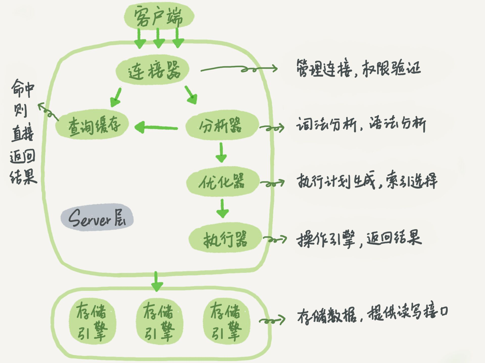

# MySQL45讲读书笔记

### 长链接和短连接

长链接: 连接器连接成功后，如果客户端持续有请求，则会一直使用同一个连接，

短连接: 每次执行完很少的几次查询后就断开连接，下次查询在重新建立连接

#### 注意

1. 建立连接的过程是比较复杂的，尽量使用长链接，但是长链接会占用内存，mysql执行过程中使用的内存等资源会在链接断开时才释放

   **解决办法：**

   - 定期断开长链接，或者再一个大查询后断开连接在重连
   - 维护一个短连接池

## 流程

连接器（权限效验），分析器（词法分析，语法分析），优化器（索引相关），执行器

## 日志

redo log (重做日志)，用于保证即使数据库发生异常重启，之前提交的记录都不会丢失（crash-safe），属于 innodb 引擎特有的日志

粉板

bin log(归档日志)，属于 server 层自己的日志

账本

**如果对字段进行了函数操作，就用不上索引了**

一个数据表，使用索引是将数据行按照更容易查询的顺序重新排列一遍，使得查询时一旦找到不满足条件的记录，就立即停止查询，而不用查询全表，提升了效率，这是索引的快速定位功能，全索引查询相当于全表查询，只是又额外消耗了一个索引树，同时还有回表操作，

