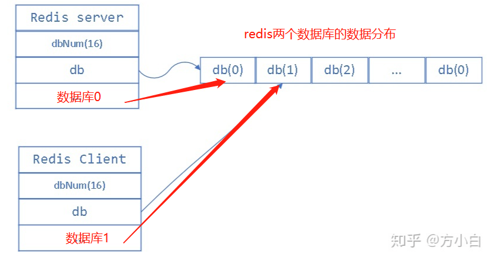

### 数据库SQL优化思路

**参考：**

- [52 条 SQL 语句性能优化策略](https://zhuanlan.zhihu.com/p/349073275) 
- [(9条消息) 实践中如何优化MySQL（精）_Chackca的博客-CSDN博客_mysql优化](https://blog.csdn.net/qq_35642036/article/details/82820129) 
- [盘点数据库慢查询的12个原因](https://juejin.cn/post/7103315065352552456) 

#### 1.索引优化

#### 2.语法优化

1. 尽量使用`union all`替换`union`

   **参考：**

   - [MySQL表组合查询：UNION、UNION ALL](https://blog.51cto.com/u_15346415/5171359) 

   `union` 总是完成去重排序的工作，而`union all`只是简单的拼接，可能会出现重复

2. 应尽量避免在 where 子句中使用 or 来连接条件，如果一个字段有索引，一个字段没有索引，将导致引擎放弃使用索引而进行全表扫描，

   尽量使用`union`操作替换`or`操作，用OR的字句可以分解成多个查询，并且通过UNION 连接多个查询。他们的速度**只同是否使用索引有关**，如果查询需要用到**联合索引**，用UNION all执行的效率更高。

3. 根据情况可以**强制指定索引**

   ```sql
   select * from users force index	('inx_user_id') where name = 1
   ```

4. 

#### 3.结构优化

1. SQL语句尽量使用大写，数据库解析会先将SQL语句转为大写，同时应该避免SQL首尾出现空格，因为查询缓冲并不自动截取首尾空格。

1. 无论是redis中的大键（查询耗时严重）还是SQL中的长SQL（SQL太长会被截断）都会对性能造成影响

1. 重建表空间，消除数据空洞，节省磁盘资源

   **参考：**

   - [(25条消息) MySQL数据库表空间回收问题_mysql 回收表空间_靖节先生的博客-CSDN博客](https://blog.csdn.net/m0_37583655/article/details/128054167) --**极好**
   - [(25条消息) mysql crud造成数据空洞的原因_S-U-M-M-E-R的博客-CSDN博客_插入数据造成空洞](https://blog.csdn.net/qq_29066533/article/details/113532109) 
   
   ```sql
   alter table A engine=InnoDB
   ```

#### 4.配置优化
1. 对查询进行优化，要尽量避免全表扫描，考虑在 where 及 order by 涉及的列上建立索引
2. 应尽量避免在 where 子句中对字段进行 null 值判断，否则将导致引擎放弃使用索引而进行全表扫描
3. 应尽量避免在 where 子句中使用 != 或 <> 操作符，否则将引擎放弃使用索引而进行全表扫描
4. 应尽量避免在 where 子句中使用 or 来连接条件，如果一个字段有索引，一个字段没有索引，将导致引擎放弃使用索引而进行全表扫描。如：select id from t where num=10 or Name = 'admin'
5. 下面的查询也将导致全表扫描select id from t where name like ‘%abc%’   若要提高效率，可以考虑全文检索。
6. 尽量避免在where子句中对字段模糊匹配，函数操作
7. 尽量避免在where子句中的=左边进行函数，算数运算，或其他表达式运算，如：select id from t where num/2 = 100应改为：select id from t where num = 100*29. 
8. 一个表的索引最好不要超过6个，因为索引提高了查询效率，但是减弱了插入和更新的效率
9. 在新建临时表时，如果一次性插入数据量很大，那么可以使用 select into 代替 create table，避免造成大量 log ，以提高速度；如果数据量不大，为了缓和系统表的资源，应先create table，然后insert。
10. 如果使用到了临时表，在存储过程的最后务必将所有的临时表显式删除，先 truncate table ，然后 drop table ，这样可以避免系统表的较长时间锁定
11. 索引数据结构为什么采用B+树     为了尽量减少I/O操作


### 长链接和短连接

> 建立连接的过程是比较复杂的，尽量使用长链接，但是长链接会占用内存，mysql执行过程中使用的内存等资源会在链接断开时才释放

长链接: 连接器连接成功后，如果客户端持续有请求，则会一直使用同一个连接，

短连接: 每次执行完很少的几次查询后就断开连接，下次查询在重新建立连接

**解决办法：**

- 定期断开长链接，或者再一个大查询后断开连接在重连
- 维护一个短连接池

### mysql表删一半数据，表空间会变小吗

**参考：**[(25条消息) MySQL数据库表空间回收问题_mysql 回收表空间_靖节先生的博客-CSDN博客](https://blog.csdn.net/m0_37583655/article/details/128054167) --**极好**

不会，mysql执行delete操作后，存储在硬盘上的数据没有被删除，只不过在记录行上做了逻辑删除，即通过删除标识位实现。

因为移除它们之后，很多其他的记录需要在磁盘上重新排列，这样会消耗大量的性能，比如如果是一张大表，存在索引，删除了其中一行，那么整个索引结构就会发生变化，随之而来的是要改变索引结构，必将带来磁盘IO，大家都知道磁盘IO是很浪费性能的。所有被删除的记录都会组成一个垃圾链表，这个链表中记录占用的空间叫做可重用空间，之后有新记录插入的时候可能把已删除记录占用的空间覆盖掉。

### 索引的优缺点   

**优点：**    

1. 通过创建唯一性索引，可以保证数据库表中每一行数据的唯一性。     

2. 可以大大加快数据的检索速度，这也是创建索引的最主要的原因。     

3. 可以加速表和表之间的连接，特别是在实现数据的参考完整性方面特别有意义。    

4. 在使用分组和排序子句进行数据检索时，同样可以显著减少查询中分组和排序的时间。    

5. 通过使用索引，可以在查询的过程中，使用优化隐藏器，提高系统的性能。

 **缺点：**    

1. 创建索引和维护索引要耗费时间，这种时间随着数据量的增加而增加。     
2. 索引需要占物理空间，除了数据表占数据空间之外，每一个索引还要占一定的物理空间，如果要建立聚簇索引，那么需要的空间就会更大。     
3. 当对表中的数据进行增加、删除和修改的时候，索引也要动态的维护，这样就降低了数据的维护速度。索引是建立在数据库表中的某些列的上面。在创建索引的时候，应该考虑在哪些列上可以创建索引，在哪些列上不能创建索引。

 **哪些字段适合建索引**    

1. 在经常需要搜索的列上，可以加快搜索的速度；     
2. 在作为主键的列上，强制该列的唯一性和组织表中数据的排列结构；    
3. 在经常用在连接的列上，这些列主要是一些外键，可以加快连接的速度；    
4. 在经常需要根据范围进行搜索的列上创建索引，因为索引已经排序，其指定的范围是连续的；     
5. 在经常需要排序的列上创建索引，因为索引已经排序，这样查询可以利用索引的排序，加快排序查询时间；     
6. 在经常使用在WHERE子句中的列上面创建索引，加快条件的判断速度。 

**哪些字段不适合建索引**     

1.对于那些在查询中很少使用或者参考的列不应该创建索引。这是因为，既然这些列很少使用到，因此有索引或者无索引，并不能提高查询速度。相反，由于增加了索引，反而降低了系统的维护速度和增大了空间需求。

### mongodb和Mysql的区别

**mysql**

1、在不同的引擎上有不同的存储方式。
 2、查询语句是使用传统的sql语句，拥有较为成熟的体系，成熟度很高。
 3、开源数据库的份额在不断增加，mysql的份额页在持续增长。
 4、**缺点就是在海量数据处理的时候效率会显著变慢**。

**mongodb**

1、存储方式：虚拟内存+持久化。
 2、查询语句：是独特的MongoDB的查询方式。
 3、适合场景：事件的记录，内容管理或者博客平台等等。
 4、架构特点：可以通过副本集，以及分片来实现高可用。
 5、数据处理：**数据是存储在硬盘上的**，只不过需要经常读取的数据会被加载到内存中，将数据存储在物理内存中，从而达到高速读写。
 6、成熟度与广泛度：新兴数据库，成熟度较低，Nosql数据库中最为接近关系型数据库，比较完善的DB之一，适用人群不断在增长。


### 最左前缀原则

> MySQL 建立多列索引（联合索引）有最左匹配的原则，即最左优先：
> 如果有一个 2 列的索引 (a, b)，则已经对 (a)、(a, b) 上建立了索引；
> 如果有一个 3 列索引 (a, b, c)，则已经对 (a)、(a, b)、(a, b, c) 上建立了索引；

```sql
select * from t where a=1 and b=1 and c =1;     #这样可以利用到定义的索引（a,b,c）,用上a,b,c

select * from t where a=1 and b=1;     #这样可以利用到定义的索引（a,b,c）,用上a,b

select * from t where b=1 and a=1;     #这样可以利用到定义的索引（a,b,c）,用上a,b（mysql有查询优化器）

select * from t where a=1;     #这样也可以利用到定义的索引（a,b,c）,用上a

select * from t where b=1 and c=1;     #这样不可以利用到定义的索引

select * from t where a=1 and c=1;     #这样可以利用到定义的索引（a,b,c），但只用上a索引，b,c索引用不到
```

**模糊匹配与范围匹配时**

> 对于索引中的字段，mysql会一直向右匹配直到遇到**范围查询(>、<、between、like) 后**就停止匹配

```sql
// (a, b, c) 联合索引，遇到b>1000时，最左匹配就会停止，结果就是用到了(a,b)索引，从没有用上，
select * from LOL where a = 2 and b > 1000  and c='JJJ疾风剑豪';

// 优化后，此时可以用上(a,b,c)索引，通过优化顺序节省了一个索引
select * from LOL where a = 2 and c='JJJ疾风剑豪' and b > 1000 ;
```


### redis的多个数据库有什么用？

> 没什么用，reids是单线程的，所以多个库并不能带来性能的提升
>
> 可以在一些不重要的地方稍微用一下第二个库，正常情况下不建议使用




### innodb存储引擎的特性

1. **插入缓冲 （insert_buffer -> change_buffer)**

   > change_buffer既是缓冲也是实际存在的数据也，插入缓冲其实并不只是插入操作，而是所有change操作都会进行缓冲，主要利用的原理是**顺序插入与批量插入**
   >
   > 用于提升非聚簇索引页的DML操作（CUD）的性能，类似于一个B+树，存储与共享表空间中

   **参考：**

   - [(26条消息) 什么是Mysql的next-key、插入缓冲、二次写、自适应哈希索引和预读_mysql next-key_走出半生仍是少年的博客-CSDN博客](https://blog.csdn.net/m0_46761060/article/details/124244111) 

   **change_buffer的使用条件**

   1. 索引为非聚簇索引

      由于聚簇索引本身便是顺序的，而且聚簇索引叶子结点存储的就是全部数据，不需要回表，如果使用change_buffer还会额外增加回表次数

   2. 索引为非唯一索引

      如果辅助索引是唯一索引，那么在插入时需要校验唯一性，校验唯一性的时候就会发生离散读取，从而又增加了开销，那么insert buffer得不偿失。


1. **预读**

   > 预读（read-ahead)操作是一种IO操作，用于异步将磁盘的页读取到buffer pool中
   >
   > 分区 extend ，一个extend有多个数据页 page

   1. Linear read-ahead（线性预读）

      > 当buffer pool 中有一定量的页被顺序访问，那么启动线性预读，预测到这些页临近的页也会很快被访问到，就从磁盘读取这些预测访问到的页加载到内存中，

      **配置：**

      ```python
      # 这个参数控制InnoDB在检测顺序页面访问模式时的灵敏度
      # 修改需要有set global 权限
      # 未添加这个参数时， InnoDB会在读取到当前区段最后一页时才会发起异步预读请求
      innodb_read_ahead_threshold = （0-64）
      
      比如，如果设置为48，在当前区块中当有48个页被顺序访问时，InnoDB就会启动异步的预读操作，如果设置为8，则仅仅有8个页被顺序访问就会启动异步预读操作。
      ```

   2. Random read-ahead（随机预读）

      > mysql5.5以废弃

2. **双写机制（double write)**

   > 在InnoDB将BP中的Dirty Page刷（flush操作）到磁盘上时，首先会将（memcpy函数）Page刷到InnoDB tablespace的一个区域中，我们称该区域为Double write Buffer（大小为2MB，每次写入1MB，128个页，每个页16k

   1. 在异常崩溃时，如果不出现“页数据损坏”，能够通过redo恢复数据
   2. 在出现“页数据损坏”时，能够通过double write buffer恢复页数据

3. **自适应哈希索引（Adaptive Hash Index，AHI）** 

   > hash的具有很高的读写性能
   >
   > InnoDB存储引擎会监控对表上辅助索引页的查询。如果观察到建立hash索引可以提升性能，就会在缓冲池建立hash索引，称之为自适应哈希索引（Adaptive Hash Index，AHI）。
   >
   > **注意：** hash查询是等值查询，所以范围查询，模糊查询不能使用自适应哈希索引（AHI）
   >
   > 启用了AHI后，读写的速度会提升2倍，辅助索引的连接操作性能可以提高5倍。

   自适应哈希索引由innodb_adaptive_hash_index 变量启用,AHI是通过缓冲池的B+ Tree构造而来，使用索引键的前缀来构建哈希索引，前缀可以是任意长度。InnoDB存储引擎会自动根据访问的频率和模式来自动地为某些热点页建立hash索引。加快索引读取的效果，相当于索引的索引，帮助InnoDB快速读取索引页。

   

### MVCC 是什么？

> 多版本并发控制，维持数据的多个版本(事务之类的)


#### 可能会导致慢查询的原因与响应的解决办法？

1. binlog日志太大，导致日志耗时严重

   **参考：**

   - [(10条消息) Mysql数据库insert报慢查询_xiaolyuh123的博客-CSDN博客](https://blog.csdn.net/xiaolyuh123/article/details/78793626)

   ```python
   # 通过修改  set global binlog_cache_size=8388608; 适当减小缓存大小
   ```

2. 对数据量极大的数据分页会越来越慢

   ```python
   # 通过指定起点，使用偏移跳过前期的查询
    select * from tb where id in（select id from tb where limit 10 offset 20）
   ```

3. 索引使用不规范

   > 条件跟索引的类型匹配导致没有用到索引，引起慢查询

4. 锁冲突，死锁。


## 实际问题

​	1. 数据字段设计问题，尽量不要使用 `json`类型，当一个字段存储了多个数据，那么反向查询就会很麻烦

2. 长事务，长SQL问题，导致的 `OperationalError: (2006, 'MySQL server has gone away')`

   **参考：**

   - https://cloud.tencent.com/developer/article/1406425

3. 死锁问题

   **参考：**

   - [Mysql报Deadlock found when trying to get lock； try restarting transaction问题解决](https://blog.csdn.net/qq_44240587/article/details/108400666) 

   无论前台后台的程序，都不应该存在仅根据非主键的几个字段一查就要update/delete的场景。即使有，也应该改为先把要更新的记录查出来然后逐条按主键id更新。
