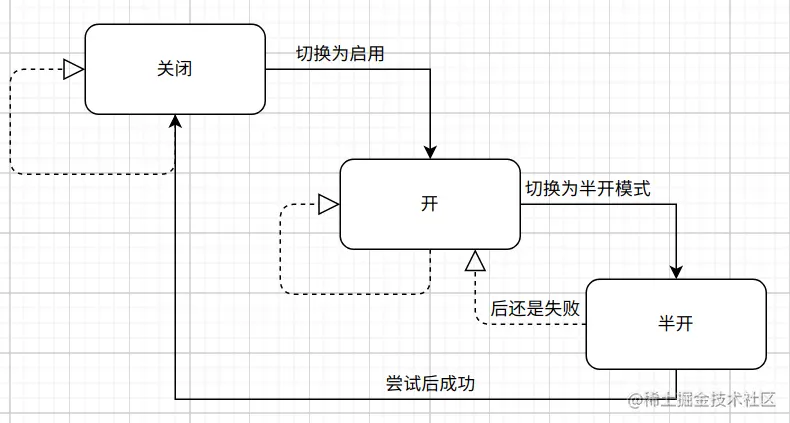

### 微服务熔断

> 熔断是从全局出发，为了保证系统稳定性而停用服务

**参考：**

- [RPC框架编写时间-熔断器](https://juejin.cn/post/7001122588357296158) 

熔断器的本质上是一个包含了熔断检测， 熔断开关， 数据统计三个功能的状态机， 它通过收集统计数据来更改熔断开关， 每次有新的请求就会通过熔断检测判断当前请求可否放行， 它的3种状态分别是：

- 全开

  此时熔断器打开， 使用快速失败返回， 请求不会请求到服务端

- 半开

  当熔断器开启到一定的阶段后， 会到了尝试阶段， 此时的熔断器会允许少量的请求通过， 并通过这些请求来判断下一步的状态

- 关

  此时熔断器关闭， 所有请求可以正常的到达服务端。

这几种状态的切换是有针对性的， 如下图， 全开只能切换到半开， 半开可以按条件切换为全开或者关， 而关只能切换到全开。

### 降级

> 指程序在出现问题时，仍能保证有限功能可用的一种机制，并不是整体不可用。

**参考：**

- [面试官：熔断和降级有什么区别？ - 掘金 (juejin.cn)](https://juejin.cn/post/7200773486797242405) 

