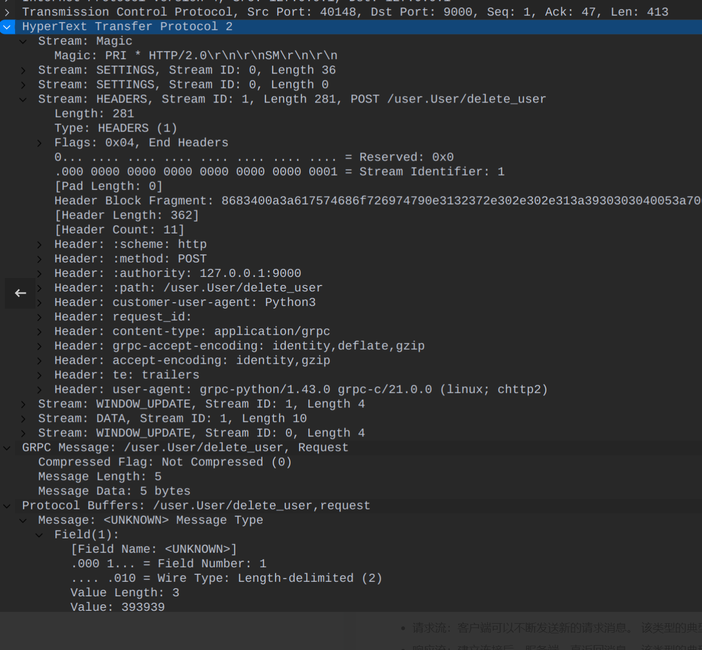

### ProtoBuffer语法

**参考：**

- [Python-gRPC实践（2）--Protocol Buffer](https://so1n.me/2022/02/05/Python-gRPC%E5%AE%9E%E8%B7%B5(2)--Protocol%20buffer/) 

#### 字段编号

> 消息体的字段编号是递增的，
>
> 之所以要求字段编号从1开始递增是因为Protobuf从message编码成二进制消息体时，字段编号1-15将会占用1个字节，16-2047将占用两个字节，优先使用1-15的字段编号将会减少数据的传输， 如果在一开始消息体的字段就比较多时， 则需要把常用的字段的字段编号安排在1-15之间。此外，19000到19999是给protocol buffers实现保留的字段标号，定义message时不能使用，如果使用了这些编号，Protobuf编译器将会报错。

**grpc请求抓包**

> 请求中表明`Field`为1，值为999, 接受端收到请求后就会先从proto文件查数据， 通过URL得出这个请求是service为`User`， rpc为`delete_user`的请求， 那么请求的message就是`DeleteUserRequest`，接下来就能知道`Field`为1实际的字段名是`uid`。



可以注意到 Field Number 为 1，即对应了proto文件

```protobuf
message DeleteUserRequest {
  string uid = 1;
}
```


需要注意的是，我们虽然声明的字段没有标明他的值是多少，但是他们**都有默认值**：

- 字符串类型：空字符串
- 字节类型：空字节
- 数字类型： 0
- enum: 默认值的第一个元素，且值必须为0

#### proto使用规范

> 这几条规范的共性就是不对源文件进行删除，每次都只做到新增，从而保证即使proto文件发生了更改， 旧的服务在不更新的情况下也还能正常的使用。

- proto文件只增不减
- proto文件的接口只增不减
- proto文件的message字段只增不减
- proto文件中的message字段类型和序号不得修改

#### 基础类型

| .proto类型 | java类型   | C++类型 | 备注                                                         |
| ---------- | ---------- | ------- | ------------------------------------------------------------ |
| double     | double     | double  |                                                              |
| float      | float      | float   |                                                              |
| int32      | int        | int32   | 使用可变长编码方式。编码负数时不够高效——如果你的字段可能含有负数，那么请使用sint32。 |
| int64      | long       | int64   | 使用可变长编码方式。编码负数时不够高效——如果你的字段可能含有负数，那么请使用sint64。 |
| unit32     | int[1]     | unit32  | 总是4个字节。如果数值总是比总是比228大的话，这个类型会比uint32高效。 |
| unit64     | long[1]    | unit64  | 总是8个字节。如果数值总是比总是比256大的话，这个类型会比uint64高效。 |
| sint32     | int        | int32   | 使用可变长编码方式。有符号的整型值。编码时比通常的int32高效。 |
| sint64     | long       | int64   | 使用可变长编码方式。有符号的整型值。编码时比通常的int64高效。 |
| fixed32    | int[1]     | unit32  |                                                              |
| fixed64    | long[1]    | unit64  | 总是8个字节。如果数值总是比总是比256大的话，这个类型会比uint64高效。 |
| sfixed32   | int        | int32   | 总是4个字节。                                                |
| sfixed64   | long       | int64   | 总是8个字节。                                                |
| bool       | boolean    | bool    |                                                              |
| string     | String     | string  | 一个字符串必须是UTF-8编码或者7-bit ASCII编码的文本。         |
| bytes      | ByteString | string  | 可能包含任意顺序的字节数据                                   |

#### 特殊字段

| 英文     | 中文                                                | 备注                                           |
| -------- | --------------------------------------------------- | ---------------------------------------------- |
| enum     | 枚举(数字从零开始) 作用是为字段指定某”预定义值序列” | enum Type {MAN = 0;WOMAN = 1; OTHER= 3;}       |
| message  | 消息体                                              | message User{}                                 |
| repeated | 数组/集合                                           | repeated User users  = 1                       |
| import   | 导入定义                                            | import "protos/other_protos.proto"             |
| map      | 类似dict                                            | map<string, int32> demo_map = 1;               |
| //       | 注释                                                | //用于注释                                     |
| extend   | 扩展                                                | extend User {}                                 |
| package  | 包名                                                | 相当于命名空间，用来防止不同消息类型的明明冲突 |

**Timestamp:**

Timestamp是Protobuf中的时间类型，Protobuf使用语法如下：

```protobuf
import "google/protobuf/timestamp.proto";

message DemoRequest {  
	google.protobuf.Timestamp timestamp = 1;
} 
```

**Empty：**

Empty是Protobuf中代表空的类型，跟Python中的None一样, 一般不用在消息体中， 而是用来标明某个rpc方法返回了空，Protobuf语法如下

```protobuf
import "google/protobuf/empty.proto";

service Demo {
  rpc demo (DemoRequest) returns (google.protobuf.Empty);
}
```

**Enum：**

> 值得注意的是**枚举定义都需要包含一个常量映射到0并且作为定义的首行**，这是因为Protobuf要求定义的枚举值中必须有字段的值为0，当引用到这个类型的字段没有定义默认值时，它的默认值就是枚举类型中值为0的字段。

在定义消息类型时， 可能希望其中一个字段只有一个预定义的值，这时就会用到枚举类型，Protobuf使用Enum语法如下

```protobuf
message DemoRequest {
  enum Status {
    open = 0;
    half_open = 1;
    close = 2;
  }
  Status status = 1;
}
```

