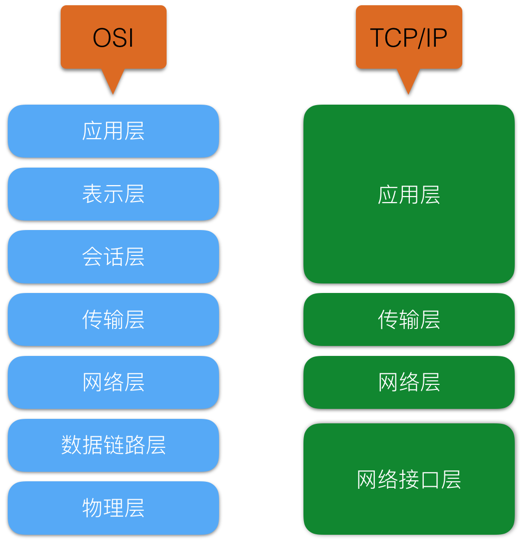
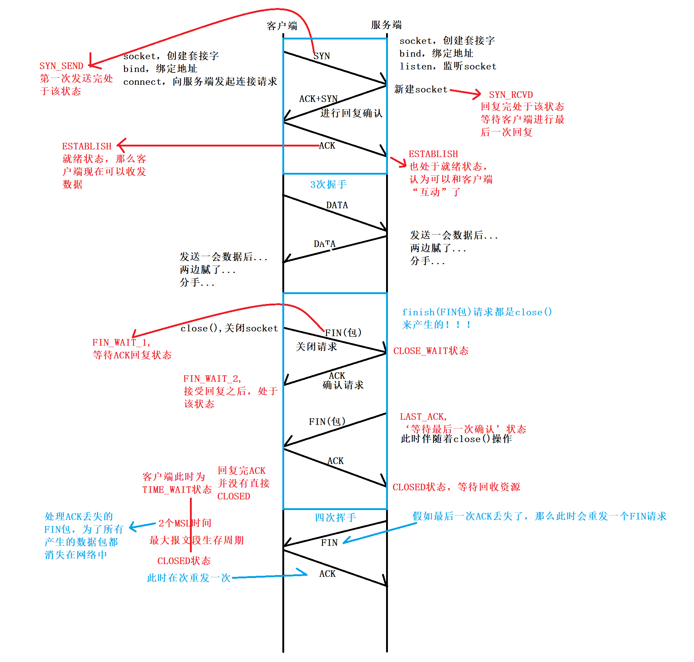

# 网络协议

## 七层网络体系结构：

- **应用层**：为应用程序提供交互服务。在互联网中的应用层协议很多，如域名系统DNS，支持万维网应用的HTTP协议，支持电子邮件的SMTP协议等。
- **表示层**：主要负责数据格式的转换，如加密解密、转换翻译、压缩解压缩等。**图像，视频编解码，数据加密**
- **会话层**：负责在网络中的两节点之间建立、维持和终止通信，如服务器验证用户登录便是由会话层完成的。**建立会话，如session认证，6666**
- **运输层**：有时也译为传输层，向主机进程提供通用的数据传输服务。该层主要有以下两种协议：
- - TCP：提供面向连接的、可靠的数据传输服务；
  - UDP：提供无连接的、尽最大努力的数据传输服务，但不保证数据传输的可靠性。
- **网络层**：选择合适的路由和交换结点，确保数据及时传送。主要包括IP协议。
- **数据链路层**：数据链路层通常简称为链路层。将网络层传下来的IP数据包组装成帧，并再相邻节点的链路上传送帧。
- **物理层**：实现相邻节点间比特流的透明传输，尽可能屏蔽传输介质和通信手段的差异。



## TCP/IP协议

**tcp协议的特性，这几个特性来保证数据的可靠性**

1. 确认机制
2. 滑动窗口
3. 重传机制
4. 拥塞机制

基于TCP/IP的参考模型将协议分成四个层次，它们分别是链路层、网络层、传输层和应用层

应用层：http，ftp

传输层：Tcp，Udp

- TCP应用，应用层协议，SMTP电子邮件，http万维网协议，FTP文件传输协议
- UDP应用，应用成协议，DNS（Domain Name System）域名解析，TFTP文件创术，SNMP网络管理，NFS远程文件服务器

网络层：IP

数据链路层： 以太网协议

每经过一层就加一层协议头

TCP ： 是一个传输层的面向连接的可靠的字节流服务，全双工共通信，与UDP相比传输效率低，传输速度慢，是用于对效率要求第，对准确型要求高，或者要求有链接的场景

**场景**，当对网络通讯质量有要求的时候，比如：整个数据要准确无误的传递给对方，这往往用于一些要求可靠的应用，比如HTTP、HTTPS、FTP等传输文件的协议，POP、SMTP等邮件传输的协议。

UDP：**UDP 是无连接的 不用握手挥手** 是一个传输层的面向无连接的不可靠的数据服务，传输效率高，传输速度块，可以一对多，一对一，多对一，多对多通信，

**场景**，当对网络通讯质量要求不高的时候，要求网络通讯速度能尽量的快，这时就可以使用UDP。


#### 三次握手

> 建立全双工通信

TCP/IP 协议是传输层的一个面向连接的安全可靠的一个传输协议，**三次握手的机制**是为了保证能建立一个安全可靠的连接，防止已失效的连接请求报文段突然又传送到了服务端，因而产生错误。

如果重发指定次数之后，仍然未收到 客户端的ACK应答，那么一段时间后，服务端自动关闭这个连接。

虽然还是能关闭这个连接，但是平白浪费了资源


**ACK 用于应答**

**SYN 用于同步**

发送同步请求 SYN 包含 seq=x 服务器收到同步请求，将同步请求的序列号加1，发送应答 ACK= x+1 ，此时客户端收到后，就已经建立了客户端向服务器的单向同步，应该在发送ACK的时候同时也发送一个同步信息 SYN 包含 seq=y,（原本是四次请求，因为ACK，SYN放在了一个包里，所以省了一次请求）客户端收到自己发送的同步请求的应答，也收到了服务器的同步请求，所以发送应答ACK=y+1,这样就建立了服务器与客户端双向的同步

#### 超时重传机制

在 TCP 的三次握手中，Client 发送 SYN，Server 收到之后回 SYN_ACK，接着 Client 再回 ACK，这时 Client 便完成了 connect() 调用，进入 ESTAB 状态。如果 Client 发送 SYN 之后，由于网络原因或者其他问题没有收到 Server 的 SYN_ACK，那么这时 Client 便会重传 SYN。重传的次数由内核参数 net.ipv4.tcp_syn_retries 控制，重传的间隔为 [1,3,7,15,31]s 等

**如果 Client 重传完所有 SYN 之后依然没有收到 SYN_ACK，那么这时 connect() 调用便会抛出 connection timeout 错误。如果 Client 在重传 SYN 期间，Client 的 sock timeout 时间到了，那么这时 connect() 会抛出 timeout 错误。**


#### **TCP半连接 （SYN攻击）**

在三次握手过程中，服务器发送SYN-ACK之后，收到客户端的ACK之前的TCP连接称为半连接(half-open connect，此时处于SYN_RECV状态)；服务器会维护一个半连接队列，存放所有当前的半连接，当收到客户端的ACK之后，会将对应的条目取出放入全连接队列中。注：服务器会定期重传SYN-ACK包，当重传次数超过系统设置最大次数，则丢弃该条目；

SYN攻击与DOS攻击很类似，利用了TCP的特性，短时间内发送大量“半连接请求”（故意丢弃服务端发回来的ACK-SYN），使得服务器的半连接队列满，从而无法接受新的连接。netstat -n -p TCP | grep SYN_RECV若发现大量连接处于SYN_RECV状态，大概率是SYN攻击。

**解决方案**

- 通过防火墙、路由器等过滤网关防护。
- 通过加固 TCP/IP 协议栈防范，如增加最大半连接数，缩短超时时间。

SYN队列(半连接对类)，accept队列(全连接队列)

#### DDos攻击

指的是处于不同位置的多个攻击者同时向一个或数个目标发动攻击，是一种分布的、协同的大规模攻击方式

使网站服务器充斥大量要求回复的信息，消耗网络带宽或系统资源，导致网络或系统不胜负荷以至于瘫痪而停止提供正常的网络服务。


#### 

#### **四次挥手**：

由客户端首先发起的，第一次挥手客户端会发送一个报文，在报文里面FIN标志位置1，当服务端收到这个报文就知道了客户端想要和我断开连接，但是此时服务端不一定能做好准备，因为当客户端发起断开连接的请求后，对于服务端而言还极有可能有未发送完的消息，还需继续发送，所以此时对于服务端而言只能进行一个消息确认（第二次挥手），即告诉客户端我知道你要和我断开连接，但是我这边还可能没有做好准备，你需要等我一下，等会儿我会告诉你（第三次挥手），于是，发完这个消息确认包过后，可能稍过片刻，服务端会继续发送一个断开连接的报文（第三次挥手），FIN位置1的报文，表示服务端已经做好断开连接的准备，当这个报文发给客户端的时候，客户端同样要给服务端发送一个消息确认的报文（第四次挥手），经过这四次的相互沟通和连接，我就知道了不管是客户端还是服务端都已经做好了断开连接的准备，于是连接断开了

**ACK 用于应答**

**FIN 用于同步**

整个请求过程和建立连接相似，但是，由于当收到断开连接的请求时，服务器可能有正在传输的数据，导致不能立刻断开连接，所以应答和同步不能放在一个包里，分为两次请求发送，所以就成了四次挥手

#### **TIME_WAIT有什么作用？**

**为什么是2MSL（Maximum Segment Lifetime）？MSL一般是多长时间**

**MSL 指一段 TCP 报文在传输过程中的最大生命周期，超过这个时间报文将被丢弃。**。因为client发送完最后的ACK之后，服务器如果没有收到这个应答，就会在发送一次FIN请求，那么客户端从发出最后一次ACK应答到收到这次FIN请求，总时间为2MSL，如果服务器正常断开连接，就不会再次发送FIN请求，所以client需要等待一段时间，**从发出到收到响应，**2MSL是为了一个发送（服务器发送FIN）和一个回复（客户端回复ACK）所需的最大时间。

 注：MSL一般实现为30秒，RFC建议2分钟。

**TTL：**ip头中有一个TTL域，TTL是time to live的缩写，中文可以译为“生存时间”，这个生存时间是由源主机设置初始值但不是存的具体时间，而是存储了一个ip数据报可以经过的最大路由数，每经过一个处理他的路由器此值就减1，当此值为0则数据报将被丢弃，同时发送ICMP报文通知源主机。**，MSL要大于等于TTL**

**TIME_WAIT只出现在主动关闭连接方**，大部分情况都是客户端主动关闭，但是也有服务器端主动关闭，如：一个简易的HTTP服务器，客户端发送HTTP请求后，服务器返回RESPONSE之后立刻主动关闭连接。

服务器端TIME_WAIT过多的原因：

1. 网络拥塞，不断重发最后一个ACK（TIME_WAIT过程中，这条连接无法被复用）
2. 短时间内高并发的短连接 （如1秒内100万条TCP连接，并且每次连接只持续10秒）

#### 拥塞控制

- 慢开始 (slow-start)； **慢开始：**不要一开始就发送大量的数据，由小到大逐渐增加拥塞窗口的大小。
- 拥塞避免 (congestion avoidance)；
- 快速重传 (fast retransmit)；
- 快速恢复 (fast recovery)。

#### 状态

主动连接端可能的状态有：         

        CLOSED        SYN_SEND        ESTABLISHED。

主动关闭端可能的状态有：         

        FIN_WAIT_1        FIN_WAIT_2        TIME_WAIT。

被动连接端可能的状态有：         

        LISTEN        SYN_RECV        ESTABLISHED。

被动关闭端可能的状态有：         

        CLOSE_WAIT        LAST_ACK        CLOSED。

## TCP/UDP

> tcp是面向连接的，可靠的字节流服务，udp是面向无连接的，不可靠而数据传输服务

| 类型 | 是否面向连接 | 传输可靠性           | 传输形式   | 传输效率 | 所需资源 | 应用场景           | 首部字节 |
| ---- | ------------ | -------------------- | ---------- | -------- | -------- | ------------------ | -------- |
| TCP  | 是           | 可靠（保证顺序接受） | 字节流     | 慢       | 多       | 文件传输           | 20-60    |
| UDP  | 否           | 不可靠（不保证）     | 数据报文段 | 块       | 少       | 即时通讯，域名转换 | 8个字节  |

#### **TCP/UDP的区别与联系**

TCP ： 面向连接，无差错，不丢失，不重复，按序到达，一对一的全双工通信

UDP：尽可能快的传输，其他不保证，一对一，一对多，多对一，多对多的交互通信

UDP是面向报文的，发送方的UDP对应用层交下来的报文，不合并，不拆分，只是在其上面加上首部后就交给了下面的网络层，论应用层交给UDP多长的报文，它统统发送，一次发送一个。而对接收方，接到后直接去除首部，交给上面的应用层就完成任务了。因此，它需要应用层控制报文的大小

TCP是面向字节流的，它把上面应用层交下来的数据看成无结构的字节流会发送，可以想象成流水形式的，发送方TCP会将数据放入“蓄水池”（缓存区），等到可以发送的时候就发送，不能发送就等着TCP会根据当前网络的拥塞状态来确定每个报文段的大小。

TCP vs UDP
基于连接 vs 无连接
资源较多 vs 资源较少（轻量）
结构复杂 vs 结构简单 — header 20字节（还有optional字段，总共最长60字节） vs 8字节
流模式（Byte Stream） vs 数据报模式
可靠传输 vs 不保证送达
保证顺序接收（seq） vs 不保证
拥塞控制 vs 无
保活 vs 无
如果已经建立了TCP连接但是客户端突然发生了故障（不接受数据，无法回复），TCP有一个保活计时器，服务器每收到一次客户端的请求都会重置改计时器，若规定时间内没收到客户端的任何消息，服务器会发送探测报文，一连发送10个都无反应的话，主动关闭连接

#### **TCP/UDP各自的应用场景**

- TCP 用于在传输层有必要实现可靠传输的情况

  - **HTTP**，FTP文件传输协议 21，SMTP简单邮件传送协议 53，POP3用于接收邮件，TELNET
  - 发消息，发邮件，文件传输（数据量不大，且需要保证不丢失）

- UDP 用于对高速传输和实时性有较高要求的通信

  - DNS — 就是要快，默认53端口
  - SNMP简单网络管理协议，161，TFTP简单文件传输协议 69
  - 视频聊天/直播，即使丢失几个画面影响也不大，同时数据量大需要速度，减小overhead

## http协议

- HTTP 协议是一个构建于 TCP/IP 协议之上的一个应用层协议，默认端口号是 80，**他 定义了与服务器交互的不同方法**

#### **什么是HTTP报文？**

HTTP报文是HTTP协议在客户端和服务端之间传送的数据块。

#### http协议是无状态的，那他怎么记得传输信息

> 协议自身不对请求和响应之间的通信状态进行保存，即对发送过来的请求和响应都不做持久化处理

1. **基于 Session 实现的会话保持**

   将状态存入session，若是分布式应用，那么就是用中间件，如Redis,这样任意一个服务器都能访问用户状态

2. **基于 Cookie 实现的会话保持**

   缺点：该方式不够安全，因为状态信息存储在客户端，这意味着不能在会话中保存机密数据。除此之外，浏览器每次发起 HTTP 请求时都需要发送额外的 Cookie 到服务器端，会占用更多带宽。


3. **Cookie被禁用了怎么办？**

   若遇到 Cookie 被禁用的情况，则可以通过重写 URL 的方式将会话标识放在 URL 的参数里，也可以实现会话保持。

#### Https和Http区别？

**http**协议是应用层的协议，中文名称是超文本传输协议，是客户端和服务端相互通信时将信息以http报文的形式传输。

**https**可以简单的理解为：https = http + 加密 + 认证 + 完整性保护。

HTTP 和 HTTPS 使用的是完全**不同的连接方式**，用的端口也不一样，前者是 80 端口，后者是 443 端口。

**http1.0和http1.1的区别**

1. **http1.0**默认采用短连接，每次请求都需要建立新的TCP连接，连接不能复用

   **HTTP1.1**支持持久连接和请求的流水线处理，在一个TCP连接上可以传送多个HTTP请求和响应，减少建立和关闭TCP连接的消耗和延迟，提高效率。HTTP1.1默认开启“Connection:Keep-Alive”，使用长连接，加入“Connection:close”才关闭

2. host字段

   在HTTP1.0中为每台服务器绑定一个唯一的IP地址，因此，请求消息中的URL并没有传递主机名（hostname）。但是随着虚拟主机技术的发展，在一台物理服务器上可以存在多个虚机主机，并且它们共享一个IP地址。

   HTTP1.1的请求消息和响应消息都应支持Host头域，且请求消息中如果没有Host头域，会报400 Bad Request错误。

3. 新增一些错误通知状态码

   HTTP1.1中新增了24个错误状态响应码，如409（Conflict）表示请求的资源与资源的当前状态发生冲突。

4. 缓存处理

   1.0中主要使用header离的Expires来走哦缓存判断的标准，而1.1中引入了更多的缓存控制，比如，if_unmodified,if-match,entity-tag

5. 带宽优化和网络连接

   http1.0不支持断点续传，有时候需要某个对象的一部分，而服务器缺件整个对象都发送回来，且发生断联后，需要重新下载完成的包

   http1.1引入了 range头域，它允许之请求资源的某个部分，返回码是206

#### http协议的缺点:

1. 通信使用明文，内容可能被窃听。
2. 通信双方的身份无法得到认证，身份可能遭遇伪装。
3. 无法验证报文的完整性。

针对以上问题，https的改进措施:

1. 加密。https协议通过SSL或者TLS协议将报文内容进行加密，client端进行加密，server端进行解密。
2. 认证。通过值得信赖的第三方机构颁布证书，即可确认通信双方的身份。客户端持有证书即可完成客户端身份的确认，客户端通信前会查看服务端的证书。
3. 完整性保护。可以通过MD5等散列码进行通信内容的校验。

HTTPS 协议需要到数字认证机构（Certificate Authority, CA）申请证书，一般需要一定的费用。
HTTP 页面响应比 HTTPS 快，主要因为 HTTP 使用 3 次握手建立连接，客户端和服务器需要握手 3 次，而 HTTPS 除了 TCP 的 3 次握手，还需要经历一个 SSL 协商过程。

#### HTTP如何禁用缓存？如何确认缓存？

```python
# 禁止缓存 no-store 指令规定不能对请求或响应的任何一部分进行缓存。
Cache-Control: no-store
    
# 确认缓存 no-cache 指令规定缓存服务器需要先向源服务器验证缓存资源的有效性，有效时才会进行响应
Cache-Control: no-cache
```

##### URI和URL的区别?

URL是URI的子集。

URI相当于抽象类，URL就是这个抽象类的具体实现类。

##### put和post的区别？

post在发请求的时候，服务器会每次都创建一个文件，而put发请求的时候，是更新文件而不是创建文件，因此put是幂等的。

##### 常见的http首部字段

**a、通用首部字段**（请求报文与响应报文都会使用的首部字段）
Date：创建报文时间
Connection：连接的管理
Cache-Control：缓存的控制
Transfer-Encoding：报文主体的传输编码方式
**b、请求首部字段**（请求报文会使用的首部字段）
Host：请求资源所在服务器
Accept：可处理的媒体类型
Accept-Charset：可接收的字符集
Accept-Encoding：可接受的内容编码
Accept-Language：可接受的自然语言
**c、响应首部字段（**响应报文会使用的首部字段）
Accept-Ranges：可接受的字节范围
Location：令客户端重新定向到的URI
Server：HTTP服务器的安装信息
**d、实体首部字段**（请求报文与响应报文的的实体部分使用的首部字段）
Allow：资源可支持的HTTP方法
Content-Type：实体主类的类型
Content-Encoding：实体主体适用的编码方式
Content-Language：实体主体的自然语言
Content-Length：实体主体的的字节数
Content-Range：实体主体的位置范围，一般用于发出部分请求时使用

**URL构成：协议 + :// + 认证信息 + @ + 域名 or IP地址 + 端口号 + 资源路径 + ? + 查询字符串 + # + 片段标识符;**

##### 资源是什么，如何获取

资源就是服务器要呈现给客户端的内容，（服务器不想呈现的就不是资源），解析url,uri ,定位标记资源路径，通过tcp，udp传输资源来获取

GET方法与POST方法的区别


- get重点在从服务器上获取资源，post重点在向服务器发送数据；
- 安全性问题，get传输数据是通过URL请求，以field（字段）= value的形式，置于URL后，并用"?"连接，多个请求数据间用"&"连接，这个过程用户是可见的；
  post传输数据通过Http的post机制，将字段与对应值封存在请求实体中发送给服务器，这个过程对用户是不可见的；
- Get传输的数据量小，因为受URL长度限制，但效率较高；
  Post可以传输大量数据，所以上传文件时只能用Post方式；
- get方式只能支持ASCII字符，向服务器传的中文字符可能会乱码。
  post支持标准字符集，可以正确传递中文字符。

 **cookie 和 session 的区别**
（1）cookie 数据存放在客户的浏览器上，session 数据放在服务器上。

（2）cookie 不是很安全，别人可以分析存放在本地的 cookie 并进行 cookie 欺骗考虑到安全应当使 用 session。

（3）session 会在一定时间内保存在服务器上。当访问增多，会比较占用服务器的性能考虑到减轻服务器性能方面，应当使用 cookie。

（4）单个 cookie 保存的数据不能超过 4K，很多浏览器都限制一个站点最多保存 20 个 cookie。

（5）建议： 将登陆信息等重要信息存放为 SESSION 其他信息如果需要保留，可以放在 cookie 中


#### http 响应

```
1xx：指示信息--表示请求已接收，继续处理

2xx：成功--表示请求已被成功接收、理解、接受

3xx：重定向--要完成请求必须进行更进一步的操作

301 永久重定向，表示源资源已经被删除
	域名到期不想续费（或者发现了更适合网站的域名），想换个域名。

302 重定向，表示仅跳转，源资源还存在

4xx：客户端错误--请求有语法错误或请求无法实现

5xx：服务器端错误--服务器未能实现合法的请求

常见状态代码、状态描述、说明：

200 OK //客户端请求成功

202 // 通常表示一个请求正在进行中

400 Bad Request //客户端请求有语法错误，不能被服务器所理解

401 Unauthorized //请求未经授权，这个状态代码必须和WWW-Authenticate报头域一起使用

403 Forbidden //服务器收到请求，但是拒绝提供服务

404 Not Found //请求资源不存在，eg：输入了错误的URL

///414 Request-URI Too Large // 表示客户端请求中所包含的 URL 地址太长，以至于服务器无法处理；

///410 Gone // 表示所请求的资源已经被永久删除。

500 Internal Server Error //服务器发生不可预期的错误

503 Server Unavailable //服务器当前不能处理客户端的请求，一段时间后可能恢复正常
```


## wsgi和uWSGI和WSGI

**WSGI**，是一种描述web服务器（如nginx，uWSGI等服务器）如何与web应用程序（如用Django、Flask框架写的程序）通信协议。

在flask中的表现为要求必须是一个可调用的对象，要求能接受两个必选参数 environ（environ 必须是一个字典，包括了请求的相关信息，比如请求方式、请求路径等等),start_response（就是状态等信息,比如 `200 OK`、`404 Not Found`），返回值必须是可迭代对象，用来表示http body

**uwsgi**协议是一个uWSGI服务器自有的协议，它用于定义传输信息的类型（type of information），每一个uwsgi packet前4byte为传输信息类型描述，用于与nginx等代理服务器通信，它与WSGI相比是两样东西。
**uWSGI**是实现了uwsgi和WSGI两种协议的Web服务器