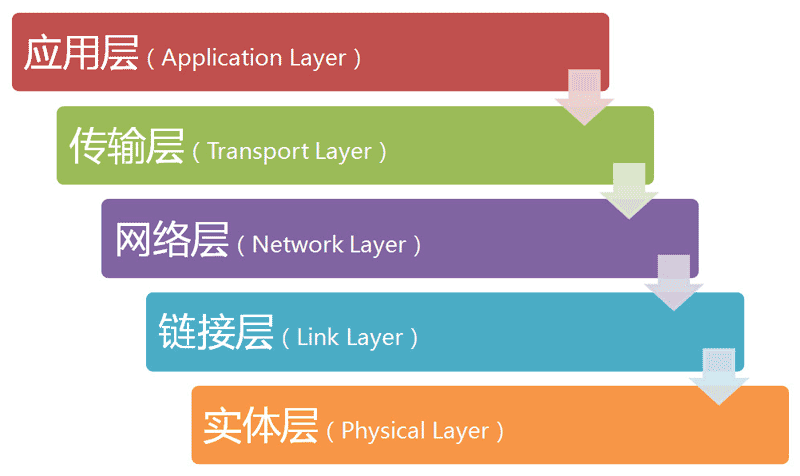
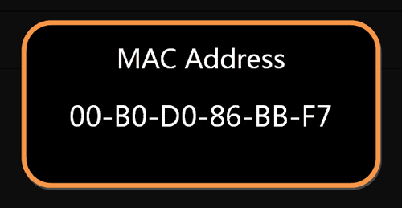
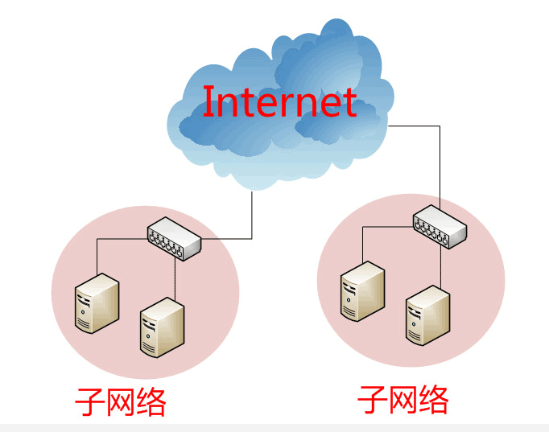
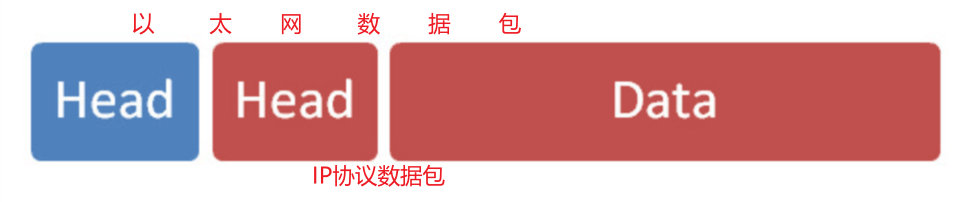
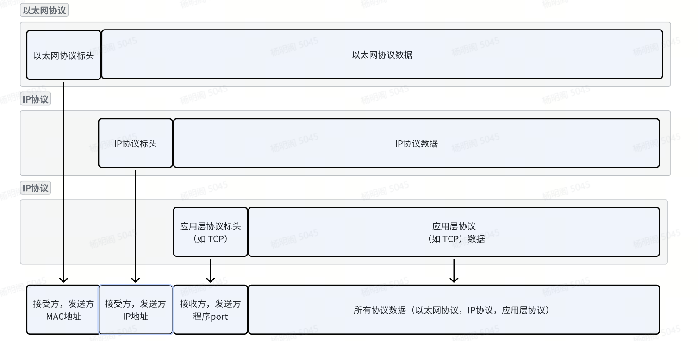
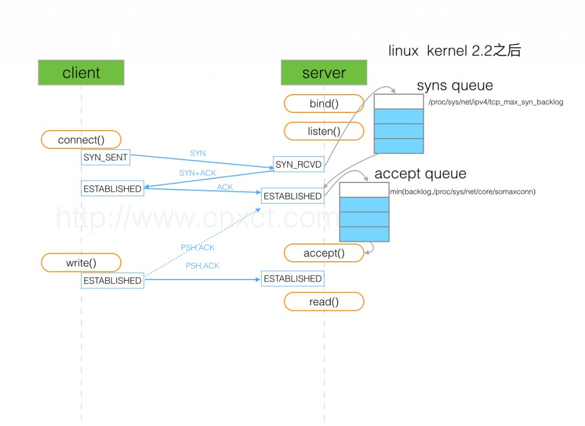
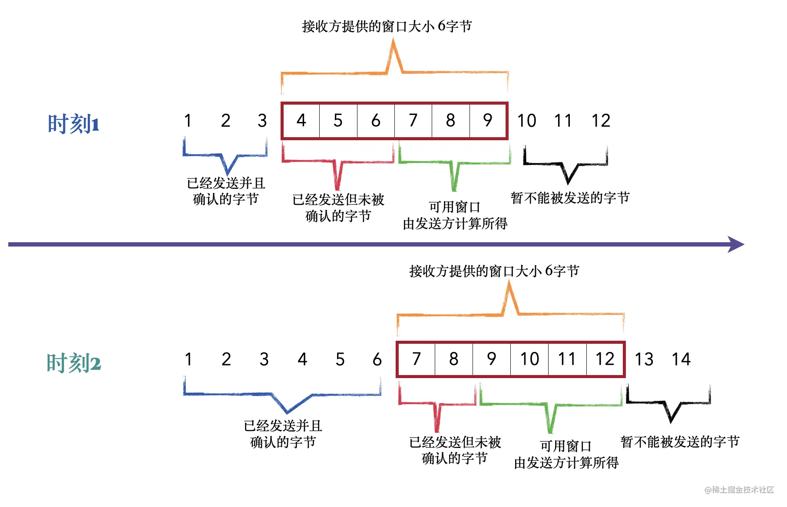

#### 网络传输协议

##### 网络分层

网络分层并不统一，比较广泛认可的有七层模型，四层模型，五层模型

- **应用层**：为应用程序提供交互服务。在互联网中的应用层协议很多，如域名系统DNS，支持万维网应用的HTTP协议，支持电子邮件的SMTP协议等。
- **表示层**：主要负责数据格式的转换，如加密解密、转换翻译、压缩解压缩等。**图像，视频编解码，数据加密**
- **会话层**：负责在网络中的两节点之间建立、维持和终止通信，如服务器验证用户登录便是由会话层完成的。**建立会话，如session认证，6666**
- **运输层**：有时也译为传输层，向主机进程提供通用的数据传输服务。该层主要有以下两种协议：
- - TCP：提供面向连接的、可靠的数据传输服务；
  - UDP：提供无连接的、尽最大努力的数据传输服务，但不保证数据传输的可靠性。
- **网络层**：选择合适的路由和交换结点，确保数据及时传送。主要包括IP协议。
- **数据链路层**：数据链路层通常简称为链路层。将网络层传下来的IP数据包组装成帧，并再相邻节点的链路上传送帧。
- **物理层**：实现相邻节点间比特流的透明传输，尽可能屏蔽传输介质和通信手段的差异。




##### 各层级解析

**参考:**

- [网络传输协议(上) (yuque.com)](https://www.yuque.com/xinu/notes/qdt0tv) - **清晰易懂**

**实体层：** 实体层组网连接使用光缆、电缆、双绞线、无线电波等方式。

**链接层：** 连接层组网使用以太网协议

以太网规定，一组电信号构成一个数据包，叫做"帧"（Frame）。每一帧分成两个部分：标头（Head）和数据（Data）。

以太网协议标头（Head）中规定接受者和发送者的信息，接收方和发送方的信息必须从一块网卡到另一块网卡，每一个块网卡从出厂开始就有一个全世界独一无二的MAC地址，长度是48个二进制位，通常用12个十六进制数表示。



每一块网卡发送信息时，通过广播（broadcasting）协议（APR）将每一帧数据发送到本网络的所有设备，所有设备通过对比帧头的接受者MAC地址是否是自己，来决定是否丢弃这帧数据。

从设计上来说，链接层已经可以做到任意两台存在MAC地址的设备之间进行通信。

**网络层：** 网络层其实是链路层的优化，链路层的缺点在于广播协议会连接所有设备，在庞大网络通信的情况下，广播通信是不可行的。解决方案是在两个设备之间搭建“中间网络（internet)”。



网络层的优化在于，区分出哪些MAC地址属于同一个自网络，如果设备存在于同一个自网络，依然使用广播协议通信，否则使用“路由”通信。

网络层协议为IP协议，现在大部分使用的依然是第四版IP协议，IPV4地址，由32个二进制为组成，从0.0.0.0一直到255.255.255.255。


每一个IP地址其实代表了两个部分的内容，网络地址和主机地址，

比如，IP地址172.16.254.1，这是一个32位的地址，**假定它的网络部分是前24位**（172.16.254），那么主机部分就是后8位（最后的那个1）。处于同一个子网络的电脑，它们IP地址的网络部分必定是相同的，也就是说172.16.254.2应该与172.16.254.1处在同一个子网络。

问题在于我们无法知道任意一个IP地址的网络部分是哪几位？于是需要子网掩码用于规定IP地址的网络部分。

所谓"**子网掩码**"，就是表示子网络特征的一个参数。它在形式上等同于IP地址，也是一个32位二进制数字，**它的网络部分全部为1，主机部分全部为0**。比如，IP地址172.16.254.1，如果已知网络部分是前24位，主机部分是后8位，那么子网络掩码就是11111111.11111111.11111111.00000000，写成十进制就是255.255.255.0。

有了网络部分的规定，即子网掩码就可以判断任意两个IP地址是否属于同一个子网络，通过两个IP地址与各自子网掩码的二进制AND操作，如果结果相同，那么即可认为属于同一个子网络。

IP协议数据包也包含了标头和数据两个部分，直接存储与以太网协议数据包的数据部分



**传输层：** 建立应用程序到应用程序的通信。通过IP地址和MAC地址已经可以实现，任意两台设备的通信。

接下来的问题是，同一台主机上有许多程序都需要用到网络，比如，你一边浏览网页，一边与朋友在线聊天。当一个数据包从互联网上发来的时候，你怎么知道，它是表示网页的内容，还是表示在线聊天的内容？

也就是说，我们还需要一个参数，表示这个数据包到底供哪个程序（进程）使用。这个参数就叫做"**端口**"（port），它其实是每一个使用网卡的程序的编号。每个数据包都发到主机的特定端口，所以不同的程序就能取到自己所需要的数据。

**"传输层"的功能，就是建立"端口到端口"的通信。相比之下，"网络层"的功能是建立"主机到主机"的通信。只要确定主机和端口，我们就能实现程序之间的交流。**
因此，Unix系统就把主机+端口，叫做"套接字"（socket）。有了它，就可以进行网络应用程序开发了。

**UDP协议：** 

​	UDP协议的默认端口是0到65535之间的任意一个端口号。与TCP协议不同，UDP并没有明确的预留端口，因此应用程序可以选择任何未被占用的端口号来进行通信。常见的应用程序使用了一些已知的默认端口号，比如DNS服务通常使用端口53，DHCP服务通常使用端口67和68等等。

**TCP协议：** 

​	TCP协议的默认端口号是针对不同的应用程序而有所不同。

```shell
1. HTTP - 80
2. HTTPS - 443
3. FTP - 21
4. SSH - 22
5. Telnet - 23
6. SMTP (邮件传输协议) - 25
7. POP3 (邮局协议) - 110
8. IMAP (Internet消息访问协议) - 143
9. MySQL - 3306
```

**应用层：** 




| 类型 | 是否面向连接 | 传输可靠性           | 传输形式   | 传输效率 | 所需资源 | 应用场景           | 首部字节 |
| ---- | ------------ | -------------------- | ---------- | -------- | -------- | ------------------ | -------- |
| TCP  | 是           | 可靠（保证顺序接受） | 字节流     | 慢       | 多       | 文件传输           | 20-60    |
| UDP  | 否           | 不可靠（不保证）     | 数据报文段 | 块       | 少       | 即时通讯，域名转换 | 8个字节  |

### UDP协议解析

### TCP协议解析

**参考：**

- [30张图说清楚 TCP 协议 - 掘金 (juejin.cn)](https://juejin.cn/post/7204594495996346424) --全面

#### 协议的特性： 

#### 连接建立过程

##### 三次握手

三次握手的目的在于为通信提供可靠性。保证建立一个安全可靠的连接，防止已失效的连接请求报文段突然又传送到了服务端，因而产生错误。



连接过程描述：

1. 服务端绑定ip，端口，开启监听，等待客户端连接
1. 客户端发起连接请求携带 `SYN` =1，客户端连接状态为 `SYN_SENT`
1. 服务端收到SYN请求，服务端的连接状态为 `SYN_RCVD`，此时该连接会进入 `syns queue`(半连接队列)，服务端返回响应 `ACK`， `SYN` 发起连接请求
1. 客户端收到服务端响应的 `ACK` 与 `SYN` ，客户端此时连接状态变为  `ESTABLISHED`
1. 此时从客户端角度来说，连接已建立，可以发送数据，实际上在服务端未收到客户端最后发送的 `ACK` 时，此时的连接状态依然是半连接状态
1. 客户端响应服务端的 `SYN`，发送 `ACK` 到服务端
1. 服务端收到客户端的 `ACK` 确认，将连接从 `syns queue` (半连接队列)中取出，服务端的连接状态修改为 `ESTABLISHED`，并将连接放入 `accept queue` (全连接队列)，此时连接才真正建立
1. 系统通过 `accept` 消费 `accept queue` (全连接队列)中的连接

##### 为什么要进行三次握手

1. 建立全双工通信，保证可靠性的一种方式
2. **防止server端一直等待，浪费资源**


##### 连接数溢出

半连接队列和全连接队列既然是队列那就会溢出。

当半连接队列溢出时，Server 收到了新的发起连接的 `SYN`：

-  如果不开启 `net.ipv4.tcp_syncookies`：直接丢弃这个 `SYN` 

-  如果开启`net.ipv4.tcp_syncookies`： 

-  如果全连接队列满了，并且 `qlen_young` 的值大于 1：丢弃这个 SYN 

- - 否则，生成 syncookie 并返回 `SYN/ACK` 包

防御SYN FLOOD

```shell
- 通过防火墙、路由器等过滤网关防护。
- 通过加固 TCP/IP 协议栈防范，如增加最大半连接数，缩短超时时间。

tcp_max_syn_backlog 调大
tcp_synack_retries 服务端重连次数，适当调小
tcp_syncookies 开启cookies验证
```


#### 连接断开过程

TCP 的连接的拆除需要发送四个包，因此称为四次挥手(Four-way handshake)，也叫做改进的三次握手。客户端或服务器均可主动发起挥手动作，在 socket 编程中，任何一方执行 `close()` 操作即可产生挥手操作。

-  第一次挥手(FIN=1，seq=x)
  假设客户端想要关闭连接，客户端发送一个 FIN 标志位置为1的包，表示自己已经没有数据可以发送了，但是仍然可以接受数据。
  发送完毕后，客户端进入 `FIN_WAIT_1` 状态。 

-  第二次挥手(ACK=1，ack=x+1)
  服务器端确认客户端的 FIN 包，发送一个确认包，表明自己接受到了客户端关闭连接的请求，但还没有准备好关闭连接。
  发送完毕后，服务器端进入 `CLOSE_WAIT` 状态，客户端接收到这个确认包之后，进入 `FIN_WAIT_2` 状态，等待服务器端关闭连接。 

-  第三次挥手(FIN=1，seq=y)
  服务器端准备好关闭连接时，向客户端发送结束连接请求，FIN 置为1。
  发送完毕后，服务器端进入 `LAST_ACK` 状态，等待来自客户端的最后一个ACK。 

-  第四次挥手(ACK=1，ack=y+1)
  客户端接收到来自服务器端的关闭请求，发送一个确认包，并进入 `TIME_WAIT`状态，等待可能出现的要求重传的 ACK 包。
  服务器端接收到这个确认包之后，关闭连接，进入 `CLOSED` 状态。
  客户端等待了某个固定时间（两个最大段生命周期，2MSL，2 Maximum Segment Lifetime）之后，没有收到服务器端的 ACK ，认为服务器端已经正常关闭连接，于是自己也关闭连接，进入 `CLOSED` 状态。 

##### 名词解释

**MSL**（Maximum Segment Lifetime）：MSL 指一段 TCP 报文在传输过程中的最大生命周期，超过这个时间报文将被丢弃。

**TTL**（Time To Live）： ip头中有一个TTL域，TTL是time to live的缩写，中文可以译为“生存时间”，这个生存时间是由源主机设置初始值但不是存的具体时间，而是存储了一个ip数据报可以经过的最大路由数，每经过一个处理他的路由器此值就减1，当此值为0则数据报将被丢弃，同时发送ICMP报文通知源主机。，MSL要大于等于TTL

##### 滑动窗口

**参考：**

- [30张图说清楚 TCP 协议 - 掘金 (juejin.cn)](https://juejin.cn/post/7204594495996346424)



拥塞避免？？？

拥塞控制？？？

- 慢启动 (slow-start)； **慢启动：**不要一开始就发送大量的数据，由小到大逐渐增加拥塞窗口的大小。
- 拥塞避免 (congestion avoidance)；
- 快速重传 (fast retransmit)；
- 快速恢复 (fast recovery)。


#### http协议

http协议是一个基于TCP/IP 协议之上的应用层协议

##### 协议的特性

1. 无状态，协议自身不对请求和响应之间的通信状态进行保存，即对发送过来的请求和响应都不做持久化处理

##### http2

##### url的构成

URL构成：协议 + :// + 认证信息 + @ + 域名 or IP地址 + 端口号 + 资源路径 + ? + 查询字符串 + # + 片段标识符;


websocket协议 与 sse协议


wsgi协议


