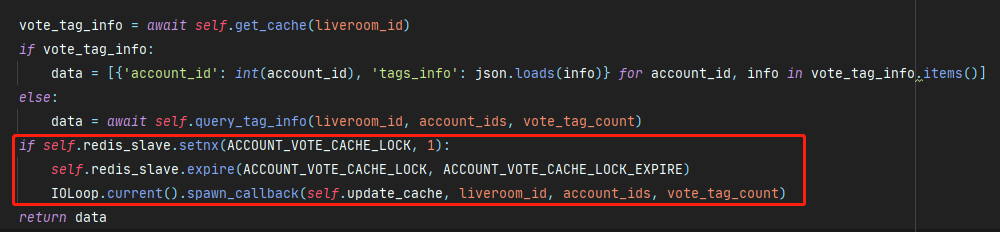

#### 后台任务中锁的应用

> 实时性要求不高， 并发量很大，后台任务， 线程锁

**场景：** 讲师端评论消息部分，会查询每一个评论用户的标签信息，标签表查询耗时严重，采用异步方式处理

**流程：**

1.  第一次请求直接查询数据库
2.  在返回数据的同时开启后台线程更新本次数据到缓存中
3.  第二次请求直接从缓存中获取数据，并重复 **2**

**问题细节**： 

1. 这个缓存依赖前台定时访问的时间， 缓存过期的时间应该大于前台缓存的时间，否则前台每一次请求，后台的缓存都是失效状态
2.  如果前台访问频繁刷新，会导致后台开很多的异步线程，导致数据库的查询压力很大  ==**High**==

**最终方案：**

在每一次请求中，设置一个线程锁，使得拿缓存但是不更新缓存[^不开后台线程],

